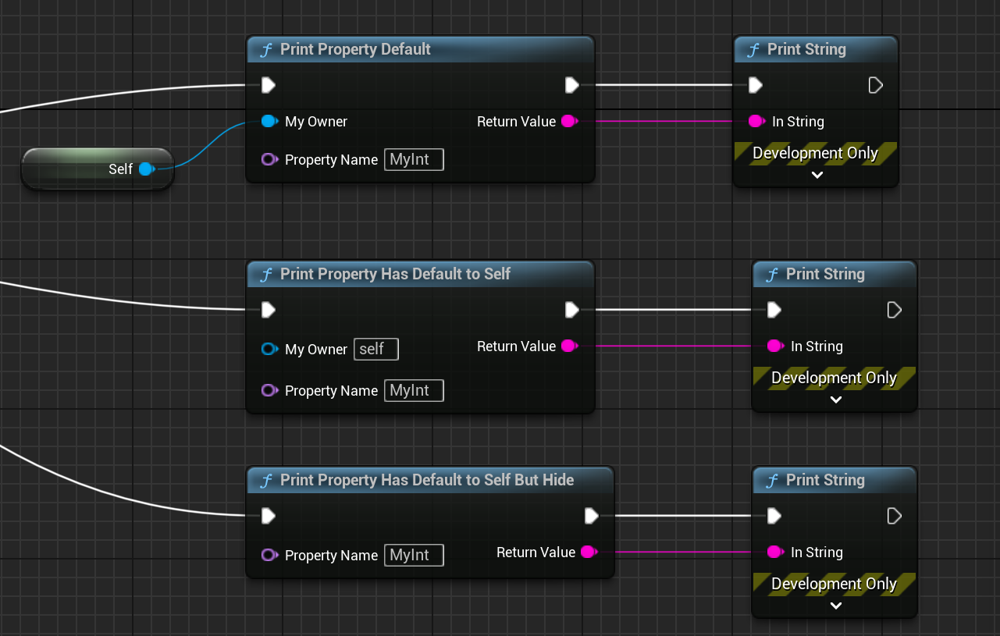

# DefaultToSelf

- **功能描述：** 用在函数上，指定一个参数的默认值为Self值
- **使用位置：** UFUNCTION
- **引擎模块：** Blueprint
- **元数据类型：** bool
- **常用程度：** ★★★★★

使得在蓝图调用的时候更加的便利，当然也要根据这个函数的需要。

## 测试代码：

```cpp
UCLASS()
class INSIDER_API UMyFunctionLibrary_SelfPinTest :public UBlueprintFunctionLibrary
{
	GENERATED_BODY()

public:
	UFUNCTION(BlueprintCallable)
	static FString PrintProperty_Default(UObject* myOwner,FName propertyName);

	UFUNCTION(BlueprintCallable,meta=(DefaultToSelf="myOwner"))
	static FString PrintProperty_HasDefaultToSelf(UObject* myOwner,FName propertyName);

	UFUNCTION(BlueprintCallable,meta=(DefaultToSelf="myOwner",hidePin="myOwner"))
	static FString PrintProperty_HasDefaultToSelf_ButHide(UObject* myOwner,FName propertyName);
};
```

蓝图里的节点，可以看出蓝图编译器会自动的把DefaultToSelf指定的函数参数，自动的赋值到Self，当然这个和手动的连到self本质是一样的。额外一点，可以通过HidePin再隐藏掉这个函数参数，这样就默认把该蓝图节点所在的蓝图对象（Self）当作第一个函数参数，显得更加简洁一些。



如果是BlueprintPure也是可以的：


## 原理：

蓝图中的函数调用在编译的时候，会自动的创建SelfPin（名字为Target)。如果该函数是静态函数或HideSelfPin的标记，则会把SelfPin隐藏起来。其SelfPin的值就是当前蓝图运行时对象的值。因此DefaultToSelf的效果就是蓝图系统会自动的把这个参数的值赋值为被调用处的蓝图运行时对象，相当于C++ this指针的效果

```cpp
bool UK2Node_CallFunction::CreatePinsForFunctionCall(const UFunction* Function)
{
	UEdGraphPin* SelfPin = CreateSelfPin(Function);
	// Renamed self pin to target
	SelfPin->PinFriendlyName = LOCTEXT("Target", "Target");
}

UEdGraphPin* FBlueprintNodeStatics::CreateSelfPin(UK2Node* Node, const UFunction* Function)
{
	// Chase up the function's Super chain, the function can be called on any object that is at least that specific
	const UFunction* FirstDeclaredFunction = Function;
	while (FirstDeclaredFunction->GetSuperFunction() != nullptr)
	{
		FirstDeclaredFunction = FirstDeclaredFunction->GetSuperFunction();
	}

	// Create the self pin
	UClass* FunctionClass = CastChecked<UClass>(FirstDeclaredFunction->GetOuter());
	// we don't want blueprint-function target pins to be formed from the
	// skeleton class (otherwise, they could be incompatible with other pins
	// that represent the same type)... this here could lead to a compiler 
	// warning (the GeneratedClass could not have the function yet), but in
	// that, the user would be reminded to compile the other blueprint
	if (FunctionClass->ClassGeneratedBy)
	{
		FunctionClass = FunctionClass->GetAuthoritativeClass();
	}

	UEdGraphPin* SelfPin = NULL;
	if (FunctionClass == Node->GetBlueprint()->GeneratedClass)
	{
		// This means the function is defined within the blueprint, so the pin should be a true "self" pin
		SelfPin = Node->CreatePin(EGPD_Input, UEdGraphSchema_K2::PC_Object, UEdGraphSchema_K2::PSC_Self, nullptr, UEdGraphSchema_K2::PN_Self);
	}
	else if (FunctionClass->IsChildOf(UInterface::StaticClass()))
	{
		SelfPin = Node->CreatePin(EGPD_Input, UEdGraphSchema_K2::PC_Interface, FunctionClass, UEdGraphSchema_K2::PN_Self);
	}
	else
	{
		// This means that the function is declared in an external class, and should reference that class
		SelfPin = Node->CreatePin(EGPD_Input, UEdGraphSchema_K2::PC_Object, FunctionClass, UEdGraphSchema_K2::PN_Self);
	}
	check(SelfPin != nullptr);

	return SelfPin;
}
```
