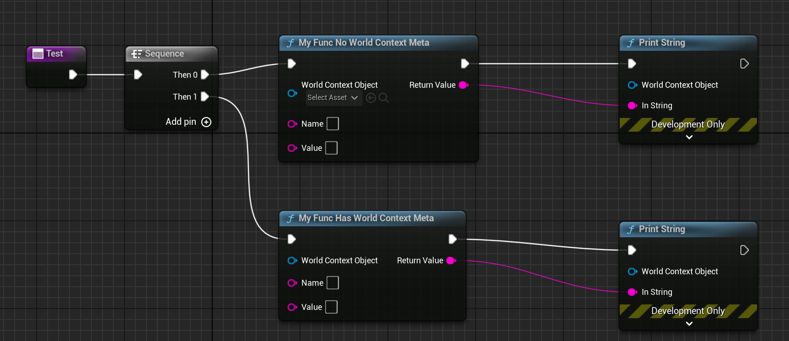

# ShowWorldContextPin

- **功能描述：** 放在UCLASS上，指定本类里的函数调用都必须显示WorldContext引脚，无论其本来是否默认隐藏
- **使用位置：** UCLASS
- **元数据类型：** bool
- **关联项：** [WorldContext](../WorldContext/WorldContext.md)

放在UCLASS上，指定本类里的函数调用都必须显示WorldContext引脚，无论其本来是否默认隐藏，因为本Object类无法被当作WorldContextObject，即使实现了GetWorld()也要当作无法自动获得以此来让用户必须手动指定WorldContextObject。

一般放在UObject上，但在源码里发现在AGameplayCueNotify_Actor，AEditorUtilityActor上也有。AEditorUtilityActor是因为本身不会在Runtime里运行，因此没有World。AGameplayCueNotify_Actor有可能在CDO上被使用和Recycle，因此可也不能假定必须有WorldContext。

## 测试代码：

```cpp
UCLASS(Blueprintable, BlueprintType)
class INSIDER_API UMyFunctionLibrary_WorldContextTest :public UBlueprintFunctionLibrary
{
public:
	GENERATED_BODY()
public:
	UFUNCTION(BlueprintCallable)
	static FString MyFunc_NoWorldContextMeta(const UObject* WorldContextObject, FString name, FString value);

	UFUNCTION(BlueprintCallable, meta = (WorldContext = "WorldContextObject"))
	static FString MyFunc_HasWorldContextMeta(const UObject* WorldContextObject, FString name, FString value);
};

UCLASS(Blueprintable, BlueprintType, meta = (ShowWorldContextPin = "true"))
class INSIDER_API UMyObject_ShowWorldContextPin :public UObject
{
	GENERATED_BODY()
	UWorld* WorldPrivate = nullptr;
public:
	UFUNCTION(BlueprintCallable)
	void RegisterWithOuter()
	{
		if (UObject* outer = GetOuter())
		{
			WorldPrivate = outer->GetWorld();
		}
	}

	virtual UWorld* GetWorld() const override final { return WorldPrivate; }
};
```

## 蓝图测试效果：

可以见到虽然UMyObject_ShowWorldContextPin类实现了GetWorld()方法，但是即使是MyFunc_HasWorldContextMeta，WorldContextObject本来应该被自动赋值且隐藏的，但是在本类里也显式显示了出来。同时注意到PrintString也显示出了WorldContextObject。



## 原理：

在CallFunction的蓝图节点上，如果有bShowWorldContextPin，则不隐藏WorldContextMetaValue或DefaultToSelfMetaValue指定的函数参数。

```cpp
bool UK2Node_CallFunction::CreatePinsForFunctionCall(const UFunction* Function)
{
	const bool bShowWorldContextPin = ((PinsToHide.Num() > 0) && BP && BP->ParentClass && BP->ParentClass->HasMetaDataHierarchical(FBlueprintMetadata::MD_ShowWorldContextPin));
	//...
	if (PinsToHide.Contains(Pin->PinName))
	{
		const FString PinNameStr = Pin->PinName.ToString();
		const FString& DefaultToSelfMetaValue = Function->GetMetaData(FBlueprintMetadata::MD_DefaultToSelf);
		const FString& WorldContextMetaValue  = Function->GetMetaData(FBlueprintMetadata::MD_WorldContext);
		bool bIsSelfPin = ((PinNameStr == DefaultToSelfMetaValue) || (PinNameStr == WorldContextMetaValue));
	
		if (!bShowWorldContextPin || !bIsSelfPin)
		{
			Pin->bHidden = true;
			Pin->bNotConnectable = InternalPins.Contains(Pin->PinName);
		}
	}

}
```
