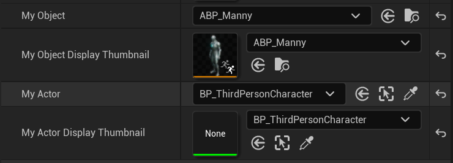

# DisplayThumbnail

Description: 说明属性是一个资源类型，其应显示选中资源的缩略图。
Usage: UPROPERTY
Feature: Editor
Group: Object Property
Type: bool
LimitedType: UObject*
Example: DisplayThumbnail="true”
Status: Done
Sub-item: ThumbnailSize (ThumbnailSize.md)

指定是否在该属性左侧显示一个缩略图。

测试代码：

```cpp
UCLASS(Blueprintable, BlueprintType)
class INSIDER_API AMyActor_Thumbnail_Test :public AActor
{
	GENERATED_BODY()
public:
	UPROPERTY(EditAnywhere, BlueprintReadWrite, meta = (DisplayThumbnail = "false"))
	UObject* MyObject;

	UPROPERTY(EditAnywhere, BlueprintReadWrite, meta = (DisplayThumbnail = "true"))
	UObject* MyObject_DisplayThumbnail;

	UPROPERTY(EditAnywhere, BlueprintReadWrite)
	AActor* MyActor;

	UPROPERTY(EditAnywhere, BlueprintReadWrite, meta = (DisplayThumbnail = "true"))
	AActor* MyActor_DisplayThumbnail;
};

```

测试效果：

可见MyObject_DisplayThumbnail的左侧显示出了所选择资产的缩略图，而MyObject因为设置了false因此是没有的。如果不设置DisplayThumbnail =false，则默认也是会显示缩略图的。

MyActor_DisplayThumbnail出现了缩略图的图标，但是发现并没有显示出正确的说了图。AActor在默认情况下是不显示缩略图的。



原理：

判断是否要显示缩略图就在这个函数。

默认情况下非Actor类型才会显示。另外SPropertyEditorAsset是用在资产类型属性上的，其实就是Object属性。

```cpp
bool SPropertyEditorAsset::ShouldDisplayThumbnail(const FArguments& InArgs, const UClass* InObjectClass) const
{
	if (!InArgs._DisplayThumbnail || !InArgs._ThumbnailPool.IsValid())
	{
		return false;
	}

	bool bShowThumbnail = InObjectClass == nullptr || !InObjectClass->IsChildOf(AActor::StaticClass());

	// also check metadata for thumbnail & text display
	const FProperty* PropertyToCheck = nullptr;
	if (PropertyEditor.IsValid())
	{
		PropertyToCheck = PropertyEditor->GetProperty();
	}
	else if (PropertyHandle.IsValid())
	{
		PropertyToCheck = PropertyHandle->GetProperty();
	}

	if (PropertyToCheck != nullptr)
	{
		PropertyToCheck = GetActualMetadataProperty(PropertyToCheck);

		return GetTagOrBoolMetadata(PropertyToCheck, TEXT("DisplayThumbnail"), bShowThumbnail);
	}

	return bShowThumbnail;
}
```