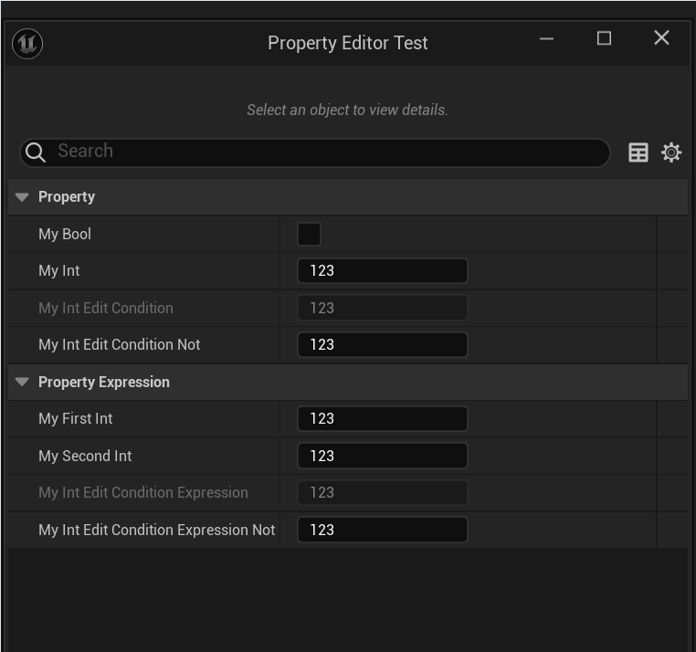

# EditConditionHides

Description: 在已经有EditCondition的情况下，指定该属性在EditCondition不满足的情况下隐藏起来。
Usage: UPROPERTY
Feature: Editor
Type: bool
Status: Done
Parent item: EditCondition (EditCondition.md)

在已经有EditCondition的情况下，指定该属性在EditCondition不满足的情况下隐藏起来。

测试代码：

```cpp
UCLASS(BlueprintType)
class INSIDER_API UMyProperty_EditCondition_Test :public UObject
{
	GENERATED_BODY()
public:
	UPROPERTY(EditAnywhere, BlueprintReadWrite, Category = Property)
	bool MyBool;

	UPROPERTY(EditAnywhere, BlueprintReadWrite, Category = Property, meta = (EditConditionHides, EditCondition = "MyBool"))
	int32 MyInt_EditCondition_Hides = 123;

public:
	UPROPERTY(EditAnywhere, BlueprintReadWrite, Category = PropertyExpression)
	int32 MyFirstInt = 123;

	UPROPERTY(EditAnywhere, BlueprintReadWrite, Category = PropertyExpression)
	int32 MySecondInt = 123;

	UPROPERTY(EditAnywhere, BlueprintReadWrite, Category = PropertyExpression, meta = (EditConditionHides, EditCondition = "(MyFirstInt+MySecondInt)==500"))
	int32 MyInt_EditConditionExpression_Hides = 123;
};
```

测试效果：

下面的图中可以明显见到两个属性随着条件的满足显示了出来。



原理：

其实就是加了个是否显示的判断。

```cpp
bool FPropertyNode::IsOnlyVisibleWhenEditConditionMet() const
{
	static const FName Name_EditConditionHides("EditConditionHides");
	if (Property.IsValid() && Property->HasMetaData(Name_EditConditionHides))
	{
		return HasEditCondition();
	}

	return false;
}
```