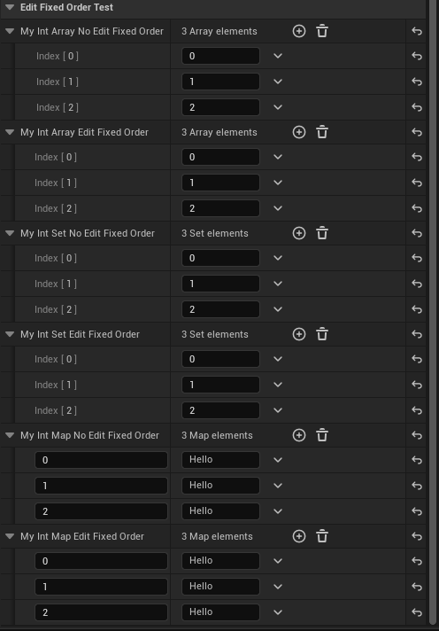

# EditFixedOrder

Description: 使数组的元素无法通过拖拽来重新排序。
Usage: UPROPERTY
Feature: Editor
Group: Container Property
Type: bool
LimitedType: TArray
Status: Done

测试代码：

```cpp
	UPROPERTY(EditAnywhere, BlueprintReadWrite, Category = EditFixedOrderTest)
	TArray<int32> MyIntArray_NoEditFixedOrder;

	UPROPERTY(EditAnywhere, BlueprintReadWrite, Category = EditFixedOrderTest, meta = (EditFixedOrder))
	TArray<int32> MyIntArray_EditFixedOrder;

	UPROPERTY(EditAnywhere, BlueprintReadWrite, Category = EditFixedOrderTest)
	TSet<int32> MyIntSet_NoEditFixedOrder;

	UPROPERTY(EditAnywhere, BlueprintReadWrite, Category = EditFixedOrderTest, meta = (EditFixedOrder))
	TSet<int32> MyIntSet_EditFixedOrder;

	UPROPERTY(EditAnywhere, BlueprintReadWrite, Category = EditFixedOrderTest)
	TMap<int32,FString> MyIntMap_NoEditFixedOrder;

	UPROPERTY(EditAnywhere, BlueprintReadWrite, Category = EditFixedOrderTest, meta = (EditFixedOrder))
	TMap<int32,FString> MyIntMap_EditFixedOrder;
```

测试效果：

- 可见只有第一个MyIntArray_NoEditFixedOrder，在数组元素上出现可拖拽的标记，然后可以改变顺序。
- 加上EditFixedOrder的TArray就无法改变顺序了。
- 其他TSet，TMap是不支持该meta的，因为其内部本身顺序也无关。



原理：

可以看见，细节面板里一个属性行是否可重排序的判断是外部是个数组，且没有EditFixedOrder和ArraySizeEnum（固定数组）。当然本身这个属性也要在可编辑状态（比如被禁用灰掉就显然不可编辑了）

```cpp
bool FPropertyNode::IsReorderable()
{
	FProperty* NodeProperty = GetProperty();
	if (NodeProperty == nullptr)
	{
		return false;
	}
	// It is reorderable if the parent is an array and metadata doesn't prohibit it
	const FArrayProperty* OuterArrayProp = NodeProperty->GetOwner<FArrayProperty>();

	static const FName Name_DisableReordering("EditFixedOrder");
	static const FName NAME_ArraySizeEnum("ArraySizeEnum");
	return OuterArrayProp != nullptr 
		&& !OuterArrayProp->HasMetaData(Name_DisableReordering)
		&& !IsEditConst()
		&& !OuterArrayProp->HasMetaData(NAME_ArraySizeEnum)
		&& !FApp::IsGame();
}
```