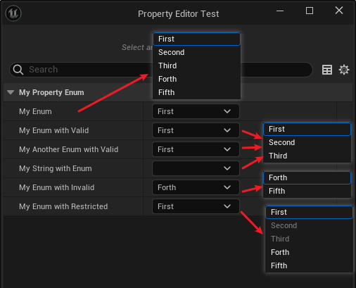

# ValidEnumValues

- **功能描述：** 指定枚举属性值上可选的枚举值选项
- **使用位置：** UPROPERTY
- **引擎模块：** Enum Property
- **元数据类型：** strings="a，b，c"
- **限制类型：** 枚举属性值
- **关联项：** [InvalidEnumValues](../InvalidEnumValues.md), [GetRestrictedEnumValues](../GetRestrictedEnumValues.md), [EnumValueDisplayNameOverrides](../EnumValueDisplayNameOverrides/EnumValueDisplayNameOverrides.md), [Enum](../Enum.md)
- **常用程度：** ★★★

指定枚举属性值上可选的枚举值选项，默认情况下。枚举属性在细节面板上可选项为全部的枚举值，但我们可以通过ValidEnumValues来限制只展示这些值。

枚举属性的写法有3种，分别是enum class，TEnumAsByte和FString叠加enum meta的写法，这3种写法都会被视为一个枚举属性然后尝试产生combo list来让用户选择属性值。

## 示例代码：

```cpp
UENUM(BlueprintType)
enum class EMyPropertyTestEnum : uint8
{
	First,
	Second,
	Third,
	Forth,
	Fifth,
};

UENUM(BlueprintType)
namespace EMyPropertyTestEnum2
{
	enum Type : int
	{
		First,
		Second,
		Third,
		Forth,
		Fifth,
	};
}

UCLASS(BlueprintType)
class INSIDER_API UMyProperty_Enum :public UObject
{
	GENERATED_BODY()
public:
	UPROPERTY(EditAnywhere, BlueprintReadWrite)
	EMyPropertyTestEnum MyEnum;

	UPROPERTY(EditAnywhere, BlueprintReadWrite, meta = (ValidEnumValues = "First,Second,Third"))
	EMyPropertyTestEnum MyEnumWithValid;	// Type 1

	UPROPERTY(EditAnywhere, BlueprintReadWrite, meta = (ValidEnumValues = "First,Second,Third"))
	TEnumAsByte<EMyPropertyTestEnum2::Type> MyAnotherEnumWithValid;	//Type 2

	UPROPERTY(EditAnywhere, BlueprintReadWrite, meta = (enum = "EMyPropertyTestEnum"))
	FString MyStringWithEnum;	//Type 3
	
	UPROPERTY(EditAnywhere, BlueprintReadWrite, meta = (InvalidEnumValues = "First,Second,Third"))
	EMyPropertyTestEnum MyEnumWithInvalid = EMyPropertyTestEnum::Forth;

	UPROPERTY(EditAnywhere, BlueprintReadWrite, meta = (GetRestrictedEnumValues = "MyGetRestrictedEnumValues"))
	EMyPropertyTestEnum MyEnumWithRestricted;

public:
	UFUNCTION(BlueprintInternalUseOnly)
	TArray<FString> MyGetRestrictedEnumValues() const{	return TArray<FString>{"Second","Third"};}
};
```

## 蓝图效果：

可见默认情况下枚举属性会显示全部5个枚举值，但其他3个枚举属性值的可选列表被限制到了3个。



## 原理：

下述的代码，

```cpp
bool FPropertyHandleBase::GeneratePossibleValues(TArray< TSharedPtr<FString> >& OutOptionStrings, TArray< FText >& OutToolTips, TArray<bool>& OutRestrictedItems)
{
	TArray<UObject*> OuterObjects;
	GetOuterObjects(OuterObjects);		
	
	const TArray<FName> ValidEnumValues = PropertyEditorHelpers::GetValidEnumsFromPropertyOverride(Property, Enum);
	const TArray<FName> InvalidEnumValues = PropertyEditorHelpers::GetInvalidEnumsFromPropertyOverride(Property, Enum);
	const TArray<FName> RestrictedEnumValues = PropertyEditorHelpers::GetRestrictedEnumsFromPropertyOverride(OuterObjects, Property, Enum);
	
	const TMap<FName, FText> EnumValueDisplayNameOverrides = PropertyEditorHelpers::GetEnumValueDisplayNamesFromPropertyOverride(Property, Enum);
	
	//NumEnums() - 1, because the last item in an enum is the _MAX item
	for( int32 EnumIndex = 0; EnumIndex < Enum->NumEnums() - 1; ++EnumIndex )
	{
		// Ignore hidden enums
		bool bShouldBeHidden = Enum->HasMetaData(TEXT("Hidden"), EnumIndex ) || Enum->HasMetaData(TEXT("Spacer"), EnumIndex );
		if (!bShouldBeHidden)
		{
			if(ValidEnumValues.Num() > 0)
			{
				bShouldBeHidden = !ValidEnumValues.Contains(Enum->GetNameByIndex(EnumIndex));
			}
			// If both are specified, InvalidEnumValues takes precedence
			else if(InvalidEnumValues.Num() > 0)
			{
				bShouldBeHidden = InvalidEnumValues.Contains(Enum->GetNameByIndex(EnumIndex));
			}
		}
	
		if (!bShouldBeHidden)
		{
			bShouldBeHidden = IsHidden(Enum->GetNameStringByIndex(EnumIndex));
		}
	
		if( !bShouldBeHidden )
		{
			// See if we specified an alternate name for this value using metadata
			FString EnumName = Enum->GetNameStringByIndex(EnumIndex);
			FString EnumDisplayName = EnumValueDisplayNameOverrides.FindRef(Enum->GetNameByIndex(EnumIndex)).ToString();
			if (EnumDisplayName.IsEmpty())
			{
				EnumDisplayName = Enum->GetDisplayNameTextByIndex(EnumIndex).ToString();
			}
	
			FText RestrictionTooltip;
			const bool bIsRestricted = GenerateRestrictionToolTip(EnumName, RestrictionTooltip) || RestrictedEnumValues.Contains(Enum->GetNameByIndex(EnumIndex));
			OutRestrictedItems.Add(bIsRestricted);
	
			if (EnumDisplayName.Len() == 0)
			{
				EnumDisplayName = MoveTemp(EnumName);
			}
			else
			{
				bUsesAlternateDisplayValues = true;
			}
	
			TSharedPtr< FString > EnumStr(new FString(EnumDisplayName));
			OutOptionStrings.Add(EnumStr);
	
			FText EnumValueToolTip = bIsRestricted ? RestrictionTooltip : Enum->GetToolTipTextByIndex(EnumIndex);
			OutToolTips.Add(MoveTemp(EnumValueToolTip));
		}
		else
		{
			OutToolTips.Add(FText());
		}
	}
}
```
