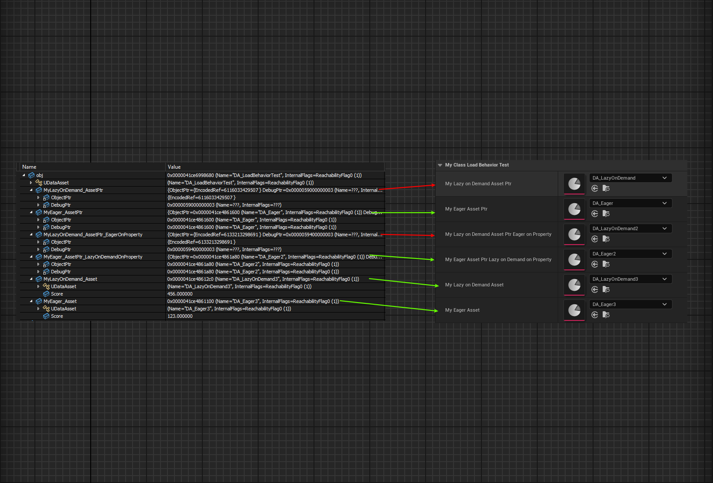

# LoadBehavior

Description: 用在UCLASS上标记这个类的加载行为，使得相应的TObjectPtr属性支持延迟加载。可选的加载行为默认为Eager，可改为LazyOnDemand。
Usage: UCLASS
Feature: Editor
Group: Object Property
Type: string="abc"
LimitedType: TObjectPtr 
Status: Done

用在UCLASS上标记这个类的加载行为，使得相应的TObjectPtr属性支持延迟加载。可选的加载行为默认为Eager，可改为LazyOnDemand。

- 默认Eager的逻辑和我们常见的资源硬引用的逻辑相同，就是如果A硬引用了B，在加载A的时候就会递归把B也加载进来。
- 改为LazyOnDemand的逻辑是只有在这个资源真正被需要（触发Get）的时候才会去加载该资源。这也是种硬引用，但是是延迟加载的。同样A硬引用了B，在加载A的时候，不会直接立马就加载B，而是先记录下来这个引用关系信息（B的ObjectPath）。在A里真正需要访问B的时候，这个时候因为已经事先记录知道了B在哪里，因此就可以在这个时候再去把B加载进来。如果加载的够快，对用户是无感的。LazyOnDemand只在编辑器下生效，这么做的好处是可以尽快的打开编辑器，而不是等待所有资源都加载进来。因为其实并不是所有资源都要第一时间加载解析进来访问。
- 同FSoftObjectPtr的区别是后者是软引用，需要用户手动的自己判断时机加载。而LazyOnDemand是自动的延迟加载，用户是无感的，不需要做额外的操作。
- LoadBehavior只作用于TObjectPtr属性，UObject*属性总是直接都加载的。因为只有TObjectPtr里实现了UObject*的引用路径信息编码，才可以支持延迟加载。
- LoadBehavior也只支持在编辑器环境。因为在Runtime，TObjectPtr会退化成UObject*，也就全部都是直接加载了。
- LoadBehavior一般标记在资产类型的类上。源码里标记的类有：DataAsset,DataTable,CurveTable,SoundCue,SoundWave,DialogueWave,AnimMontage。因此假如你自己自定义了资产类，也包含了许多数据，就可以用LazyOnDemand来优化在编辑器下的加载速度。
- 要测试LoadBehavior，要打开引擎的的LazyLoadImports功能，默认情况下是关闭的。打开的方式可在DefaultEngine.ini下增加Core.System.Experimental节下LazyLoadImports=True的设置。源码可参考IsImportLazyLoadEnabled这个方法。
- 在测试的时候，要小心如果是双击打开DataAsset资产，因为在属性细节面板里要展示属性的值，在属性上会调用GetObjectPropertyValue_InContainer，因此会触发ObjectHandleResolve，导致TObjectPtr的Resolve。

## 测试代码：

如下专门定义了UMyDataAsset_Eager 和UMyDataAsset_LazyOnDemand 两种DataAsset，并标注了不同的LoadBehavior 以做对比。

```cpp
//(BlueprintType = true, IncludePath = Property/MyProperty_Asset.h, IsBlueprintBase = true, LoadBehavior = Eager, ModuleRelativePath = Property/MyProperty_Asset.h)
UCLASS(Blueprintable, Blueprintable, meta = (LoadBehavior = "Eager"))
class INSIDER_API UMyDataAsset_Eager :public UDataAsset
{
	GENERATED_BODY()
public:
	UPROPERTY(BlueprintReadWrite, EditAnywhere)
	float Score;
};

//(BlueprintType = true, IncludePath = Property/MyProperty_Asset.h, IsBlueprintBase = true, LoadBehavior = LazyOnDemand, ModuleRelativePath = Property/MyProperty_Asset.h)
UCLASS(Blueprintable, Blueprintable, meta = (LoadBehavior = "LazyOnDemand"))
class INSIDER_API UMyDataAsset_LazyOnDemand :public UDataAsset
{
	GENERATED_BODY()
public:
	UPROPERTY(BlueprintReadWrite, EditAnywhere)
	float Score;
};

UCLASS(BlueprintType)
class INSIDER_API UMyClass_LoadBehaviorTest :public UDataAsset
{
	GENERATED_BODY()
public:
	UPROPERTY(BlueprintReadWrite, EditAnywhere)
	TObjectPtr<UMyDataAsset_LazyOnDemand> MyLazyOnDemand_AssetPtr;

	UPROPERTY(BlueprintReadWrite, EditAnywhere)
	TObjectPtr<UMyDataAsset_Eager> MyEager_AssetPtr;

public:
	UPROPERTY(BlueprintReadWrite, EditAnywhere,meta = (LoadBehavior = "Eager"))
	TObjectPtr<UMyDataAsset_LazyOnDemand> MyLazyOnDemand_AssetPtr_EagerOnProperty;

	UPROPERTY(BlueprintReadWrite, EditAnywhere,meta = (LoadBehavior = "LazyOnDemand"))
	TObjectPtr<UMyDataAsset_Eager> MyEager_AssetPtr_LazyOnDemandOnProperty;

public:
	UPROPERTY(BlueprintReadWrite, EditAnywhere)
	UMyDataAsset_LazyOnDemand* MyLazyOnDemand_Asset;

	UPROPERTY(BlueprintReadWrite, EditAnywhere)
	UMyDataAsset_Eager* MyEager_Asset;

public:
	UFUNCTION(BlueprintCallable)
	static void LoadBehaviorTest();
};

void UMyClass_LoadBehaviorTest::LoadBehaviorTest()
{
	UPackage* pk = LoadPackage(nullptr, TEXT("/Game/Class/Behavior/LoadBehavior/DA_LoadBehaviorTest"), 0);
	UMyClass_LoadBehaviorTest* obj = LoadObject<UMyClass_LoadBehaviorTest>(pk, TEXT("DA_LoadBehaviorTest"));
}

//开启功能
DefaultEngine.ini
[Core.System.Experimental]
LazyLoadImports=True
```

## 测试结果：

在编辑器运行起来之后，手动调用LoadBehaviorTest来加载这个UMyClass_LoadBehaviorTest 的DataAsset。查看不同类型属性的对象值。可以发现：

- 其中MyLazyOnDemand_AssetPtr和MyLazyOnDemand_AssetPtr_EagerOnProperty的ObjectPtr的值是还没有Resolved的，其他的都可以查看到直接对象的值。
- 可以得出的结论有，只有在UCLASS上标记LazyOnDemand才可以使得延迟加载生效。在属性上标记LoadBehavior 并不会起作用。直接UObject*的属性统统都会直接加载。



## 原理：

在LinkerLoadImportBehavior.cpp里可看见判断LoadBehavior的FindLoadBehavior方法，因此发现其只作用在UCLASS上。

另外也可在TObjectPtr的Get函数里发现ResolveObjectHandle的调用。这是触发Resolve的地方。

也注意到UE_WITH_OBJECT_HANDLE_LATE_RESOLVE 的定义是WITH_EDITORONLY_DATA，因此是在编辑器环境下生效。

```cpp
//D:\github\UnrealEngine\Engine\Source\Runtime\CoreUObject\Private\UObject\LinkerLoadImportBehavior.cpp
enum class EImportBehavior : uint8
{
	Eager = 0,
	// @TODO: OBJPTR: we want to permit lazy background loading in the future
	//LazyBackground,
	LazyOnDemand,
};

EImportBehavior FindLoadBehavior(const UClass& Class)
{
	//Package class can't have meta data because of UHT
	if (&Class == UPackage::StaticClass())
	{
		return EImportBehavior::LazyOnDemand;
	}

	static const FName Name_LoadBehavior(TEXT("LoadBehavior"));
	if (const FString* LoadBehaviorMeta = Class.FindMetaData(Name_LoadBehavior))
	{
		if (*LoadBehaviorMeta == TEXT("LazyOnDemand"))
		{
			return EImportBehavior::LazyOnDemand;
		}
		return EImportBehavior::Eager;
	}
	else
	{
		//look in super class to see if it has lazy load on
		const UClass* Super = Class.GetSuperClass();
		if (Super != nullptr)
		{
			return FindLoadBehavior(*Super);
		}
		return EImportBehavior::Eager;
	}
}

	#define UE_WITH_OBJECT_HANDLE_LATE_RESOLVE WITH_EDITORONLY_DATA

	inline UObject* ResolveObjectHandle(FObjectHandle& Handle)
	{
#if UE_WITH_OBJECT_HANDLE_LATE_RESOLVE || UE_WITH_OBJECT_HANDLE_TRACKING
		UObject* ResolvedObject = ResolveObjectHandleNoRead(Handle);
		UE::CoreUObject::Private::OnHandleRead(ResolvedObject);
		return ResolvedObject;
#else
		return ReadObjectHandlePointerNoCheck(Handle);
#endif
	}
```