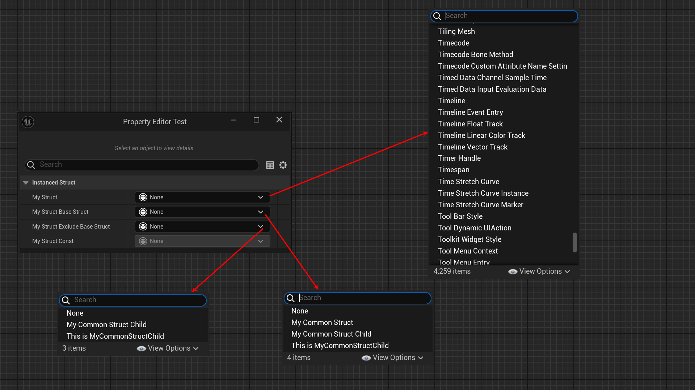

# BaseStruct

Usage: UPROPERTY
Feature: Blueprint
Type: bool
Description: 指定FInstancedStruct属性选项列表选择的结构都必须继承于BaseStruct指向的结构。
LimitedType: FInstancedStruct
Status: Done
Group: TypePicker
Sub-item: ExcludeBaseStruct (ExcludeBaseStruct.md), StructTypeConst (StructTypeConst.md)

指定FInstancedStruct属性选项列表选择的结构都必须继承于BaseStruct指向的结构。

测试代码：

```cpp

USTRUCT(BlueprintType)
struct INSIDER_API FMyCommonStruct
{
}；

USTRUCT(BlueprintType)
struct INSIDER_API FMyCommonStructChild:public FMyCommonStruct
{
	GENERATED_BODY()
};

USTRUCT(BlueprintType, DisplayName = "This is MyCommonStructChild")
struct INSIDER_API FMyCommonStructChild_HasDisplayName :public FMyCommonStruct
{
	GENERATED_BODY()
};

UCLASS(BlueprintType)
class INSIDER_API UMyProperty_Struct :public UObject
{
	GENERATED_BODY()
public:
	UPROPERTY(EditAnywhere, BlueprintReadWrite, Category = "InstancedStruct")
	FInstancedStruct MyStruct;

	UPROPERTY(EditAnywhere, BlueprintReadWrite, Category = "InstancedStruct", meta = (BaseStruct = "/Script/Insider.MyCommonStruct"))
	FInstancedStruct MyStruct_BaseStruct;

	UPROPERTY(EditAnywhere, BlueprintReadWrite, Category = "InstancedStruct", meta = (ExcludeBaseStruct, BaseStruct = "/Script/Insider.MyCommonStruct"))
	FInstancedStruct MyStruct_ExcludeBaseStruct;
	
		UPROPERTY(EditAnywhere, BlueprintReadWrite, Category = "InstancedStruct", meta = (StructTypeConst))
		FInstancedStruct MyStruct_Const;
};
```

测试结果：

可见MyStruct_BaseStruct的选择限制在FMyCommonStruct的自己以及子类。

而如果不想要基类本身，则加上ExcludeBaseStruct的MyStruct_ExcludeBaseStruct就不包含FMyCommonStruct了。

加上StructTypeConst的MyStruct_Const就不能编辑了。



原理：

抽取BaseStruct的元信息以填充到StructFilter中去。

```cpp

void FInstancedStructDetails::CustomizeHeader(TSharedRef<class IPropertyHandle> StructPropertyHandle, class FDetailWidgetRow& HeaderRow, IPropertyTypeCustomizationUtils& StructCustomizationUtils)
{
		static const FName NAME_BaseStruct = "BaseStruct";
	const FString& BaseStructName = StructProperty->GetMetaData(NAME_BaseStruct);
	if (!BaseStructName.IsEmpty())
	{
		BaseScriptStruct = UClass::TryFindTypeSlow<UScriptStruct>(BaseStructName);
		if (!BaseScriptStruct)
		{
			BaseScriptStruct = LoadObject<UScriptStruct>(nullptr, *BaseStructName);
		}
	}

}

TSharedRef<SWidget> FInstancedStructDetails::GenerateStructPicker()
{
	static const FName NAME_ExcludeBaseStruct = "ExcludeBaseStruct";
	static const FName NAME_HideViewOptions = "HideViewOptions";
	static const FName NAME_ShowTreeView = "ShowTreeView";

	const bool bExcludeBaseStruct = StructProperty->HasMetaData(NAME_ExcludeBaseStruct);
	const bool bAllowNone = !(StructProperty->GetMetaDataProperty()->PropertyFlags & CPF_NoClear);
	const bool bHideViewOptions = StructProperty->HasMetaData(NAME_HideViewOptions);
	const bool bShowTreeView = StructProperty->HasMetaData(NAME_ShowTreeView);
	
	StructFilter->BaseStruct = BaseScriptStruct;
	StructFilter->bAllowBaseStruct = !bExcludeBaseStruct;
	
}

```