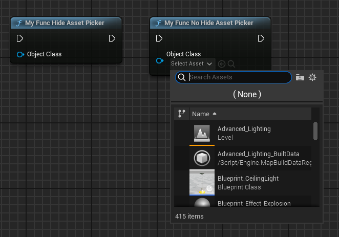

# HideAssetPicker

Usage: UFUNCTION
Feature: Editor
Type: strings="a，b，c"
Description: 隐藏Object类型引脚上的AssetPicker的选择列表
LimitedType: UObject*
Status: Done
Group: Object Property

隐藏Object类型引脚上的AssetPicker的选择列表。这在有时我们只是想要自己传递Object引用，不希望用户选择到引擎里别的资产的时候会比较有用。因为Asset类型其实也是Object，因此对于Object引用类型的参数叫做HideAssetPicker。

在源码里并没有找到有使用的地方，但是这个功能是可用的。

测试代码：

```cpp
	UFUNCTION(BlueprintCallable)
	static void MyFunc_NoHideAssetPicker(UObject* ObjectClass) {}

	UFUNCTION(BlueprintCallable, meta = (HideAssetPicker = "ObjectClass"))
	static void MyFunc_HideAssetPicker(UObject* ObjectClass) {}
```

蓝图效果：

默认的情况MyFunc_NoHideAssetPicker是可以弹出选择列表的。而MyFunc_HideAssetPicker则就隐藏了起来。



## 原理：

判断一个函数引脚是否允许打开AssetPicker的逻辑是：

- 必须是个object 类型
- 如果是UActorComponent则不显示
- 如果是Actor类型，那么得在关卡蓝图中，且该Actor是placeable的才显示。
- 如果用HideAssetPicker显式指定了该参数，则该参数也不显示。

```cpp
bool UEdGraphSchema_K2::ShouldShowAssetPickerForPin(UEdGraphPin* Pin) const
{
	bool bShow = true;
	if (Pin->PinType.PinCategory == PC_Object)
	{
		UClass* ObjectClass = Cast<UClass>(Pin->PinType.PinSubCategoryObject.Get());
		if (ObjectClass)
		{
			// Don't show literal buttons for component type objects
			bShow = !ObjectClass->IsChildOf(UActorComponent::StaticClass());

			if (bShow && ObjectClass->IsChildOf(AActor::StaticClass()))
			{
				// Only show the picker for Actor classes if the class is placeable and we are in the level script
				bShow = !ObjectClass->HasAllClassFlags(CLASS_NotPlaceable)
							&& FBlueprintEditorUtils::IsLevelScriptBlueprint(FBlueprintEditorUtils::FindBlueprintForNode(Pin->GetOwningNode()));
			}

			if (bShow)
			{
				if (UK2Node_CallFunction* CallFunctionNode = Cast<UK2Node_CallFunction>(Pin->GetOwningNode()))
				{
					if (UFunction* FunctionRef = CallFunctionNode->GetTargetFunction())
					{
						const UEdGraphPin* WorldContextPin = CallFunctionNode->FindPin(FunctionRef->GetMetaData(FBlueprintMetadata::MD_WorldContext));
						bShow = ( WorldContextPin != Pin );

						// Check if we have explictly marked this pin as hiding the asset picker
						const FString& HideAssetPickerMetaData = FunctionRef->GetMetaData(FBlueprintMetadata::MD_HideAssetPicker);
						if(!HideAssetPickerMetaData.IsEmpty())
						{
							TArray<FString> PinNames;
							HideAssetPickerMetaData.ParseIntoArray(PinNames, TEXT(","), true);
							const FString PinName = Pin->GetName();
							for(FString& ParamNameToHide : PinNames)
							{
								ParamNameToHide.TrimStartAndEndInline();
								if(ParamNameToHide == PinName)
								{
									bShow = false;
									break;
								}
							}
						}
					}
				}
				else if (Cast<UK2Node_CreateDelegate>( Pin->GetOwningNode())) 
				{
					bShow = false;
				}
			}
		}
	}
	return bShow;
}

```