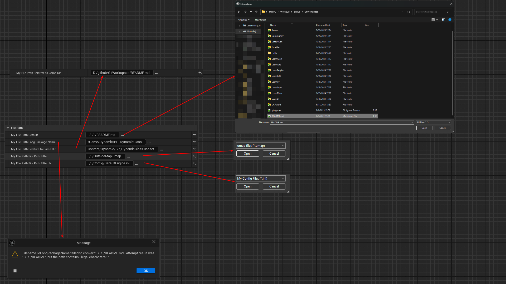

# RelativeToGameDir

Usage: UPROPERTY
Feature: Editor
Type: bool
Description: 如果系统目录选择框的结果为Project的子目录，则转换为相对路径，否则返回绝对路径。
LimitedType: FFilePath 
Status: Done
Group: Path Property

如果系统目录选择框的结果为Project的子目录，则转换为相对路径，否则返回绝对路径。

测试代码：

```cpp
public:
	UPROPERTY(EditAnywhere, BlueprintReadWrite, Category = FilePath)
	FFilePath MyFilePath_Default;

	UPROPERTY(EditAnywhere, BlueprintReadWrite, Category = FilePath, meta = (LongPackageName))
	FFilePath MyFilePath_LongPackageName;

	UPROPERTY(EditAnywhere, BlueprintReadWrite, Category = FilePath, meta = (RelativeToGameDir))
	FFilePath MyFilePath_RelativeToGameDir;

	UPROPERTY(EditAnywhere, BlueprintReadWrite, Category = FilePath, meta = (FilePathFilter = "umap"))
	FFilePath MyFilePath_FilePathFilter;

	UPROPERTY(EditAnywhere, BlueprintReadWrite, Category = FilePath, meta = (FilePathFilter = "My Config Files|*.ini"))
	FFilePath MyFilePath_FilePathFilter_INI;
```

测试结果：

- FFilePath弹出的都为Windows系统的默认文件选择对话框。
- MyFilePath_Default，弹出默认的系统文件选择对话框，可以选择任何路径的任何文件。
- MyFilePath_LongPackageName，限制选择范围为Content下的资产，否则会弹出报错。结果路径会被转换为/Game/ObjectPath这种长的包名。
- MyFilePath_RelativeToGameDir，如果选择结果为Project目录（uproject所在的目录）下的子文件，则返回结果会相对路径。否则直接返回绝对路径。
- MyFilePath_FilePathFilter，可以选择任何目录下的指定后缀名的文件。代码里示例为umap，则只能选择关卡文件。
- MyFilePath_FilePathFilter_INI，演示了只能选取ini文件。FilePathFilter 支持我们采用“描述 | *.后缀名”的格式自己书写过滤方式，规则同windows系统选取规则一样，也可以同时写多个后缀名。



## 原理：

在下面代码就可以看见FilePathFilter，bLongPackageName ，bRelativeToGameDir 的处理逻辑。

- FileTypeFilter 设定扩展名到SFilePathPicker里
- bLongPackageName 触发TryConvertFilenameToLongPackageName来转换路径。
- bRelativeToGameDir 触发AbsolutePickedPath.RightChop(AbsoluteProjectDir.Len());来变成相对路径。

```cpp
USTRUCT(BlueprintType)
struct FFilePath
{
	GENERATED_BODY()

	/**
	* The path to the file.
	*/
	UPROPERTY(EditAnywhere, BlueprintReadWrite, Category = FilePath)
	FString FilePath;
};

void FFilePathStructCustomization::CustomizeHeader( TSharedRef<IPropertyHandle> StructPropertyHandle, class FDetailWidgetRow& HeaderRow, IPropertyTypeCustomizationUtils& StructCustomizationUtils )
{
	const FString& MetaData = StructPropertyHandle->GetMetaData(TEXT("FilePathFilter"));
	bLongPackageName = StructPropertyHandle->HasMetaData(TEXT("LongPackageName"));
	bRelativeToGameDir = StructPropertyHandle->HasMetaData(TEXT("RelativeToGameDir"));
	
	if (MetaData.IsEmpty())
	{
		FileTypeFilter = TEXT("All files (*.*)|*.*");
	}
	else
	{
		if (MetaData.Contains(TEXT("|"))) // If MetaData follows the Description|ExtensionList format, use it as is
		{
			FileTypeFilter = MetaData;
		}
		else
		{
			FileTypeFilter = FString::Printf(TEXT("%s files (*.%s)|*.%s"), *MetaData, *MetaData, *MetaData);
		}
	}
}

void FFilePathStructCustomization::HandleFilePathPickerPathPicked( const FString& PickedPath )
{
	FString FinalPath = PickedPath;
	if (bLongPackageName)
	{
		FString LongPackageName;
		FString StringFailureReason;
		if (FPackageName::TryConvertFilenameToLongPackageName(PickedPath, LongPackageName, &StringFailureReason) == false)
		{
			FMessageDialog::Open(EAppMsgType::Ok, FText::FromString(StringFailureReason));
		}
		FinalPath = LongPackageName;
	}
	else if (bRelativeToGameDir && !PickedPath.IsEmpty())
	{
		//A filepath under the project directory will be made relative to the project directory
		//Otherwise, the absolute path will be returned unless it doesn't exist, the current path will
		//be kept. This can happen if it's already relative to project dir (tabbing when selected)

		const FString ProjectDir = FPaths::ProjectDir();
		const FString AbsoluteProjectDir = FPaths::ConvertRelativePathToFull(ProjectDir);
		const FString AbsolutePickedPath = FPaths::ConvertRelativePathToFull(PickedPath);

		//Verify if absolute path to file exists. If it was already relative to content directory
		//the absolute will be to binaries and will possibly be garbage
		if (FPaths::FileExists(AbsolutePickedPath))
		{
			//If file is part of the project dir, chop the project dir part
			//Otherwise, use the absolute path
			if (AbsolutePickedPath.StartsWith(AbsoluteProjectDir))
			{
				FinalPath = AbsolutePickedPath.RightChop(AbsoluteProjectDir.Len());
			}
			else
			{
				FinalPath = AbsolutePickedPath;
			}
		}
		else
		{
			//If absolute file doesn't exist, it might already be relative to project dir
			//If not, then it might be a manual entry, so keep it untouched either way
			FinalPath = PickedPath;
		}
	}

	PathStringProperty->SetValue(FinalPath);
	FEditorDirectories::Get().SetLastDirectory(ELastDirectory::GENERIC_OPEN, FPaths::GetPath(PickedPath));
}
```