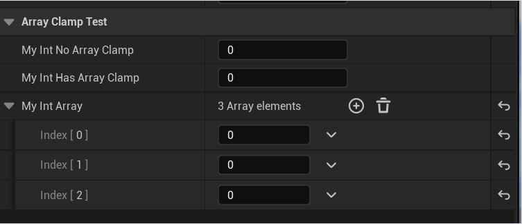

# ArrayClamp

- **功能描述：** 限定整数属性的值必须在指定数组的合法下标范围内，[0,ArrayClamp.Size()-1]
- **使用位置：** UPROPERTY
- **引擎模块：** Numeric Property
- **元数据类型：** int32
- **限制类型：** int32
- **常用程度：** ★★★

限定整数属性的值必须在指定数组的合法下标范围内，[0,ArrayClamp.Size()-1]

## 测试代码：

```cpp
public:
	UPROPERTY(EditAnywhere, BlueprintReadWrite, Category = ArrayClampTest)
	int32 MyInt_NoArrayClamp = 0;

	UPROPERTY(EditAnywhere, BlueprintReadWrite, Category = ArrayClampTest, meta = (ArrayClamp = "MyIntArray"))
	int32 MyInt_HasArrayClamp = 0;

	UPROPERTY(EditAnywhere, BlueprintReadWrite, Category = ArrayClampTest)
	TArray<int32> MyIntArray;
```

## 测试效果：

可见拥有ArrayClamp的整数值被限制在数组的下标中。



## 原理：

根据指定的数组名称在本类里寻找到Array属性，然后把本整数属性的值Clamp在该数组的下标范围内。

```cpp
template <typename Type>
static Type ClampIntegerValueFromMetaData(Type InValue, FPropertyHandleBase& InPropertyHandle, FPropertyNode& InPropertyNode)
{
	Type RetVal = ClampValueFromMetaData<Type>(InValue, InPropertyHandle);

	//enforce array bounds
	const FString& ArrayClampString = InPropertyHandle.GetMetaData(TEXT("ArrayClamp"));
	if (ArrayClampString.Len())
	{
		FObjectPropertyNode* ObjectPropertyNode = InPropertyNode.FindObjectItemParent();
		if (ObjectPropertyNode && ObjectPropertyNode->GetNumObjects() == 1)
		{
			Type LastValidIndex = static_cast<Type>(GetArrayPropertyLastValidIndex(ObjectPropertyNode, ArrayClampString));
			RetVal = FMath::Clamp<Type>(RetVal, 0, LastValidIndex);
		}
		else
		{
			UE_LOG(LogPropertyNode, Warning, TEXT("Array Clamping isn't supported in multi-select (Param Name: %s)"), *InPropertyHandle.GetProperty()->GetName());
		}
	}

	return RetVal;
}
```
