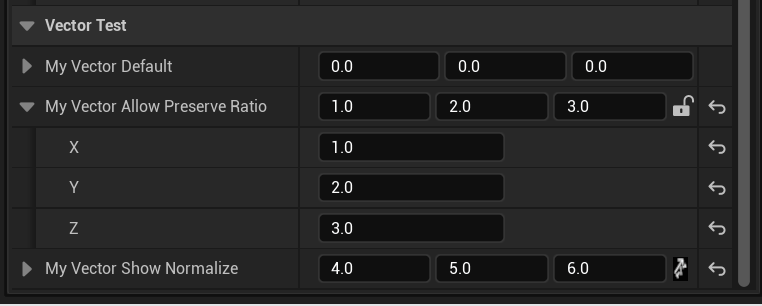

# ShowNormalize

- **功能描述：** 使得FVector变量在细节面板出现一个正规化的按钮。
- **使用位置：** UPROPERTY
- **引擎模块：** Numeric Property
- **元数据类型：** bool
- **限制类型：** FVector
- **常用程度：** ★★★

使得FVector变量在细节面板出现一个正规化的按钮。

## 测试代码：

```cpp
	UPROPERTY(EditAnywhere, Category = VectorTest)
	FVector MyVector_Default;

	UPROPERTY(EditAnywhere, Category = VectorTest, meta = (AllowPreserveRatio))
	FVector MyVector_AllowPreserveRatio;

	UPROPERTY(EditAnywhere, Category = VectorTest, meta = (ShowNormalize))
	FVector MyVector_ShowNormalize;
```

## 测试结果：

MyVector_ShowNormalize右侧的按钮可以把值正规化。



## 原理：

其实就是UI定制化的时候检测出ShowNormalize就创建单独的UI。

```cpp
if (StructPropertyHandle->HasMetaData("ShowNormalize") && MathStructCustomization::IsFloatVector(StructPropertyHandle))
{
	HorizontalBox->AddSlot()
		.AutoWidth()
		.MaxWidth(18.0f)
		.VAlign(VAlign_Center)
		[
			// Add a button to scale the vector uniformly to achieve a unit vector
			SNew(SButton)
				.OnClicked(this, &FMathStructCustomization::OnNormalizeClicked, StructWeakHandlePtr)
				.ButtonStyle(FAppStyle::Get(), "NoBorder")
				.ToolTipText(LOCTEXT("NormalizeToolTip", "When clicked, if the vector is large enough, it scales the vector uniformly to achieve a unit vector (vector with a length of 1)"))
				[
					SNew(SImage)
						.ColorAndOpacity(FSlateColor::UseForeground())
						.Image(FAppStyle::GetBrush(TEXT("Icons.Normalize")))	
				]
		];
}
```
