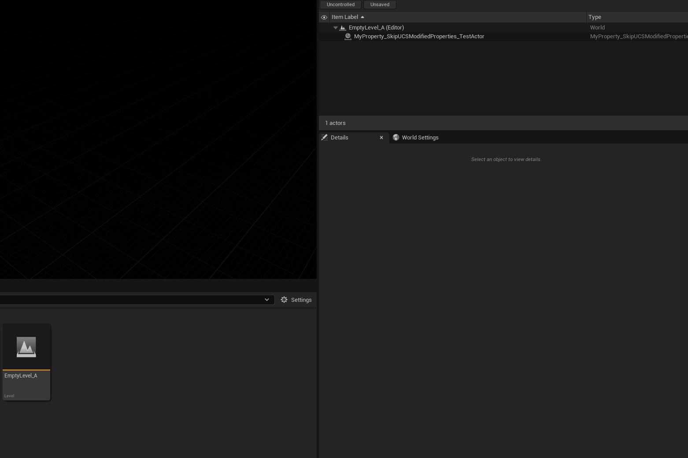

# SkipUCSModifiedProperties

- **功能描述：** 允许ActorComponent里的属性在Actor构造函数里被修改后依然保存下来。
- **使用位置：** UPROPERTY
- **引擎模块：** Serialization
- **元数据类型：** bool
- **限制类型：** ActorComponent下的属性
- **常用程度：** 1


允许ActorComponent里的属性在Actor构造函数里被修改后依然保存下来。

默认情况下，这些属性是不会被序列化保存下来的。猜测可能是官方认为这些属性反正会在Actor的构造函数里再次被赋值，所以就没必要序列化保存了。但是在一些情况下，比如这个构造函数只运行一次，或者这个Actor是被动态创建出来的带有一组件内的属性（如PCG），这个时候我们希望该Component下属性可以被序列化保存起来。

## 测试代码：

```cpp
UCLASS(Blueprintable, BlueprintType,meta=(BlueprintSpawnableComponent))
class INSIDER_API UMyComponent_SkipUCSModifiedProperties :public UActorComponent
{
public:
	GENERATED_BODY()
public:
	UPROPERTY(EditAnywhere, BlueprintReadWrite)
	FString MyString_Default = TEXT("Hello");
	UPROPERTY(EditAnywhere, BlueprintReadWrite, meta = (SkipUCSModifiedProperties))
	FString MyString_Skip = TEXT("Hello");
};

UCLASS(Blueprintable, BlueprintType)
class INSIDER_API AMyProperty_SkipUCSModifiedProperties_BaseActor :public AActor
{
public:
	GENERATED_BODY()

	UPROPERTY(BlueprintReadWrite,EditDefaultsOnly)
	bool CanCallConstruction=false;
};

UCLASS(Blueprintable, BlueprintType)
class INSIDER_API AMyProperty_SkipUCSModifiedProperties_TestActor :public AActor
{
public:
	GENERATED_BODY()

	UPROPERTY(EditAnywhere)
	TSubclassOf<AMyProperty_SkipUCSModifiedProperties_BaseActor> ActorClass;
	
	UFUNCTION(CallInEditor)
	void CreateActor();

	UFUNCTION(CallInEditor)
	void CleanupActor();
};

void AMyProperty_SkipUCSModifiedProperties_TestActor::CreateActor()
{
	UWorld* editorWorld = this->GetWorld();
	FActorSpawnParameters params;
	params.Template = (AActor*)ActorClass->GetDefaultObject();
	params.OverrideLevel=GetLevel();
	params.SpawnCollisionHandlingOverride=ESpawnActorCollisionHandlingMethod::AlwaysSpawn;
	params.bDeferConstruction=true;
	FTransform t;

	AMyProperty_SkipUCSModifiedProperties_BaseActor* newActor =Cast<AMyProperty_SkipUCSModifiedProperties_BaseActor>(editorWorld->SpawnActor(ActorClass,&t, params));//cannot call user construction script in BP actor
	newActor->CanCallConstruction=true;
	newActor->FinishSpawning(t);
}

void AMyProperty_SkipUCSModifiedProperties_TestActor::CleanupActor()
{
	UWorld* editorWorld = this->GetWorld();

	for (TActorIterator<AActor> It(editorWorld, ActorClass); It; ++It)
	{
		AActor* Actor = *It;
		editorWorld->DestroyActor(Actor);
	}
}
```

## 测试效果：


操作步骤：



可见一开始在场景里动态创建的Actor下的组件里的两个属性都是被构造函数修改后的First和Second，但是在关卡Map保存之后，只有MyString_Default的值回归了默认值（没有被序列化下来），而MyString_Skip的值就有保存了下来。

在示例代码里我在Actor上加了一个变量CanCallConstruction，其修饰符是EditDefaultsOnly，这个很重要。因为如果设置成EditAnywhere，其值就会保存在Actor在场景里的实例上。而EditDefaultsOnly的变量，其值只会保存在CDO上。因此我用该值来控制该Actor的构造函数只能在该Actor被我手动创建后运行一次，而在之后的Map重载后不会再触发该Actor构造函数之后的赋值逻辑。从而特别的体现出这两个属性的值的差别，否则总是先调用构造函数之后的赋值逻辑，map里序列化的值总是会被覆盖掉。

## 原理：

在UActorComponent 下有一个AllUCSModifiedProperties记录了所有UActorComponent 下的属性被其所在的Actor的构造函数里修改的属性列表。其作用是这些属性修改后的值不需要序列化到level中的Actor实例上。

从FComponentPropertyReader 和FComponentPropertyWriter 里的代码也可知，在AllUCSModifiedProperties里的属性不会参与序列化。因此SkipUCSModifiedProperties的作用就反过来，是允许某个ActorComponent下的属性在Actor构造函数里被修改后依然能序列化保存下来。

```cpp
class UActorComponent : public UObject, public IInterface_AssetUserData
{
	static ENGINE_API TMap<UActorComponent*, TArray<FSimpleMemberReference>> AllUCSModifiedProperties;
}

void UActorComponent::GetUCSModifiedProperties(TSet<const FProperty*>& ModifiedProperties) const
{
	FRWScopeLock Lock(AllUCSModifiedPropertiesLock, SLT_ReadOnly);
	if (TArray<FSimpleMemberReference>* UCSModifiedProperties = AllUCSModifiedProperties.Find(this))
	{
		for (const FSimpleMemberReference& MemberReference : *UCSModifiedProperties)
		{
			ModifiedProperties.Add(FMemberReference::ResolveSimpleMemberReference<FProperty>(MemberReference));
		}
	}
}

class FDataCachePropertyReader : public FObjectReader
{
public:
	FDataCachePropertyReader(FInstanceCacheDataBase& InInstanceData)
		: FObjectReader(InInstanceData.SavedProperties)
		, InstanceData(InInstanceData)
	{
		// Include properties that would normally skip tagged serialization (e.g. bulk serialization of array properties).
		ArPortFlags |= PPF_ForceTaggedSerialization;
	}

	virtual bool ShouldSkipProperty(const FProperty* InProperty) const override
	{
		return PropertiesToSkip.Contains(InProperty);
	}
	
};

class FComponentPropertyReader : public FDataCachePropertyReader
{
public:
	FComponentPropertyReader(UActorComponent* InComponent, FActorComponentInstanceData& InInstanceData)
		: FDataCachePropertyReader(InInstanceData)
	{
		InComponent->GetUCSModifiedProperties(PropertiesToSkip);

		UClass* Class = InComponent->GetClass();
		Class->SerializeTaggedProperties(*this, (uint8*)InComponent, Class, (uint8*)InComponent->GetArchetype());
	}
};

class FComponentPropertyWriter : public FDataCachePropertyWriter
{
public:

	FComponentPropertyWriter(const UActorComponent* Component, FActorComponentInstanceData& InInstanceData)
		: FDataCachePropertyWriter(Component, InInstanceData)
	{
		if (Component)
		{
			Component->GetUCSModifiedProperties(PropertiesToSkip);

			if (AActor* ComponentOwner = Component->GetOwner())
			{
				// If this is the owning Actor's root scene component, don't include relative transform properties. This is handled elsewhere.
				if (Component == ComponentOwner->GetRootComponent())
				{
					UClass* ComponentClass = Component->GetClass();
					PropertiesToSkip.Add(ComponentClass->FindPropertyByName(USceneComponent::GetRelativeLocationPropertyName()));
					PropertiesToSkip.Add(ComponentClass->FindPropertyByName(USceneComponent::GetRelativeRotationPropertyName()));
					PropertiesToSkip.Add(ComponentClass->FindPropertyByName(USceneComponent::GetRelativeScale3DPropertyName()));
				}
			}

			SerializeProperties();
		}
	}
};

void UActorComponent::DetermineUCSModifiedProperties()
{

	class FComponentPropertySkipper : public FArchive
	{
	public:
		FComponentPropertySkipper()
			: FArchive()
		{
			this->SetIsSaving(true);
	
			// Include properties that would normally skip tagged serialization (e.g. bulk serialization of array properties).
			ArPortFlags |= PPF_ForceTaggedSerialization;
		}
	
		virtual bool ShouldSkipProperty(const FProperty* InProperty) const override
		{
			static const FName MD_SkipUCSModifiedProperties(TEXT("SkipUCSModifiedProperties"));
			return (InProperty->HasAnyPropertyFlags(CPF_Transient)
				|| !InProperty->HasAnyPropertyFlags(CPF_Edit | CPF_Interp)
				|| InProperty->IsA<FMulticastDelegateProperty>()
	#if WITH_EDITOR
				|| InProperty->HasMetaData(MD_SkipUCSModifiedProperties)
	#endif
				);
		}
	} PropertySkipper;
	
	UClass* ComponentClass = GetClass();
	UObject* ComponentArchetype = GetArchetype();

	for (TFieldIterator<FProperty> It(ComponentClass); It; ++It)
	{
		FProperty* Property = *It;
		if( Property->ShouldSerializeValue(PropertySkipper) )
		{
			for( int32 Idx=0; Idx<Property->ArrayDim; Idx++ )
			{
				uint8* DataPtr      = Property->ContainerPtrToValuePtr           <uint8>((uint8*)this, Idx);
				uint8* DefaultValue = Property->ContainerPtrToValuePtrForDefaults<uint8>(ComponentClass, (uint8*)ComponentArchetype, Idx);
				if (!Property->Identical( DataPtr, DefaultValue, PPF_DeepCompareInstances))
				{
					UCSModifiedProperties.Add(FSimpleMemberReference());
					FMemberReference::FillSimpleMemberReference<FProperty>(Property, UCSModifiedProperties.Last());
					break;
				}
			}
		}
	}

	FRWScopeLock Lock(AllUCSModifiedPropertiesLock, SLT_Write);
	if (UCSModifiedProperties.Num() > 0)
	{
		AllUCSModifiedProperties.Add(this, MoveTemp(UCSModifiedProperties));
	}
	else
	{
		AllUCSModifiedProperties.Remove(this);
	}
}
```

在源码里发现也只在UPrimitiveComponent 里的BodyInstance用到。

```cpp
UCLASS(abstract, HideCategories=(Mobility, VirtualTexture), ShowCategories=(PhysicsVolume), MinimalAPI)
class UPrimitiveComponent : public USceneComponent, public INavRelevantInterface, public IInterface_AsyncCompilation, public IPhysicsComponent
{
	UPROPERTY(EditAnywhere, BlueprintReadOnly, Category=Collision, meta=(ShowOnlyInnerProperties, SkipUCSModifiedProperties))
	FBodyInstance BodyInstance;
}
```

## 致谢：

感谢**徐若疾**的反馈指正以及示例提供！