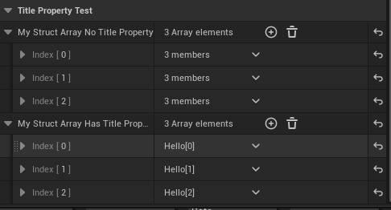

# TitleProperty

Description: 指定结构数组里的结构成员属性内容来作为结构数组元素的显示标题。
Usage: UPROPERTY
Feature: Editor
Group: Container Property
Type: string="abc"
LimitedType: TArray<FStruct>
Example: meta = (TitleProperty="{MyString}[{MyInt}]")
Status: Done

指定结构数组里的结构成员属性内容来作为结构数组元素的显示标题。

重点是：

- 作用目标为结构数组TArray<FStruct>，其他的TSet，TMap不支持。
- TitleProperty顾名思义是用作标题的属性。但要更明确一些，标题指的是结构数组元素在细节面板里显示的标题。属性指的是结构数组里的结构里面的属性。
- 然后下一步是TitleProperty的格式要怎么写。根据引擎源码，TitleProperty最后是用FTitleMetadataFormatter来解析计算内容。通过查看其内部代码，可知其TitleProperty格式可以为：
    - 如果TitleProperty里包含“{”，则会把里面的字符串当作一个FTextFormat（以“{ArgName}…”组织的格式字符串）。最终格式是以“{PropertyName}…”组织的字符串去找多个对应的属性。
    - 否则就会把TitleProperty的全部当作PropertyName，直接去找对应的属性名称。

测试代码：

```cpp
USTRUCT(BlueprintType)
struct INSIDER_API FMyArrayTitleStruct
{
	GENERATED_BODY()
public:
	FMyArrayTitleStruct() = default;
	FMyArrayTitleStruct(int32 id) :MyInt(id) {}
	UPROPERTY(BlueprintReadWrite, EditAnywhere)
	int32 MyInt = 123;
	UPROPERTY(BlueprintReadWrite, EditAnywhere)
	FString MyString=TEXT("Hello");
	UPROPERTY(BlueprintReadWrite, EditAnywhere)
	float MyFloat=456.f;
};

UPROPERTY(EditAnywhere, BlueprintReadWrite, Category = TitlePropertyTest)
TArray<FMyArrayTitleStruct> MyStructArray_NoTitleProperty;

UPROPERTY(EditAnywhere, BlueprintReadWrite, Category = TitlePropertyTest, meta = (TitleProperty="{MyString}[{MyInt}]"))
TArray<FMyArrayTitleStruct> MyStructArray_HasTitleProperty;
```

测试效果：

可以发现，下面的数组元素的标题变为了“Hello[x]”，而不是默认的“3 members”。



原理：

属性编辑器里属性节点如果发现有TitleProperty，则会生成一个FTitleMetadataFormatter的TitlePropertyFormatter 来进行字符串格式的解析和输出结果内容。其内部其实真正用的又是FTextFormat，这样才可以把多个属性的内容拼接成一个目标字符串。

当然SPropertyEditorTitle还注意到了如果有TitleProperty，可能会实时的改变，因此绑定了一个函数来进行Tick更新。

```cpp
//绑定一个函数来每tick获取名字
void SPropertyEditorTitle::Construct( const FArguments& InArgs, const TSharedRef<FPropertyEditor>& InPropertyEditor )
{
	// If our property has title support we want to fetch the value every tick, otherwise we can just use a static value
	static const FName NAME_TitleProperty = FName(TEXT("TitleProperty"));
	const bool bHasTitleProperty = InPropertyEditor->GetProperty() && InPropertyEditor->GetProperty()->HasMetaData(NAME_TitleProperty);
	if (bHasTitleProperty)
	{
		NameTextBlock =
			SNew(STextBlock)
			.Text(InPropertyEditor, &FPropertyEditor::GetDisplayName)
			.Font(NameFont);
	}		
	else
	{
		NameTextBlock =
			SNew(STextBlock)
			.Text(InPropertyEditor->GetDisplayName())
			.Font(NameFont);
	}
}

FText FPropertyEditor::GetDisplayName() const
{
	FItemPropertyNode* ItemPropertyNode = PropertyNode->AsItemPropertyNode();

	if ( ItemPropertyNode != NULL )
	{
		return ItemPropertyNode->GetDisplayName();
	}

	if (const FComplexPropertyNode* ComplexPropertyNode = PropertyNode->AsComplexNode())
	{
		const FText DisplayName = ComplexPropertyNode->GetDisplayName();

		// Does this property define its own name?
		if (!DisplayName.IsEmpty())
		{
			return DisplayName;
		}
	}

	FString DisplayName;
	PropertyNode->GetQualifiedName( DisplayName, true );
	return FText::FromString(DisplayName);
}

//生成TitleFormatter来解析TitleProperty里面的内容，最后得出文字。发现不支持Map，Set，因此只支持array。签名还有个判断ArrayIndex()==1的分支，走进普通属性
FText FItemPropertyNode::GetDisplayName() const
{
	if (CastField<FSetProperty>(ParentProperty) == nullptr &&  CastField<FMapProperty>(ParentProperty) == nullptr)
	{
		// Check if this property has Title Property Meta
			static const FName NAME_TitleProperty = FName(TEXT("TitleProperty"));
			FString TitleProperty = PropertyPtr->GetMetaData(NAME_TitleProperty);
			if (!TitleProperty.IsEmpty())
			{
				// Find the property and get the right property handle
				if (PropertyStruct != nullptr)
				{
					const TSharedPtr<IPropertyHandle> ThisAsHandle = PropertyEditorHelpers::GetPropertyHandle(NonConstThis->AsShared(), nullptr, nullptr);
					TSharedPtr<FTitleMetadataFormatter> TitleFormatter = FTitleMetadataFormatter::TryParse(ThisAsHandle, TitleProperty);
					if (TitleFormatter)
					{
						TitleFormatter->GetDisplayText(FinalDisplayName);
					}
				}
			}
		}
}

//生成一个TitlePropertyFormatter 
void SPropertyEditorArrayItem::Construct( const FArguments& InArgs, const TSharedRef< class FPropertyEditor>& InPropertyEditor )
{
		static const FName TitlePropertyFName = FName(TEXT("TitleProperty"));

	// if this is a struct property, try to find a representative element to use as our stand in
		if (PropertyEditor->PropertyIsA( FStructProperty::StaticClass() ))
		{
			const FProperty* MainProperty = PropertyEditor->GetProperty();
			const FProperty* ArrayProperty = MainProperty ? MainProperty->GetOwner<const FProperty>() : nullptr;
			if (ArrayProperty) // should always be true
			{
				TitlePropertyFormatter = FTitleMetadataFormatter::TryParse(PropertyEditor->GetPropertyHandle(), ArrayProperty->GetMetaData(TitlePropertyFName));
			}
		}
}
```

源码中例子：

读者还可以在UPropertyEditorTestObject里找到应用的例子。用testprops命令行就可以打开。

```cpp
	UPROPERTY(EditAnywhere, Category=ArraysOfProperties, meta=(TitleProperty=IntPropertyInsideAStruct))
	TArray<FPropertyEditorTestBasicStruct> StructPropertyArrayWithTitle;

	UPROPERTY(EditAnywhere, Category=ArraysOfProperties, meta=(TitleProperty="{IntPropertyInsideAStruct} + {FloatPropertyInsideAStruct}"))
	TArray<FPropertyEditorTestBasicStruct> StructPropertyArrayWithFormattedTitle;

	UPROPERTY(EditAnywhere, Category=ArraysOfProperties, meta=(TitleProperty=ErrorProperty))
	TArray<FPropertyEditorTestBasicStruct> StructPropertyArrayWithTitleError;

	UPROPERTY(EditAnywhere, Category=ArraysOfProperties, meta=(TitleProperty="{ErrorProperty}"))
	TArray<FPropertyEditorTestBasicStruct> StructPropertyArrayWithFormattedTitleError;
```