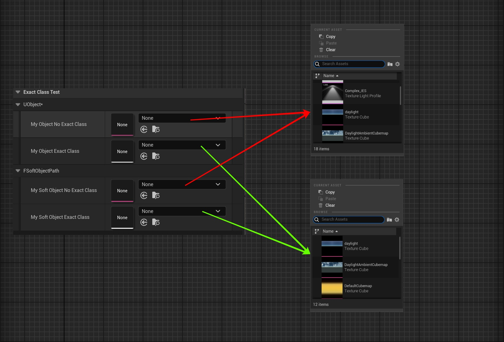

# ExactClass

- **功能描述：** 在同时设置AllowedClasses和GetAllowedClasses的时候，ExactClass指定只取这两个集合中类型完全一致的类型交集，否则取一致的交集再加上其子类。
- **使用位置：** UPROPERTY
- **引擎模块：** TypePicker
- **元数据类型：** bool
- **限制类型：** FSoftObjectPath，UObject*
- **关联项：** [AllowedClasses](../AllowedClasses/AllowedClasses.md)
- **常用程度：** ★

在同时设置AllowedClasses和GetAllowedClasses的时候，ExactClass指定只取这两个集合中类型完全一致的类型交集，否则取一致的交集再加上其子类。

- 只作用于FSoftObjectPath和UObject*，因为目前只有SPropertyEditorAsset才用到这个Meta。
- 在二者区分度上很不容易理解。因为如果一致的类型刚好是其他类型的基类，则有没有取到“其子类”本身也没有关系。
- 在测试代码里，构建了一个测试例子，AllowedClasses 里取Texture2D和TextureCube，GetAllowedClasses 里取TextureLightProfile和TextureCube。我们知道TextureLightProfile是继承于Texture2D的。因此如果ExactClass==true，则最后的筛选类型是TextureCube，因为要类型完全一致。而如果ExactClass==false，则最后的筛选类型是TextureCube和TextureLightProfile，因为TextureLightProfile是继承于对面的Texture2D，因此TextureLightProfile会被选中。

## 测试代码：

```cpp
	UFUNCTION()
	TArray<UClass*> MyGetAllowedClassesFunc()
	{
		TArray<UClass*> classes;
		classes.Add(UTextureLightProfile::StaticClass());
		classes.Add(UTextureCube::StaticClass());
		return classes;
	}
	
	
	UPROPERTY(EditAnywhere, BlueprintReadWrite, Category = "ExactClassTest|UObject*", meta = (AllowedClasses = "/Script/Engine.Texture2D,/Script/Engine.TextureCube",GetAllowedClasses = "MyGetAllowedClassesFunc"))
	UObject* MyObject_NoExactClass;

	UPROPERTY(EditAnywhere, BlueprintReadWrite, Category = "ExactClassTest|UObject*", meta = (ExactClass, AllowedClasses = "/Script/Engine.Texture2D,/Script/Engine.TextureCube",GetAllowedClasses = "MyGetAllowedClassesFunc"))
	UObject* MyObject_ExactClass;

	UPROPERTY(EditAnywhere, BlueprintReadWrite, Category = "ExactClassTest|FSoftObjectPath", meta = (AllowedClasses = "/Script/Engine.Texture2D,/Script/Engine.TextureCube",GetAllowedClasses = "MyGetAllowedClassesFunc"))
	FSoftObjectPath MySoftObject_NoExactClass;

	UPROPERTY(EditAnywhere, BlueprintReadWrite, Category = "ExactClassTest|FSoftObjectPath", meta = (ExactClass, AllowedClasses = "/Script/Engine.Texture2D,/Script/Engine.TextureCube",GetAllowedClasses = "MyGetAllowedClassesFunc"))
	FSoftObjectPath MySoftObject_ExactClass;
```

## 测试效果：

- 可见没有ExactClass的时候，筛选类型是TextureCube和TextureLightProfile，总共有18项。
- 而有ExactClass后，筛选类型是TextureCube，总共只有12项。



## 原理：

经过测试和源码逻辑查看，确定ExactClass必须配合GetAllowedClasses来用，而且还必须AllowedClasses同时有。因为“ExactClass”属性传递到GetAllowedAndDisallowedClasses里。在整个源码中只找到这个地方使用。而继续根据GetAllowedAndDisallowedClasses里面的逻辑，当AllowedClasses和GetAllowedClasses里都有值的情况下，才会进bExactClass 的判断。

- 如果bExactClass ==false，则AllowedClasses和GetAllowedClasses里的值，要相等或者是对方的子类才可以，意思就是得是一个继承树里面的，然后最终取值的时候会取子类，而不是基类。
- 如果bExactClass ==true，则只有AllowedClasses和GetAllowedClasses里一致相等的才可以。

```cpp
void SPropertyEditorClass::Construct(const FArguments& InArgs, const TSharedPtr< FPropertyEditor >& InPropertyEditor)
{
	//默认就是false，因此没用到ExactClass
	PropertyEditorUtils::GetAllowedAndDisallowedClasses(ObjectList, *Property, AllowedClassFilters, DisallowedClassFilters, false);
}
void SPropertyEditorAsset::InitializeClassFilters(const FProperty* Property)
{
	if (Property == nullptr)
	{
		AllowedClassFilters.Add(ObjectClass);
		return;
	}

	// Account for the allowed classes specified in the property metadata
	const FProperty* MetadataProperty = GetActualMetadataProperty(Property);

	bExactClass = GetTagOrBoolMetadata(MetadataProperty, "ExactClass", false);
	
	TArray<UObject*> ObjectList;
	if (PropertyEditor && PropertyEditor->GetPropertyHandle()->IsValidHandle())
	{
		PropertyEditor->GetPropertyHandle()->GetOuterObjects(ObjectList);
	}
	else if (PropertyHandle.IsValid())
	{
		PropertyHandle->GetOuterObjects(ObjectList);
	}
	
	PropertyEditorUtils::GetAllowedAndDisallowedClasses(ObjectList, *MetadataProperty, AllowedClassFilters, DisallowedClassFilters, bExactClass, ObjectClass);
	
	if (AllowedClassFilters.Num() == 0)
	{
		// always add the object class to the filters
		AllowedClassFilters.Add(ObjectClass);
	}
}

void GetAllowedAndDisallowedClasses(const TArray<UObject*>& ObjectList, const FProperty& MetadataProperty, TArray<const UClass*>& AllowedClasses, TArray<const UClass*>& DisallowedClasses, bool bExactClass, const UClass* ObjectClass)
{
		TArray<const UClass*> CurrentAllowedClassFilters = MoveTemp(AllowedClasses);
			ensure(AllowedClasses.IsEmpty());
			for (const UClass* MergedClass : MergedClasses)
			{
				// Keep classes that match both allow list
				for (const UClass* CurrentClass : CurrentAllowedClassFilters)
				{
					if (CurrentClass == MergedClass || (!bExactClass && CurrentClass->IsChildOf(MergedClass)))
					{
						AllowedClasses.Add(CurrentClass);
						break;
					}
					if (!bExactClass && MergedClass->IsChildOf(CurrentClass))
					{
						AllowedClasses.Add(MergedClass);
						break;
					}
				}

}

```
