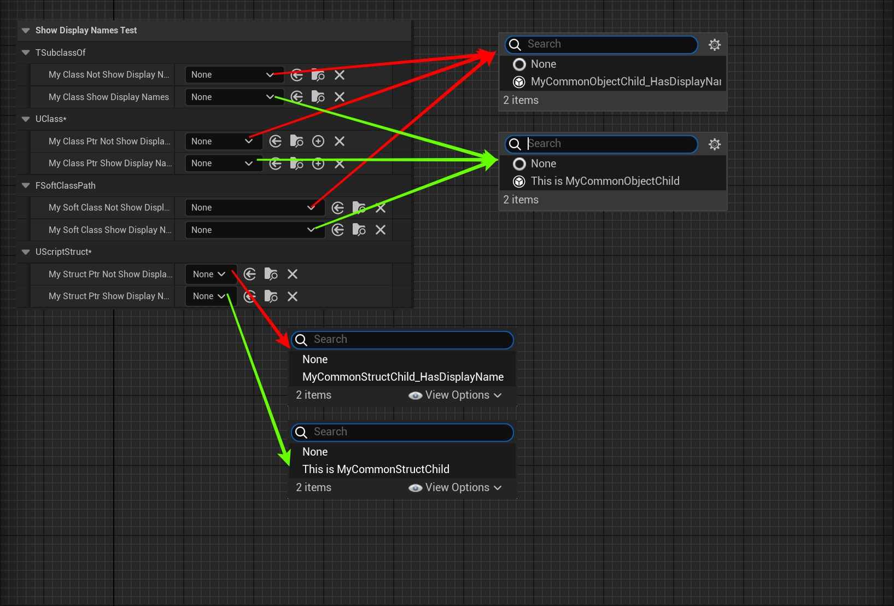

# ShowDisplayNames

- **功能描述：** 在Class和Struct属性上，指定类选择器显示另外的显示名称而不是类原始的名字。
- **使用位置：** UPROPERTY
- **引擎模块：** TypePicker
- **元数据类型：** bool
- **限制类型：** TSubClassOf，FSoftClassPath，UClass*，UScriptStruct*
- **常用程度：** ★

在Class和Struct属性上，指定类选择器显示另外的显示名称而不是类原始的名字。

类的显示名称指的是加在UCLASS或USTUCT上的DisplayName上的名字，这往往是对用户更友好的名字。类的原始名字就是类的类型名。

## 测试代码：

```cpp
UCLASS(BlueprintType, NotBlueprintable,DisplayName="This is MyCommonObjectChild")
class INSIDER_API UMyCommonObjectChild_HasDisplayName :public UMyCommonObject
{
	GENERATED_BODY()
public:
};

USTRUCT(BlueprintType,DisplayName="This is MyCommonStructChild")
struct INSIDER_API FMyCommonStructChild_HasDisplayName:public FMyCommonStruct
{
	GENERATED_BODY()
};

UPROPERTY(EditAnywhere, BlueprintReadWrite, Category = "ShowDisplayNamesTest|TSubclassOf", meta = ())
TSubclassOf<UMyCommonObjectChild_HasDisplayName> MyClass_NotShowDisplayNames;

UPROPERTY(EditAnywhere, BlueprintReadWrite, Category = "ShowDisplayNamesTest|TSubclassOf", meta = (ShowDisplayNames))
TSubclassOf<UMyCommonObjectChild_HasDisplayName> MyClass_ShowDisplayNames;

UPROPERTY(EditAnywhere, BlueprintReadWrite, Category = "ShowDisplayNamesTest|UClass*", meta = (AllowedClasses = "MyCommonObjectChild_HasDisplayName"))
UClass* MyClassPtr_NotShowDisplayNames;

UPROPERTY(EditAnywhere, BlueprintReadWrite, Category = "ShowDisplayNamesTest|UClass*", meta = (AllowedClasses = "MyCommonObjectChild_HasDisplayName", ShowDisplayNames))
UClass* MyClassPtr_ShowDisplayNames;

UPROPERTY(EditAnywhere, BlueprintReadWrite, Category = "ShowDisplayNamesTest|FSoftClassPath", meta = (MetaClass = "MyCommonObjectChild_HasDisplayName"))
FSoftClassPath MySoftClass_NotShowDisplayNames;

UPROPERTY(EditAnywhere, BlueprintReadWrite, Category = "ShowDisplayNamesTest|FSoftClassPath", meta = (MetaClass = "MyCommonObjectChild_HasDisplayName", ShowDisplayNames))
FSoftClassPath MySoftClass_ShowDisplayNames;

UPROPERTY(EditAnywhere, BlueprintReadWrite, Category = "ShowDisplayNamesTest|UScriptStruct*", meta = (MetaStruct = "MyCommonStructChild_HasDisplayName"))
UScriptStruct* MyStructPtr_NotShowDisplayNames;

UPROPERTY(EditAnywhere, BlueprintReadWrite, Category = "ShowDisplayNamesTest|UScriptStruct*", meta = (MetaStruct = "MyCommonStructChild_HasDisplayName", ShowDisplayNames))
UScriptStruct* MyStructPtr_ShowDisplayNames;
```

## 测试结果：

可见加上ShowDisplayNames后，显示在列表里的是“This is XXX”的更友好的名字，否则就是直接的类名。

为了让效果更加直观，上面的测试代码里也加上了MetaClass，MetaStruct，AllowedClasses 用来限定选择范围。



## 原理：

在源码中可见，如果打开了bShowDisplayNames ，则最后显示的是(Class,Struct)→GetDisplayNameText而不是(Class,Struct)→GetName。

因为FInstancedStructDetails里并没有使用这个Meta，因此并不支持该选项。

```cpp
void FSoftClassPathCustomization::CustomizeHeader(TSharedRef<IPropertyHandle> InPropertyHandle, FDetailWidgetRow& HeaderRow, IPropertyTypeCustomizationUtils& StructCustomizationUtils)
{
	const bool bShowDisplayNames = PropertyHandle->HasMetaData("ShowDisplayNames");
	SNew(SClassPropertyEntryBox)
	.ShowDisplayNames(bShowDisplayNames)
}

void SPropertyEditorClass::Construct(const FArguments& InArgs, const TSharedPtr< FPropertyEditor >& InPropertyEditor)
{
		bShowViewOptions = Property->GetOwnerProperty()->HasMetaData(TEXT("HideViewOptions")) ? false : true;
		bShowTree = Property->GetOwnerProperty()->HasMetaData(TEXT("ShowTreeView"));
		bShowDisplayNames = Property->GetOwnerProperty()->HasMetaData(TEXT("ShowDisplayNames"));
}
void SPropertyEditorStruct::Construct(const FArguments& InArgs, const TSharedPtr< class FPropertyEditor >& InPropertyEditor)
{
		bShowViewOptions = Property->GetOwnerProperty()->HasMetaData(TEXT("HideViewOptions")) ? false : true;
		bShowTree = Property->GetOwnerProperty()->HasMetaData(TEXT("ShowTreeView"));
		bShowDisplayNames = Property->GetOwnerProperty()->HasMetaData(TEXT("ShowDisplayNames"));
}

static FText GetClassDisplayName(const UObject* Object, bool bShowDisplayNames)
{
	const UClass* Class = Cast<UClass>(Object);
	if (Class != nullptr)
	{
		if (bShowDisplayNames)
		{
			return Class->GetDisplayNameText();
		}
		
		UBlueprint* BP = UBlueprint::GetBlueprintFromClass(Class);
		if(BP != nullptr)
		{
			return FText::FromString(BP->GetName());
		}
	}
	return (Object) ? FText::FromString(Object->GetName()) : LOCTEXT("InvalidObject", "None");
}

FText SPropertyEditorStruct::GetDisplayValue() const
{
		static bool bIsReentrant = false;
	
		auto GetStructDisplayName = [this](const UObject* InObject) -> FText
		{
			if (const UScriptStruct* Struct = Cast<UScriptStruct>(InObject))
			{
				return bShowDisplayNames
					? Struct->GetDisplayNameText()
					: FText::AsCultureInvariant(Struct->GetName());
			}
			return LOCTEXT("None", "None");
		};
	}
```
