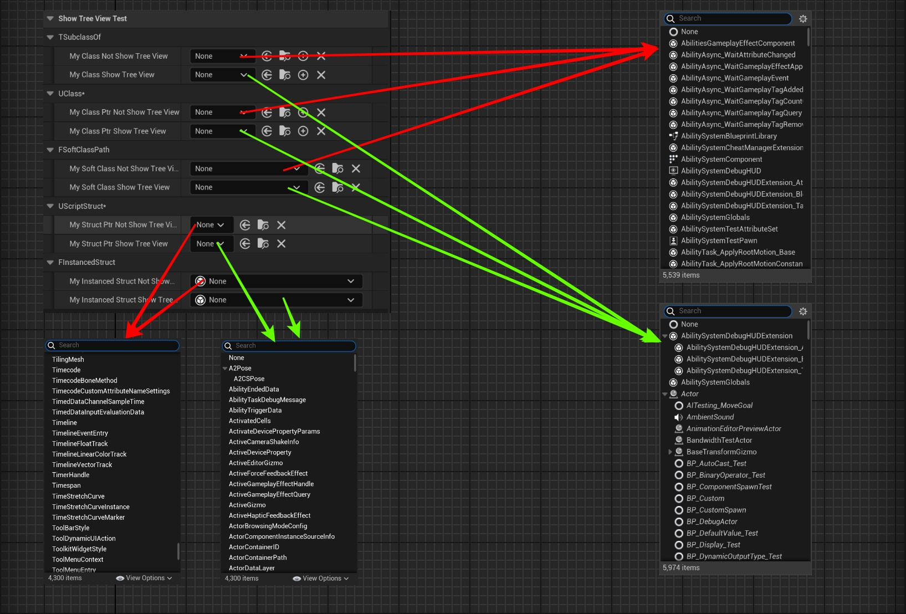

# ShowTreeView

- **功能描述：** 用于选择Class或Struct的属性上，使得在类选取器中显示为树形而不是列表。
- **使用位置：** UPROPERTY
- **引擎模块：** TypePicker
- **元数据类型：** bool
- **限制类型：** TSubClassOf，FSoftClassPath，UClass*，UScriptStruct*，FInstancedStruct 
- **常用程度：** ★★

用于选择Class或Struct的属性上，使得在类选取器中显示为树形而不是列表。

应用的属性类型有TSubClassOf，FSoftClassPath，UClass*，UScriptStruct*，FInstancedStruct 这种用于选择类型的属性。如果是TSoftObjectPtr或者FSoftObjectPath这种用于选择对象的则不起作用。

## 测试代码：

```cpp
	UPROPERTY(EditAnywhere, BlueprintReadWrite, Category = "ShowTreeViewTest|TSubclassOf")
	TSubclassOf<UObject> MyClass_NotShowTreeView;

	UPROPERTY(EditAnywhere, BlueprintReadWrite, Category = "ShowTreeViewTest|TSubclassOf", meta = (ShowTreeView))
	TSubclassOf<UObject> MyClass_ShowTreeView;

	UPROPERTY(EditAnywhere, BlueprintReadWrite, Category = "ShowTreeViewTest|UClass*")
	UClass* MyClassPtr_NotShowTreeView;

	UPROPERTY(EditAnywhere, BlueprintReadWrite, Category = "ShowTreeViewTest|UClass*", meta = (ShowTreeView))
	UClass* MyClassPtr_ShowTreeView;

	UPROPERTY(EditAnywhere, BlueprintReadWrite, Category = "ShowTreeViewTest|FSoftClassPath")
	FSoftClassPath MySoftClass_NotShowTreeView;

	UPROPERTY(EditAnywhere, BlueprintReadWrite, Category = "ShowTreeViewTest|FSoftClassPath", meta = (ShowTreeView))
	FSoftClassPath MySoftClass_ShowTreeView;

	UPROPERTY(EditAnywhere, BlueprintReadWrite, Category = "ShowTreeViewTest|UScriptStruct*")
	UScriptStruct* MyStructPtr_NotShowTreeView;

	UPROPERTY(EditAnywhere, BlueprintReadWrite, Category = "ShowTreeViewTest|UScriptStruct*", meta = (ShowTreeView))
	UScriptStruct* MyStructPtr_ShowTreeView;

	UPROPERTY(EditAnywhere, BlueprintReadWrite, Category = "ShowTreeViewTest|FInstancedStruct")
	FInstancedStruct MyInstancedStruct_NotShowTreeView;

	UPROPERTY(EditAnywhere, BlueprintReadWrite, Category = "ShowTreeViewTest|FInstancedStruct", meta = (ShowTreeView))
	FInstancedStruct MyInstancedStruct_ShowTreeView;
```

## 测试结果：

可见带有ShowTreeView的属性，在弹出的选择框上显示的是树形而不是列表。



## 原理：

在源码中对于TSubClassOf和UClass*有SPropertyEditorClass，对于FSoftClassPath有FSoftClassPathCustomization，对于UScriptStruct*有SPropertyEditorStruct，对于FInstancedStruct 有FInstancedStructDetails来进行UI定制化。

```cpp
void FSoftClassPathCustomization::CustomizeHeader(TSharedRef<IPropertyHandle> InPropertyHandle, FDetailWidgetRow& HeaderRow, IPropertyTypeCustomizationUtils& StructCustomizationUtils)
{
		const bool bShowTreeView = PropertyHandle->HasMetaData("ShowTreeView");
		const bool bHideViewOptions = PropertyHandle->HasMetaData("HideViewOptions");
		
	SNew(SClassPropertyEntryBox)
		.ShowTreeView(bShowTreeView)
		.HideViewOptions(bHideViewOptions)
		.ShowDisplayNames(bShowDisplayNames)
}

void SPropertyEditorClass::Construct(const FArguments& InArgs, const TSharedPtr< FPropertyEditor >& InPropertyEditor)
{
		bShowViewOptions = Property->GetOwnerProperty()->HasMetaData(TEXT("HideViewOptions")) ? false : true;
		bShowTree = Property->GetOwnerProperty()->HasMetaData(TEXT("ShowTreeView"));
		bShowDisplayNames = Property->GetOwnerProperty()->HasMetaData(TEXT("ShowDisplayNames"));
}
void SPropertyEditorStruct::Construct(const FArguments& InArgs, const TSharedPtr< class FPropertyEditor >& InPropertyEditor)
{
		bShowViewOptions = Property->GetOwnerProperty()->HasMetaData(TEXT("HideViewOptions")) ? false : true;
		bShowTree = Property->GetOwnerProperty()->HasMetaData(TEXT("ShowTreeView"));
		bShowDisplayNames = Property->GetOwnerProperty()->HasMetaData(TEXT("ShowDisplayNames"));
}
TSharedRef<SWidget> FInstancedStructDetails::GenerateStructPicker()
{
		const bool bExcludeBaseStruct = StructProperty->HasMetaData(NAME_ExcludeBaseStruct);
		const bool bAllowNone = !(StructProperty->GetMetaDataProperty()->PropertyFlags & CPF_NoClear);
		const bool bHideViewOptions = StructProperty->HasMetaData(NAME_HideViewOptions);
		const bool bShowTreeView = StructProperty->HasMetaData(NAME_ShowTreeView);
}
```
