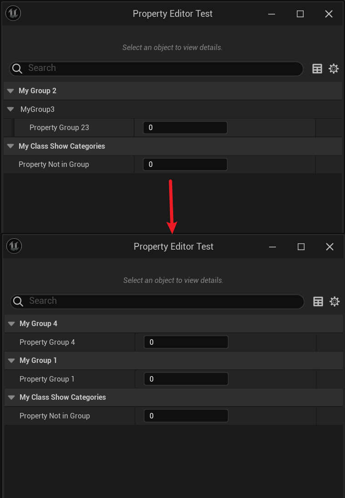

# ShowCategories

- **功能描述：**  在类的ClassDefaults属性面板里显示某些Category的属性。
- **引擎模块：** Category
- **元数据类型：** strings=(abc，"d|e"，"x|y|z")
- **作用机制：** 在Meta中增加[HideCategories](../../../../Meta/DetailsPanel/HideCategories.md)
- **关联项：** [HideCategories](../HideCategories/HideCategories.md)
- **常用程度：★★★**

在类的ClassDefaults属性面板里显示某些Category的属性。使列出的类别的继承自基类的HideCategories说明符无效。

ShowCategories会被UHT分析，但不会被保存到UClass的元数据里去。它作用的方式是可以抹去之前基类设置的HideCategories的属性。ShowCategories可以被子类继承下来。

## 示例代码：

```cpp
/*
(BlueprintType = true, HideCategories = MyGroup1, IncludePath = Class/Display/MyClass_ShowCategories.h, IsBlueprintBase = true, ModuleRelativePath = Class/Display/MyClass_ShowCategories.h)
*/
UCLASS(Blueprintable, hideCategories = MyGroup1)
class INSIDER_API UMyClass_ShowCategories :public UObject
{
	GENERATED_BODY()
public:
	UPROPERTY(EditAnywhere, BlueprintReadWrite, Category = MyGroup1)
		int Property_Group1;
	UPROPERTY(EditAnywhere, BlueprintReadWrite, Category = "MyGroup2 | MyGroup3")
		int Property_Group23;

	UPROPERTY(EditAnywhere, BlueprintReadWrite)
		int Property_NotInGroup;
};

/*
(BlueprintType = true, HideCategories = MyGroup2 | MyGroup3, IncludePath = Class/Display/MyClass_ShowCategories.h, IsBlueprintBase = true, ModuleRelativePath = Class/Display/MyClass_ShowCategories.h)
*/

UCLASS(Blueprintable, showCategories = MyGroup1, hideCategories = "MyGroup2 | MyGroup3")
class INSIDER_API UMyClass_ShowCategoriesChild :public UMyClass_ShowCategories
{
	GENERATED_BODY()
public:

	UPROPERTY(EditAnywhere, BlueprintReadWrite, Category = "MyGroup2")
		int Property_Group2;

	UPROPERTY(EditAnywhere, BlueprintReadWrite, Category = "MyGroup3")
		int Property_Group3;

	UPROPERTY(EditAnywhere, BlueprintReadWrite, Category = MyGroup4)
		int Property_Group4;
};

```

## 示例效果：



## 原理：

其实实际上UHT保存的只在HideCategories里，这点通过对类的元数据查看就可知。

```cpp
void  FEditorCategoryUtils::GetClassShowCategories(const UStruct* Class, TArray<FString>& CategoriesOut)
{
	CategoriesOut.Empty();

	using namespace FEditorCategoryUtilsImpl;
	if (Class->HasMetaData(ClassShowCategoriesMetaKey))
	{
		const FString& ShowCategories = Class->GetMetaData(ClassShowCategoriesMetaKey);
		ShowCategories.ParseIntoArray(CategoriesOut, TEXT(" "), /*InCullEmpty =*/true);

		for (FString& Category : CategoriesOut)
		{
			Category = GetCategoryDisplayString(FText::FromString(Category)).ToString();
		}
	}
}

void FEditorCategoryUtils::GetClassHideCategories(const UStruct* Class, TArray<FString>& CategoriesOut, bool bHomogenize)
{
	CategoriesOut.Empty();

	using namespace FEditorCategoryUtilsImpl;
	if (Class->HasMetaData(ClassHideCategoriesMetaKey))
	{
		const FString& HideCategories = Class->GetMetaData(ClassHideCategoriesMetaKey);

		HideCategories.ParseIntoArray(CategoriesOut, TEXT(" "), /*InCullEmpty =*/true);
		
		if (bHomogenize)
		{
			for (FString& Category : CategoriesOut)
			{
				Category = GetCategoryDisplayString(Category);
			}
		}
	}
}
```