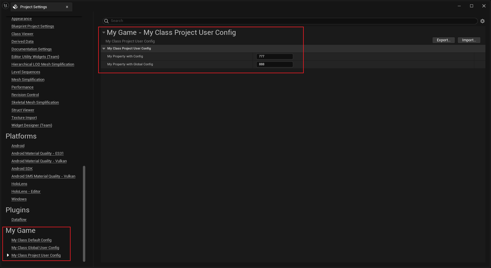

# ProjectUserConfig

- **功能描述：**  指定保存到的配置文件层级是项目用户设置 Project/Config/UserXXX.ini。
- **引擎模块：** Config
- **元数据类型：** bool
- **作用机制：** 在ClassFlags中增加[CLASS_ProjectUserConfig](../../../../Flags/EClassFlags/CLASS_ProjectUserConfig.md)
- **关联项：** [Config](../Config.md)
- **常用程度：★★★**

指定保存到的配置文件层级是项目用户设置 Project/Config/UserXXX.ini。

## 示例代码：

保存的目录是\Hello\Config\UserMyGame.ini

```cpp
UCLASS(Config = MyGame, ProjectUserConfig)
class INSIDER_API UMyClass_ProjectUserConfig :public UDeveloperSettings
{
	GENERATED_BODY()
public:
	/** Gets the settings container name for the settings, either Project or Editor */
	virtual FName GetContainerName() const override { return TEXT("Project"); }
	/** Gets the category for the settings, some high level grouping like, Editor, Engine, Game...etc. */
	virtual FName GetCategoryName() const override { return TEXT("MyGame"); }
	/** The unique name for your section of settings, uses the class's FName. */
	virtual FName GetSectionName() const override { return TEXT("MyProjectGame"); }
public:
	UPROPERTY(EditAnywhere, BlueprintReadWrite, Config)
		int32 MyPropertyWithConfig = 123;

	UPROPERTY(EditAnywhere, BlueprintReadWrite, GlobalConfig)
		int32 MyPropertyWithGlobalConfig = 456;
};

//结果：\Hello\Config\UserMyGame.ini
[/Script/Insider.MyClass_ProjectUserConfig]
MyPropertyWithConfig=777
MyPropertyWithGlobalConfig=888
```

## 示例效果：



## 在源码中搜索：

```cpp
UCLASS(config = Engine, projectuserconfig, meta = (DisplayName = "Rendering Overrides (Local)"))
class ENGINE_API URendererOverrideSettings : public UDeveloperSettings
{
}
```