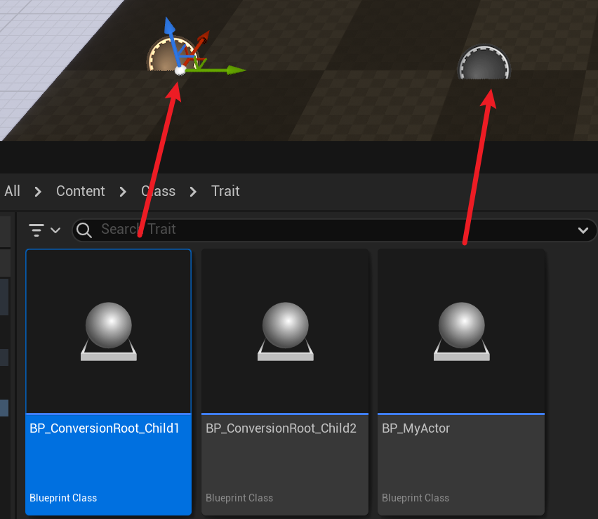

# ConversionRoot

Type: bool
Feature: Trait
Description: 允许Actor在自身以及子类之间做转换
MetaOperation: |=
Meta: IsConversionRoot (../../Meta/Meta/IsConversionRoot.md)
Status: Done

一般是用在Actor上，在Actor转换的时候用来限制转换的级别。比如ASkeletalMeshActor，AStaticMeshActor等。

常常ComponentWrapperClass一起出现。

根据代码来说，meta中的IsConversionRoot会限制只传达到这一层，不继续往根上查找。

只有配有ConversionRoot的Actor才会允许Convert Actor，否则是禁用的。

```cpp
UClass* FActorDetails::GetConversionRoot( UClass* InCurrentClass ) const
{
	UClass* ParentClass = InCurrentClass;

	while(ParentClass)
	{
		if( ParentClass->GetBoolMetaData(FName(TEXT("IsConversionRoot"))) )
		{
			break;
		}
		ParentClass = ParentClass->GetSuperClass();
	}

	return ParentClass;
}

用在：
在关卡中的Actor选择：
关卡中选择一个Actor，然后DetailsPanel里会显示ConverActor属性栏，可以选择另外一个Actor来进行改变。
TSharedRef<SWidget> FActorDetails::MakeConvertMenu( const FSelectedActorInfo& SelectedActorInfo )
这个函数就是用来创建Select Type的Combo Button的菜单的。内部会调用CreateClassPickerConvertActorFilter：

void FActorDetails::CreateClassPickerConvertActorFilter(const TWeakObjectPtr<AActor> ConvertActor, class FClassViewerInitializationOptions* ClassPickerOptions)
Filter->AllowedChildOfRelationship.Add(RootConversionClass);//限定这个基类以下的其他子类

```



在关卡中选择Child1，会允许ConvertActor，在ConverstionRoot的自身以及所有子类之间做转换。


如果是普通的Actor，因为没有定义ConversionRoot，则不能做转换。

