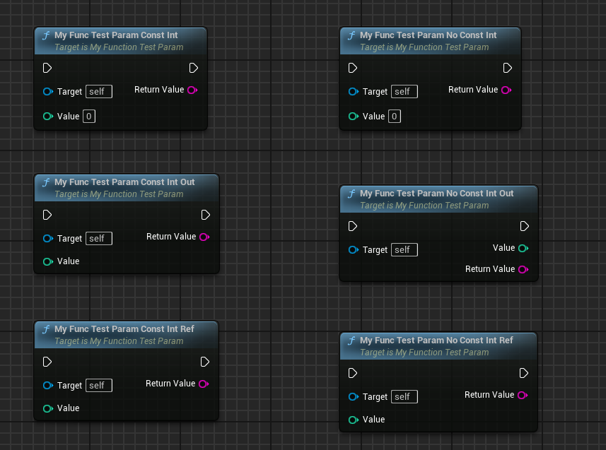

# Const

Description: 不可更改的参数
Type: bool
Feature: Blueprint, Parameter
EPropertyFlagsOperation: |=
EPropertyFlags: CPF_ConstParm (../../Flags/EPropertyFlags/CPF_ConstParm.md)
Meta: NativeConst (../../Meta/Meta/NativeConst.md)
Status: Done

如果在C++代码的参数上直接加const，则会自动的被UHT识别并添加CPF_ConstParm 标志，以及NativeConst元数据。但也可以手动加上UPARAM(const)来强制UHT添加CPF_ConstParm，效果建下面蓝图中的Out节点，把输出参数变成了输入参数。

虽然不知道什么情况下需要手动添加，因此在源码中没有找到实际的用例。

测试代码：

```cpp
//PropertyFlags:	CPF_ConstParm | CPF_Parm | CPF_ZeroConstructor | CPF_IsPlainOldData | CPF_NoDestructor | CPF_HasGetValueTypeHash | CPF_NativeAccessSpecifierPublic 
	UFUNCTION(BlueprintCallable)
	FString MyFuncTestParam_ConstInt(UPARAM(const) int value);

	//PropertyFlags:	CPF_ConstParm | CPF_Parm | CPF_OutParm | CPF_ZeroConstructor | CPF_ReferenceParm | CPF_IsPlainOldData | CPF_NoDestructor | CPF_HasGetValueTypeHash | CPF_NativeAccessSpecifierPublic 
	UFUNCTION(BlueprintCallable)
	FString MyFuncTestParam_ConstIntOut(UPARAM(const) int& value);

	//(NativeConst = )
	//PropertyFlags:	CPF_ConstParm | CPF_Parm | CPF_OutParm | CPF_ZeroConstructor | CPF_ReferenceParm | CPF_IsPlainOldData | CPF_NoDestructor | CPF_HasGetValueTypeHash | CPF_NativeAccessSpecifierPublic 
	UFUNCTION(BlueprintCallable)
	FString MyFuncTestParam_ConstIntRef(UPARAM(const) const int& value);

	//PropertyFlags:	CPF_Parm | CPF_ZeroConstructor | CPF_IsPlainOldData | CPF_NoDestructor | CPF_HasGetValueTypeHash | CPF_NativeAccessSpecifierPublic 
	UFUNCTION(BlueprintCallable)
	FString MyFuncTestParam_NoConstInt(int value);

	//PropertyFlags:	CPF_Parm | CPF_OutParm | CPF_ZeroConstructor | CPF_IsPlainOldData | CPF_NoDestructor | CPF_HasGetValueTypeHash | CPF_NativeAccessSpecifierPublic 
	UFUNCTION(BlueprintCallable)
	FString MyFuncTestParam_NoConstIntOut(int& value);

	//(NativeConst = )
	//PropertyFlags:	CPF_ConstParm | CPF_Parm | CPF_OutParm | CPF_ZeroConstructor | CPF_ReferenceParm | CPF_IsPlainOldData | CPF_NoDestructor | CPF_HasGetValueTypeHash | CPF_NativeAccessSpecifierPublic 
	UFUNCTION(BlueprintCallable)
	FString MyFuncTestParam_NoConstIntRef(const int& value);
```

蓝图节点：



在代码中实际出现const，就会增加CPF_ConstParam Flag。原理代码：

```cpp
E:\P4V\Engine\Source\Programs\Shared\EpicGames.UHT\Parsers\UhtPropertyParser.cs 1030

if (propertySettings.PropertyCategory != UhtPropertyCategory.Member && !isTemplateArgument)
{
	// const before the variable type support (only for params)
	if (tokenReader.TryOptional("const"))
	{
		propertySettings.PropertyFlags |= EPropertyFlags.ConstParm;
		propertySettings.MetaData.Add(UhtNames.NativeConst, "");
	}
}
```