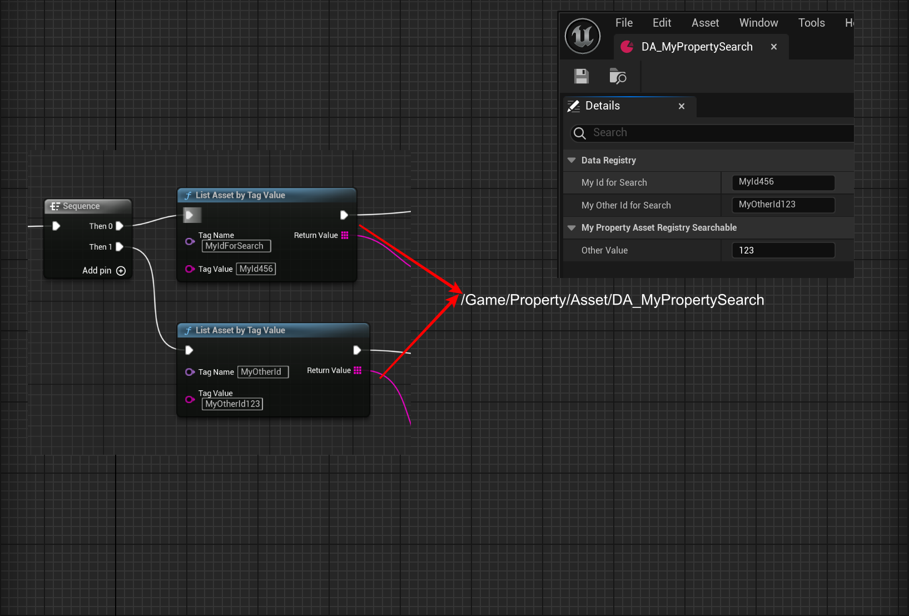

# AssetRegistrySearchable

Description: 标记该属性可以作为AssetRegistry的Tag和Value值来进行资产的过滤搜索，不能用在结构属性上
Type: bool
Feature: Behavior
EPropertyFlags: CPF_AssetRegistrySearchable (../../Flags/EPropertyFlags/CPF_AssetRegistrySearchable.md)
MetaOperation: Related
Meta: RequiredAssetDataTags (../../Meta/Meta/RequiredAssetDataTags.md), DisallowedAssetDataTags (../../Meta/Meta/DisallowedAssetDataTags.md)
Status: Done

在UObject::GetAssetRegistryTags中调用使用，把该属性的值作为AssetData的Tag供给AssetRegistry

子类也可以重载GetAssetRegistryTags以提供自定义的Tag。

测试代码：

```cpp
UCLASS(Blueprintable, BlueprintType)
class INSIDER_API UMyProperty_AssetRegistrySearchable :public UDataAsset
{
public:
	GENERATED_BODY()
public:
	UPROPERTY(EditAnywhere, BlueprintReadWrite, AssetRegistrySearchable, Category = DataRegistry)
		FString MyIdForSearch;
	UPROPERTY(EditAnywhere, BlueprintReadWrite)
		int32 OtherValue = 123;
	UPROPERTY(EditAnywhere, BlueprintReadWrite, Category = DataRegistry)
		FString MyOtherIdForSearch;
public:
	virtual void GetAssetRegistryTags(FAssetRegistryTagsContext Context) const override
	{
		//called on CDO and instances
		Super::GetAssetRegistryTags(Context);
		Context.AddTag(FAssetRegistryTag(TEXT("MyOtherId"),MyOtherIdForSearch, UObject::FAssetRegistryTag::TT_Alphabetical));
	}
};

```

测试结果：

在EditorUtilityWidget中测试，可见ListAssetByTagValue都可以搜索找到该Asset。



测试的蓝图代码，也可用IAssetRegistry::Get()->GetAssetsByTagValues(tagValues,outAssets);来进行搜索，不过要注意搜索的时机要在AssetRegistry加载之后，AssetRegistry如果是Runtime要记得序列化到磁盘

```cpp
//DefaultEngine.ini
[AssetRegistry]
bSerializeAssetRegistry=true
```

原理：

可查看GetAssetRegistryTags的函数的实现和调用。