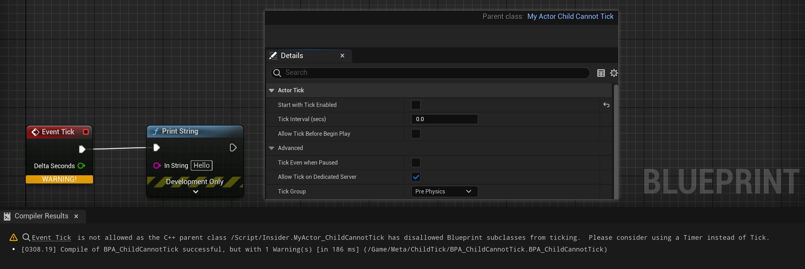

# ChildCanTick

- **Functional Description:** Indicates that its Blueprint subclasses are permitted to receive the Tick event
- **Usage Location:** UCLASS
- **Engine Module:** Actor
- **Metadata Type:** bool
- **Restriction Type:** Subclasses of Actor or ActorComponent
- **Associated Items:** [ChildCannotTick](../ChildCannotTick.md)
- **Commonality:** ★★★

To override the Tick event function in a Blueprint, this check is performed only at compile time.

```cpp
//(BlueprintType = true, ChildCannotTick = , IncludePath = Class/Blueprint/MyActor_ChildTick.h, IsBlueprintBase = true, ModuleRelativePath = Class/Blueprint/MyActor_ChildTick.h)
UCLASS(Blueprintable,meta=(ChildCanTick))
class INSIDER_API AMyActor_ChildCanTick : public AActor
{
	GENERATED_BODY()
public:
	AMyActor_ChildCanTick()
	{
		PrimaryActorTick.bCanEverTick = false;
	}
};

//(BlueprintType = true, ChildCanTick = , IncludePath = Class/Blueprint/MyActor_ChildTick.h, IsBlueprintBase = true, ModuleRelativePath = Class/Blueprint/MyActor_ChildTick.h)
UCLASS(Blueprintable,meta=(ChildCanTick))
class INSIDER_API UMyActorComponent_ChildCanTick : public UActorComponent
{
	GENERATED_BODY()
public:
};

//(BlueprintType = true, ChildCannotTick = , IncludePath = Class/Blueprint/MyActor_ChildTick.h, IsBlueprintBase = true, ModuleRelativePath = Class/Blueprint/MyActor_ChildTick.h)
UCLASS(Blueprintable,meta=(ChildCannotTick))
class INSIDER_API AMyActor_ChildCannotTick : public AActor
{
	GENERATED_BODY()
public:
};

//(BlueprintType = true, ChildCannotTick = , IncludePath = Class/Blueprint/MyActor_ChildTick.h, IsBlueprintBase = true, ModuleRelativePath = Class/Blueprint/MyActor_ChildTick.h)
UCLASS(Blueprintable,meta=(ChildCannotTick))
class INSIDER_API UMyActorComponent_ChildCannotTick : public UActorComponent
{
	GENERATED_BODY()
public:
};
```

Test within the Blueprint Actor or ActorComponent:

Also, be aware that this assessment is unrelated to whether the Tick is enabled in the blueprint.




Even though PrimaryActorTick.bCanEverTick is manually disabled in the AMyActor_ChildCanTick class, subclasses can still tick normally (the bCanEverTick can be re-enabled internally during compilation).


## The logical reasoning within the source code:

There are three conditions for enabling bCanEverTick to be true: first, EngineSettings->bCanBlueprintsTickByDefault; second, the parent class is AActor or UActorComponent itself; and third, there is a ChildCanTick attribute on the C++ base class.

```cpp
void FKismetCompilerContext::SetCanEverTick() const
{
// RECEIVE TICK
if (!TickFunction->bCanEverTick)
{
	// Make sure that both AActor and UActorComponent have the same name for their tick method
	static FName ReceiveTickName(GET_FUNCTION_NAME_CHECKED(AActor, ReceiveTick));
	static FName ComponentReceiveTickName(GET_FUNCTION_NAME_CHECKED(UActorComponent, ReceiveTick));

	if (const UFunction* ReceiveTickEvent = FKismetCompilerUtilities::FindOverriddenImplementableEvent(ReceiveTickName, NewClass))
	{
		// We have a tick node, but are we allowed to?

		const UEngine* EngineSettings = GetDefault<UEngine>();
		const bool bAllowTickingByDefault = EngineSettings->bCanBlueprintsTickByDefault;

		const UClass* FirstNativeClass = FBlueprintEditorUtils::FindFirstNativeClass(NewClass);
		const bool bHasCanTickMetadata = (FirstNativeClass != nullptr) && FirstNativeClass->HasMetaData(FBlueprintMetadata::MD_ChildCanTick);
		const bool bHasCannotTickMetadata = (FirstNativeClass != nullptr) && FirstNativeClass->HasMetaData(FBlueprintMetadata::MD_ChildCannotTick);
		const bool bHasUniversalParent = (FirstNativeClass != nullptr) && ((AActor::StaticClass() == FirstNativeClass) || (UActorComponent::StaticClass() == FirstNativeClass));

		if (bHasCanTickMetadata && bHasCannotTickMetadata)
		{
			// User error: The C++ class has conflicting metadata
			const FString ConlictingMetadataWarning = FText::Format(
				LOCTEXT("HasBothCanAndCannotMetadataFmt", "Native class %s has both '{0}' and '{1}' metadata specified, they are mutually exclusive and '{1}' will win."),
				FText::FromString(FirstNativeClass->GetPathName()),
				FText::FromName(FBlueprintMetadata::MD_ChildCanTick),
				FText::FromName(FBlueprintMetadata::MD_ChildCannotTick)
			).ToString();
			MessageLog.Warning(*ConlictingMetadataWarning);
		}

		if (bHasCannotTickMetadata)
		{
			// This could only happen if someone adds bad metadata to AActor or UActorComponent directly
			check(!bHasUniversalParent);

			// Parent class has forbidden us to tick
			const FString NativeClassSaidNo = FText::Format(
				LOCTEXT("NativeClassProhibitsTickingFmt", "@@ is not allowed as the C++ parent class {0} has disallowed Blueprint subclasses from ticking.  Please consider using a Timer instead of Tick."),
				FText::FromString(FirstNativeClass->GetPathName())
			).ToString();
			MessageLog.Warning(*NativeClassSaidNo, FindLocalEntryPoint(ReceiveTickEvent));
		}
		else
		{
			if (bAllowTickingByDefault || bHasUniversalParent || bHasCanTickMetadata)
			{
				// We're allowed to tick for one reason or another
				TickFunction->bCanEverTick = true;
			}
			else
			{
				// Nothing allowing us to tick
				const FString ReceiveTickEventWarning = FText::Format(
					LOCTEXT("ReceiveTick_CanNeverTickFmt", "@@ is not allowed for Blueprints based on the C++ parent class {0}, so it will never Tick!"),
					FText::FromString(FirstNativeClass ? *FirstNativeClass->GetPathName() : TEXT("<null>"))
				).ToString();
				MessageLog.Warning(*ReceiveTickEventWarning, FindLocalEntryPoint(ReceiveTickEvent));

				const FString ReceiveTickEventRemedies = FText::Format(
					LOCTEXT("ReceiveTick_CanNeverTickRemediesFmt", "You can solve this in several ways:\n  1) Consider using a Timer instead of Tick.\n  2) Add meta=({0}) to the parent C++ class\n  3) Reparent the Blueprint to AActor or UActorComponent, which can always tick."),
					FText::FromName(FBlueprintMetadata::MD_ChildCanTick)
				).ToString();
				MessageLog.Warning(*ReceiveTickEventRemedies);
			}
		}
	}
}
}
```