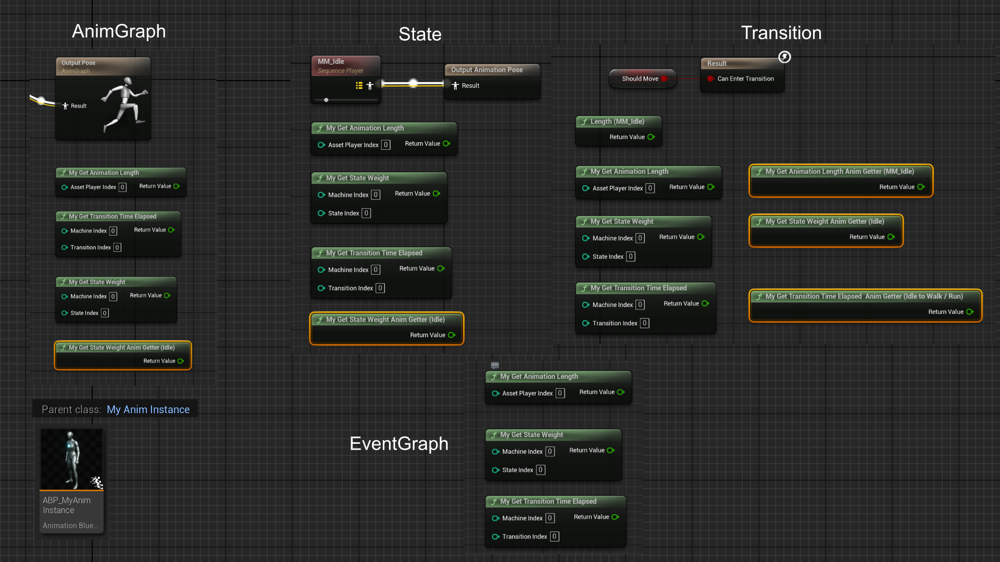

# AnimGetter

- **Function Description:** Designates the function of specified UAnimInstance and its subclasses as an AnimGetter function.
- **Usage Location:** UFUNCTION
- **Engine Module:** AnimationGraph
- **Metadata Type:** bool
- **Restricted Types:** Functions of UAnimInstance and its subclasses
- **Associated Items:** [GetterContext](../GetterContext/GetterContext.md)
- **Commonly Used:** ★★★

Designates the function of specified UAnimInstance and its subclasses as an AnimGetter function.

- In certain scenarios, UAnimInstance is inherited to create a custom animation blueprint subclass, where optimizations or additional functional methods can be implemented.
- An AnimGetter is essentially a function that is recognized and wrapped by the UK2Node_AnimGetter, within the scope of UAnimInstance and its subclasses (i.e., animation blueprints).
- AnimGetter also offers two additional features: it automatically populates the AssetPlayerIndex, MachineIndex, StateIndex, TransitionIndex, and parameters within the function based on the current context. It also restricts the function to be callable only within certain blueprints, based on the GetterContext. These conveniences and checks are not available in standard blueprint functions, making them less intelligent.
- To qualify as an AnimGetter, it must also possess:
    - AnimGetter, naturally
    - BlueprintThreadSafe, to be callable within animation blueprints and thread-safe
    - BlueprintPure, to function as a value-getting function
    - BlueprintInternalUseOnly = "true", to prevent generating a default blueprint node and only use the one wrapped by UK2Node_AnimGetter.

## Test Code:

```cpp
UCLASS(BlueprintType)
class INSIDER_API UMyAnimInstance :public UAnimInstance
{
	GENERATED_BODY()
public:
	UFUNCTION(BlueprintPure, Category = "Animation|Insider", meta = (BlueprintInternalUseOnly = "true", AnimGetter, BlueprintThreadSafe))
	float MyGetAnimationLength_AnimGetter(int32 AssetPlayerIndex);

	UFUNCTION(BlueprintPure, Category = "Animation|Insider", meta = (BlueprintThreadSafe))
	float MyGetAnimationLength(int32 AssetPlayerIndex);
public:
	UFUNCTION(BlueprintPure, Category = "Animation|Insider", meta = (BlueprintInternalUseOnly = "true", AnimGetter, BlueprintThreadSafe))
	float MyGetStateWeight_AnimGetter(int32 MachineIndex, int32 StateIndex);

	UFUNCTION(BlueprintPure, Category = "Animation|Insider", meta = (BlueprintThreadSafe))
	float MyGetStateWeight(int32 MachineIndex, int32 StateIndex);
public:
	UFUNCTION(BlueprintPure, Category = "Animation|Insider", meta = (BlueprintInternalUseOnly = "true", AnimGetter, BlueprintThreadSafe))
	float MyGetTransitionTimeElapsed_AnimGetter(int32 MachineIndex, int32 TransitionIndex);

	UFUNCTION(BlueprintPure, Category = "Animation|Insider", meta = (BlueprintThreadSafe))
	float MyGetTransitionTimeElapsed(int32 MachineIndex, int32 TransitionIndex);
};

```

## Test Results:

Define AnimGetter functions that use AssetPlayerIndex, MachineIndex, StateIndex, TransitionIndex, as well as ordinary blueprint functions for comparison. Examine their usage in various scopes within animation blueprints.

- It can be seen that no matter what scope, ordinary blueprint functions can be called (after all, there is no Context check). In addition, parameters such as AssetPlayerIndex are not automatically filled in, which is almost useless because users don't really know how to fill in these Indexes by hand. It is best to leave it to the compiler.
- The highlighted functions in the diagram are the callable AnimGetter functions. A closer examination reveals that the rule is that only those functions that can correctly populate parameters like AssetPlayerIndex can be called. Thus, the most callable are within Transitions, as this is the leaf node with animations, state machines, and Transition nodes.



## Principle:

The functionality of analyzing the AnimGetter tag on a function and generating blueprint nodes is primarily located within the UK2Node_AnimGetter class. Feel free to inspect it yourself.

```cpp
void UK2Node_AnimGetter::GetMenuActions(FBlueprintActionDatabaseRegistrar& ActionRegistrar) const
{
			TArray<UFunction*> AnimGetters;
			for(TFieldIterator<UFunction> FuncIter(BPClass) ; FuncIter ; ++FuncIter)
			{
				UFunction* Func = *FuncIter;

				if(Func->HasMetaData(TEXT("AnimGetter")) && Func->HasAnyFunctionFlags(FUNC_Native))
				{
					AnimGetters.Add(Func);
				}
			}
}
```