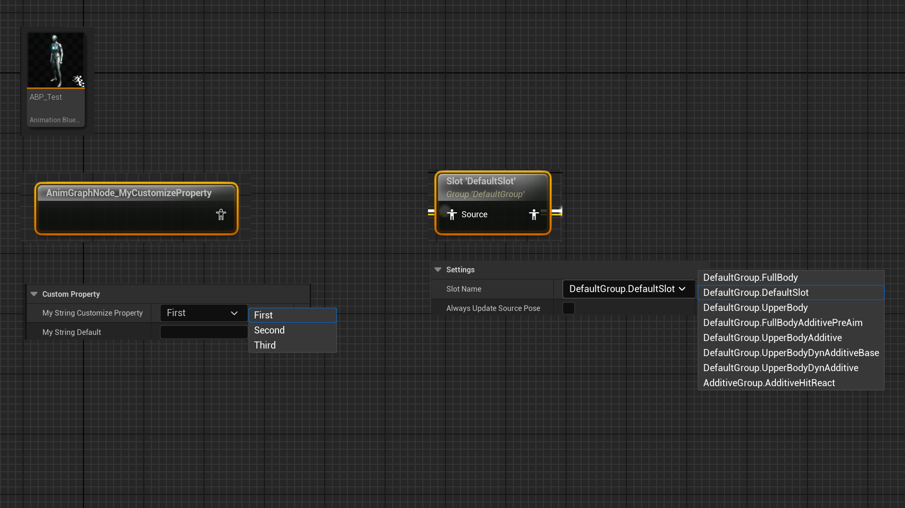

# CustomizeProperty

- **Function Description:** Used on member properties of FAnimNode to instruct the editor not to generate the default Details panel control for them. Custom controls will be created later in DetailsCustomization.
- **Usage Location:** UPROPERTY
- **Engine Module:** AnimationGraph
- **Metadata Type:** bool
- **Restricted Type:** Attributes within FAnimNode
- **Commonality:** ★

Applied to member properties of FAnimNode, this tells the editor not to generate the default Details panel control for them. Custom controls will be created in DetailsCustomization subsequently.

Its function is somewhat similar to AllowEditInlineCustomization, both serving as markers to indicate that the editor will customize elsewhere, thus no default Details panel control needs to be generated for them.

## Example in Source Code:

There are numerous examples in the source code. Commonly, properties on nodes in AnimBP require specific customization in the Details panel. The most typical example is the Slot node, where SlotName is merely a FString type, but it is displayed as a ComboString in the Details panel. This is because it is tagged with CustomizeProperty, instructing the default animation node Details panel generator (FAnimGraphNodeDetails) not to create an edit control for this property initially, and instead, a custom UI will be created for SlotName within its own customization (FAnimGraphNodeSlotDetails).

```cpp
struct FAnimNode_Slot : public FAnimNode_Base
{
	UPROPERTY(EditAnywhere, BlueprintReadWrite, Category=Settings, meta=(CustomizeProperty))
	FName SlotName;
}

void FPersonaModule::CustomizeBlueprintEditorDetails(const TSharedRef<class IDetailsView>& InDetailsView, FOnInvokeTab InOnInvokeTab)
{
	InDetailsView->RegisterInstancedCustomPropertyLayout(UAnimGraphNode_Slot::StaticClass(),
		FOnGetDetailCustomizationInstance::CreateStatic(&FAnimGraphNodeSlotDetails::MakeInstance, InOnInvokeTab));

	InDetailsView->SetExtensionHandler(MakeShared<FAnimGraphNodeBindingExtension>());
}

```

## Test Code:

```cpp
USTRUCT(BlueprintInternalUseOnly)
struct INSIDER_API FAnimNode_MyCustomProperty : public FAnimNode_Base
{
	GENERATED_USTRUCT_BODY()
public:
	UPROPERTY(EditAnywhere, BlueprintReadWrite, Category = CustomProperty)
	FString MyString_Default;
	UPROPERTY(EditAnywhere, BlueprintReadWrite, Category = CustomProperty, meta = (CustomizeProperty))
	FString MyString_CustomizeProperty;
	UPROPERTY(EditAnywhere, BlueprintReadWrite, Category = CustomProperty, meta = (CustomizeProperty))
	FString MyString_CustomizeProperty_Other;
};

UCLASS()
class INSIDEREDITOR_API UAnimGraphNode_MyCustomProperty : public UAnimGraphNode_Base
{
	GENERATED_UCLASS_BODY()

	UPROPERTY(EditAnywhere, Category = Settings)
	FAnimNode_MyCustomProperty Node;
};

//Create another customization to generate a custom UI
void FMyAnimNode_MyCustomPropertyCustomization::CustomizeDetails(class IDetailLayoutBuilder& DetailBuilder)
{
	TSharedPtr<IPropertyHandle> PropertyHandle = DetailBuilder.GetProperty(TEXT("Node.MyString_CustomProperty"));

	//Just for test
	ComboListItems.Empty();
	ComboListItems.Add(MakeShareable(new FString(TEXT("First"))));
	ComboListItems.Add(MakeShareable(new FString(TEXT("Second"))));
	ComboListItems.Add(MakeShareable(new FString(TEXT("Third"))));
	const TSharedPtr<FString> ComboBoxSelectedItem = ComboListItems[0];

	IDetailCategoryBuilder& Group = DetailBuilder.EditCategory(TEXT("CustomProperty"));
	Group.AddCustomRow(INVTEXT("CustomProperty"))
		.NameContent()
		[
			PropertyHandle->CreatePropertyNameWidget()
		]
		.ValueContent()
		[
			SNew(STextComboBox)
				.OptionsSource(&ComboListItems)
				.InitiallySelectedItem(ComboBoxSelectedItem)
				.ContentPadding(2.f)
				.ToolTipText(FText::FromString(*ComboBoxSelectedItem))
		];
}

//Register the customization
PropertyModule.RegisterCustomClassLayout(TEXT("AnimGraphNode_MyCustomProperty"), FOnGetDetailCustomizationInstance::CreateStatic(&FMyAnimNode_MyCustomPropertyCustomization::MakeInstance));

```

## Test Results:

The effect of SlotName is as shown on the right.

Our mimicked example shows that MyString_Default remains just a default String, while MyString_CustomizeProperty has a custom UI created for it.

For comparison, MyString_CustomizeProperty_Other is marked with CustomizeProperty but no UI is created for it, so it does not appear, indicating that the engine's default mechanism skips the UI creation process for it.



## Principle:

CustomizeProperty actually changes the Pin's bPropertyIsCustomized attribute (as reflected in GetRecordDefaults), and during the creation process, it does not create a default widget, which can be deduced from the bPropertyIsCustomized check in CustomizeDetails.

```cpp
void FAnimBlueprintNodeOptionalPinManager::GetRecordDefaults(FProperty* TestProperty, FOptionalPinFromProperty& Record) const
{
	const UAnimationGraphSchema* Schema = GetDefault<UAnimationGraphSchema>();

	// Determine if this is a pose or array of poses
	FArrayProperty* ArrayProp = CastField<FArrayProperty>(TestProperty);
	FStructProperty* StructProp = CastField<FStructProperty>(ArrayProp ? ArrayProp->Inner : TestProperty);
	const bool bIsPoseInput = (StructProp  && StructProp->Struct->IsChildOf(FPoseLinkBase::StaticStruct()));

	//@TODO: Error if they specified two or more of these flags
	const bool bAlwaysShow = TestProperty->HasMetaData(Schema->NAME_AlwaysAsPin) || bIsPoseInput;
	const bool bOptional_ShowByDefault = TestProperty->HasMetaData(Schema->NAME_PinShownByDefault);
	const bool bOptional_HideByDefault = TestProperty->HasMetaData(Schema->NAME_PinHiddenByDefault);
	const bool bNeverShow = TestProperty->HasMetaData(Schema->NAME_NeverAsPin);
	const bool bPropertyIsCustomized = TestProperty->HasMetaData(Schema->NAME_CustomizeProperty);
	const bool bCanTreatPropertyAsOptional = CanTreatPropertyAsOptional(TestProperty);

	Record.bCanToggleVisibility = bCanTreatPropertyAsOptional && (bOptional_ShowByDefault || bOptional_HideByDefault);
	Record.bShowPin = bAlwaysShow || bOptional_ShowByDefault;
	Record.bPropertyIsCustomized = bPropertyIsCustomized;
}

//This is the property that appears when a node is selected in AnimBP and then viewed in the Details panel on the right
void FAnimGraphNodeDetails::CustomizeDetails(class IDetailLayoutBuilder& DetailBuilder)
{
		// sometimes because of order of customization
		// this gets called first for the node you'd like to customize
		// then the above statement won't work
		// so you can mark certain property to have meta data "CustomizeProperty"
		// which will trigger below statement
		if (OptionalPin.bPropertyIsCustomized)
		{
						continue;
		}
		TSharedRef<SWidget> InternalCustomWidget = CreatePropertyWidget(TargetProperty, TargetPropertyHandle.ToSharedRef(), AnimGraphNode->GetClass());
}
```