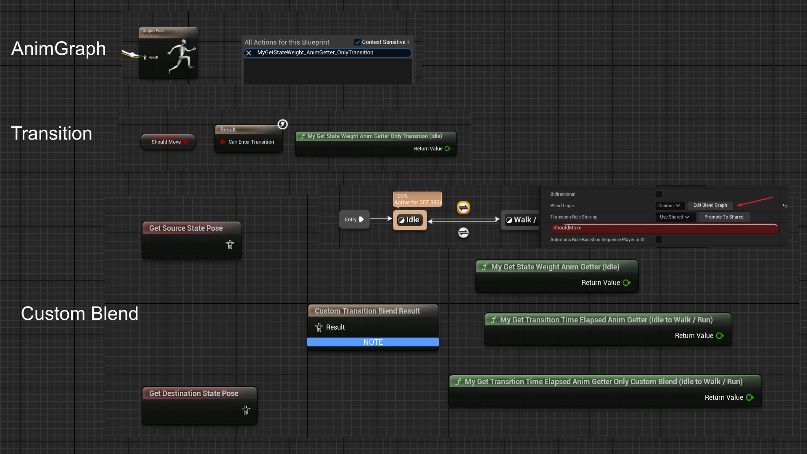

# GetterContext

- **Function Description:** Further specifies where the AnimGetter function can be utilized; if left blank, it is assumed to be available everywhere.
- **Usage Location:** UFUNCTION
- **Engine Module:** AnimationGraph
- **Metadata Type:** string="abc"
- **Restriction Type:** AnimGetter function of UAnimInstance and its subclasses
- **Associated Items:** [AnimGetter](../AnimGetter/AnimGetter.md)
- **Commonality:** ★★

Continuing to specify where the AnimGetter function can be used, if not filled, it can be used universally.

Options include: Transition, CustomBlend, AnimGraph.

## Source Code Comments:

```cpp
	 * A context string can be provided in the GetterContext metadata and can contain any (or none) of the
	 * following entries separated by a pipe (|)
	 * Transition  - Only available in a transition rule
	 * AnimGraph   - Only available in an animgraph (also covers state anim graphs)
	 * CustomBlend - Only available in a custom blend graph
```

## Test Code:

```cpp
UFUNCTION(BlueprintPure, Category = "Animation|Insider", meta = (BlueprintThreadSafe))
float MyGetStateWeight(int32 MachineIndex, int32 StateIndex);
public:
UFUNCTION(BlueprintPure, Category = "Animation|Insider", meta = (BlueprintInternalUseOnly = "true", AnimGetter, GetterContext = "Transition", BlueprintThreadSafe))
float MyGetStateWeight_AnimGetter_OnlyTransition(int32 MachineIndex, int32 StateIndex);

UFUNCTION(BlueprintPure, Category = "Animation|Insider", meta = (BlueprintInternalUseOnly = "true", AnimGetter, GetterContext = "CustomBlend", BlueprintThreadSafe))
float MyGetTransitionTimeElapsed_AnimGetter_OnlyCustomBlend(int32 MachineIndex, int32 TransitionIndex);
```

## Test Results:

This diagram should be compared with the one in AnimGetter for review.

The first point of focus is on MyGetStateWeight_AnimGetter_OnlyTransition within AnimGraph. If GetterContext is not marked, it can be invoked, but with the marking, it can only be called within Transition. It is also noted that this function cannot be called in CustomBlend.

The second point is in CustomBlend. The steps to operate are to change the detail panel on the right side of the Rule to Custom and then enter the CustomBlend blueprint. In this blueprint, MyGetStateWeight can be invoked as GetterContext is not specified. MyGetTransitionTimeElapsed_AnimGetter_OnlyCustomBlend can now be called.



## Principle:

The function to determine whether it can be called is as follows.

```cpp
bool UK2Node_AnimGetter::IsContextValidForSchema(const UEdGraphSchema* Schema) const
{
	if(Contexts.Num() == 0)
	{
		// Valid in all graphs
		return true;
	}

	for(const FString& Context : Contexts)
	{
		UClass* ClassToCheck = nullptr;
		if(Context == TEXT("CustomBlend"))
		{
			ClassToCheck = UAnimationCustomTransitionSchema::StaticClass();
		}

		if(Context == TEXT("Transition"))
		{
			ClassToCheck = UAnimationTransitionSchema::StaticClass();
		}

		if(Context == TEXT("AnimGraph"))
		{
			ClassToCheck = UAnimationGraphSchema::StaticClass();
		}

		return Schema->GetClass() == ClassToCheck;
	}

	return false;
}
```