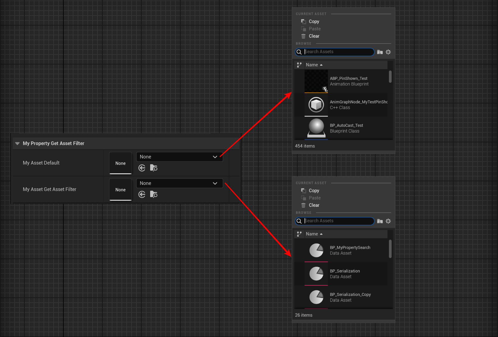

# GetAssetFilter

- **Function Description:** Specifies a UFUNCTION to filter out and exclude optional resources for a UObject* attribute.
- **Usage Location:** UPROPERTY
- **Engine Module:** Asset Property
- **Metadata Type:** string="abc"
- **Restriction Type:** UObject*
- **Commonliness:** ★★★

Specifies a UFUNCTION to filter out and exclude optional resources for a UObject* attribute.

- The specified function name must be a UFUNCTION defined within this class.
- The prototype of the function is bool FuncName ( const FAssetData& AssetData ) const; and returns true to exclude the asset.
- This provides a method for users to customize asset filtering.

## Test Code:

```cpp
UCLASS(Blueprintable, BlueprintType)
class INSIDER_API UMyProperty_GetAssetFilter :public UDataAsset
{
public:
	GENERATED_BODY()
public:
	UPROPERTY(EditAnywhere, BlueprintReadWrite)
	UObject* MyAsset_Default;
	UPROPERTY(EditAnywhere, BlueprintReadWrite, meta = (GetAssetFilter = "IsShouldFilterAsset"))
	UObject* MyAsset_GetAssetFilter;
public:
	UFUNCTION()
	bool IsShouldFilterAsset(const FAssetData& AssetData)
	{
		return !AssetData.IsInstanceOf<UDataAsset>();
	}
};
```

## Test Effects:

It can be observed that after MyAsset_GetAssetFilter performs the filtering, only assets of type DataAsset are allowed.



## Principle:

In SPropertyEditorAsset (which corresponds to properties of type UObject), there is a check on the meta for GetAssetFilter, from which the function obtained, it is attached to the callback for asset exclusion.

```cpp
void SPropertyEditorAsset::Construct(const FArguments& InArgs, const TSharedPtr<FPropertyEditor>& InPropertyEditor)
{
	if (Property && Property->GetOwnerProperty()->HasMetaData("GetAssetFilter"))
{
	// Add MetaData asset filter
	const FString GetAssetFilterFunctionName = Property->GetOwnerProperty()->GetMetaData("GetAssetFilter");
	if (!GetAssetFilterFunctionName.IsEmpty())
	{
		TArray<UObject*> ObjectList;
		if (PropertyEditor.IsValid())
		{
			PropertyEditor->GetPropertyHandle()->GetOuterObjects(ObjectList);
		}
		else if (PropertyHandle.IsValid())
		{
			PropertyHandle->GetOuterObjects(ObjectList);
		}
		for (UObject* Object : ObjectList)
		{
			const UFunction* GetAssetFilterFunction = Object ? Object->FindFunction(*GetAssetFilterFunctionName) : nullptr;
			if (GetAssetFilterFunction)
			{
				AppendOnShouldFilterAssetCallback(FOnShouldFilterAsset::CreateUFunction(Object, GetAssetFilterFunction->GetFName()));
			}
		}
	}
}
}
```