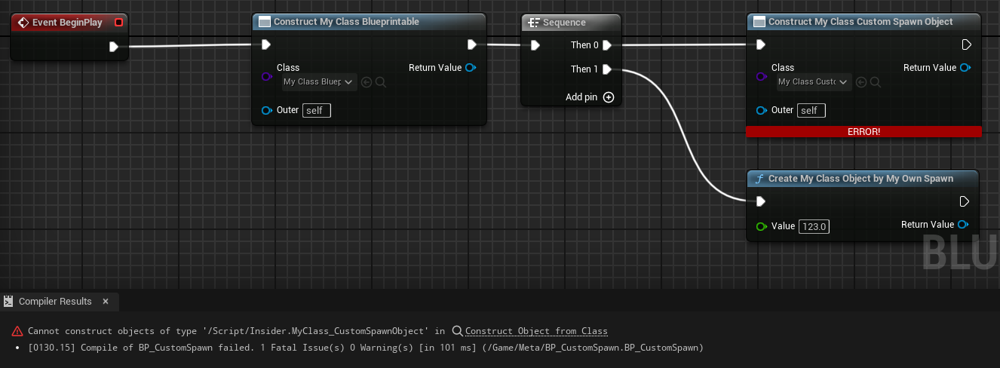

# DontUseGenericSpawnObject

- **Function Description:** Prevent the use of the Generic Create Object node in blueprints from instantiating objects of this class.
- **Usage Location:** UCLASS
- **Engine Module:** Blueprint
- **Metadata Type:** boolean
- **Restriction Type:** When the BlueprintType class is neither an Actor nor an ActorComponent
- **Commonality:** ★★

Used to inhibit the construction of this class using the generic ConstructObject Blueprint node. Typical examples in the source code include UDragDropOperation and UUserWidget; the former is created by the specialized node UK2Node_CreateDragDropOperation (which internally calls UWidgetBlueprintLibrary::CreateDragDropOperation), and the latter is created by CreateWidget. Therefore, the typical use case is to create a custom New function to instantiate the object yourself.

## Test Code:

```cpp
UCLASS(Blueprintable,meta=(DontUseGenericSpawnObject="true"))
class INSIDER_API UMyClass_CustomSpawnObject :public UObject
{
	GENERATED_BODY()
public:
	UPROPERTY(BlueprintReadWrite,EditAnywhere)
	float MyFloat;

	UFUNCTION(BlueprintCallable)
	static UMyClass_CustomSpawnObject* CreateMyClassObjectByMyOwnSpawn(float value)
	{
		UMyClass_CustomSpawnObject* obj= NewObject<UMyClass_CustomSpawnObject>();
		obj->MyFloat=value;
		return obj;
	}
};
```

## Test Code:



## 测试效果:

The presence of the DontUseGenericSpawnObject metadata is checked in advance. Since the GetBoolMetaData function is used, the value must be explicitly set to "true"

```cpp
struct FK2Node_GenericCreateObject_Utils
{
	static bool CanSpawnObjectOfClass(TSubclassOf<UObject> ObjectClass, bool bAllowAbstract)
	{
		// Initially include types that meet the basic requirements.
		// Note: CLASS_Deprecated is an inherited class flag, so any subclass of an explicitly-deprecated class also cannot be spawned.
		bool bCanSpawnObject = (nullptr != *ObjectClass)
			&& (bAllowAbstract || !ObjectClass->HasAnyClassFlags(CLASS_Abstract))
			&& !ObjectClass->HasAnyClassFlags(CLASS_Deprecated | CLASS_NewerVersionExists);

		// UObject is a special case where if we are allowing abstract we are going to allow it through even though it doesn't have BlueprintType on it
		if (bCanSpawnObject && (!bAllowAbstract || (*ObjectClass != UObject::StaticClass())))
		{
			static const FName BlueprintTypeName(TEXT("BlueprintType"));
			static const FName NotBlueprintTypeName(TEXT("NotBlueprintType"));
			static const FName DontUseGenericSpawnObjectName(TEXT("DontUseGenericSpawnObject"));

			auto IsClassAllowedLambda = [](const UClass* InClass)
			{
				return InClass != AActor::StaticClass()
					&& InClass != UActorComponent::StaticClass();
			};

			// Exclude all types in the initial set by default.
			bCanSpawnObject = false;
			const UClass* CurrentClass = ObjectClass;

			// Climb up the class hierarchy and look for "BlueprintType." If "NotBlueprintType" is seen first, or if the class is not allowed, then stop searching.
			while (!bCanSpawnObject && CurrentClass != nullptr && !CurrentClass->GetBoolMetaData(NotBlueprintTypeName) && IsClassAllowedLambda(CurrentClass))
			{
				// Include any type that either includes or inherits 'BlueprintType'
				bCanSpawnObject = CurrentClass->GetBoolMetaData(BlueprintTypeName);

				// Stop searching if we encounter 'BlueprintType' with 'DontUseGenericSpawnObject'
				if (bCanSpawnObject && CurrentClass->GetBoolMetaData(DontUseGenericSpawnObjectName))
				{
					bCanSpawnObject = false;
					break;
				}

				CurrentClass = CurrentClass->GetSuperClass();
			}

			// If we validated the given class, continue walking up the hierarchy to make sure we exclude it if it's an Actor or ActorComponent derivative.
			while (bCanSpawnObject && CurrentClass != nullptr)
			{
				bCanSpawnObject &= IsClassAllowedLambda(CurrentClass);

				CurrentClass = CurrentClass->GetSuperClass();
			}
		}

		return bCanSpawnObject;
	}
};
```