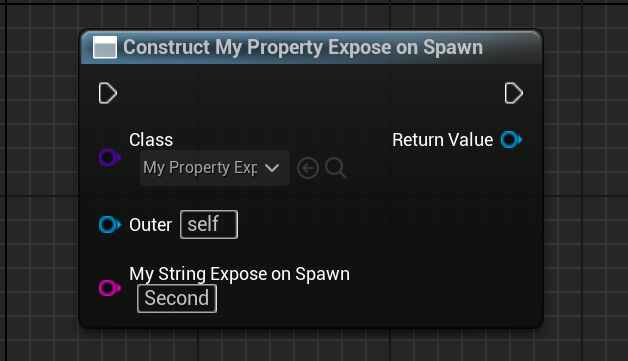

# ExposeOnSpawn

- **Function Description:** Make this attribute exposed during object creation using ContructObject or SpawnActor, etc.
- **Use location:** UPROPERTY
- **Engine module:** Blueprint
- **Metadata type:** bool
- **Frequency:** ★★★★★

Expose this property during object creation operations like ContructObject or SpawnActor.

- Specifically, searching the source code reveals its usage in UK2Node_AddComponent, UK2Node_ConstructObjectFromClass, UK2Node_SpawnActor, and UK2Node_LatentGameplayTaskCall.
- The effect of setting this in C++ is analogous to toggling the "ExposeOnSpawn" option in blueprints.
- Applying this meta setting will also simultaneously set CPF_ExposeOnSpawn in PropertyFlags

## Test Code:

```cpp

UCLASS(BlueprintType)
class INSIDER_API UMyProperty_ExposeOnSpawn :public UObject
{
	GENERATED_BODY()
public:
	//	(Category = MyProperty_ExposeOnSpawn, ModuleRelativePath = Property/Blueprint/MyProperty_ExposeOnSpawn.h)
	//	PropertyFlags:	CPF_Edit | CPF_BlueprintVisible | CPF_ZeroConstructor | CPF_HasGetValueTypeHash | CPF_NativeAccessSpecifierPublic

	UPROPERTY(EditAnywhere, BlueprintReadWrite)
	FString MyString = TEXT("First");

	//	(Category = MyProperty_ExposeOnSpawn, ExposeOnSpawn = , ModuleRelativePath = Property/Blueprint/MyProperty_ExposeOnSpawn.h)
	//	PropertyFlags:	CPF_Edit | CPF_BlueprintVisible | CPF_ZeroConstructor | CPF_ExposeOnSpawn | CPF_HasGetValueTypeHash | CPF_NativeAccessSpecifierPublic
	UPROPERTY(EditAnywhere, BlueprintReadWrite, meta = (ExposeOnSpawn))
	FString MyString_ExposeOnSpawn = TEXT("Second");
};
```

## Test Results:

Notice that MyString_ExposeOnSpawn is exposed, while MyString is not.



## Principle:

During UHT analysis, if a property contains ExposeOnSpawn, CPF_ExposeOnSpawn will be set synchronously.

The IsPropertyExposedOnSpawn function determines whether to expose the property. This function is referenced by the aforementioned four function nodes.  UK2Node_ConstructObjectFromClass's CreatePinsForClass serves as an example in the source code, demonstrating that additional Pins are created for the blueprint node only when bIsExposedToSpawn is true.

```cpp
if (propertySettings.MetaData.ContainsKey(UhtNames.ExposeOnSpawn))
{
	propertySettings.PropertyFlags |= EPropertyFlags.ExposeOnSpawn;
}

bool UEdGraphSchema_K2::IsPropertyExposedOnSpawn(const FProperty* Property)
{
	Property = FBlueprintEditorUtils::GetMostUpToDateProperty(Property);
	if (Property)
	{
		const bool bMeta = Property->HasMetaData(FBlueprintMetadata::MD_ExposeOnSpawn);
		const bool bFlag = Property->HasAllPropertyFlags(CPF_ExposeOnSpawn);
		if (bMeta != bFlag)
		{
			const FCoreTexts& CoreTexts = FCoreTexts::Get();

			UE_LOG(LogBlueprint, Warning
				, TEXT("ExposeOnSpawn ambiguity. Property '%s', MetaData '%s', Flag '%s'")
				, *Property->GetFullName()
				, bMeta ? *CoreTexts.True.ToString() : *CoreTexts.False.ToString()
				, bFlag ? *CoreTexts.True.ToString() : *CoreTexts.False.ToString());
		}
		return bMeta || bFlag;
	}
	return false;
}

void UK2Node_ConstructObjectFromClass::CreatePinsForClass(UClass* InClass, TArray<UEdGraphPin*>* OutClassPins)
{
	for (TFieldIterator<FProperty> PropertyIt(InClass, EFieldIteratorFlags::IncludeSuper); PropertyIt; ++PropertyIt)
{
	FProperty* Property = *PropertyIt;
	UClass* PropertyClass = CastChecked<UClass>(Property->GetOwner<UObject>());
	const bool bIsDelegate = Property->IsA(FMulticastDelegateProperty::StaticClass());
	const bool bIsExposedToSpawn = UEdGraphSchema_K2::IsPropertyExposedOnSpawn(Property);
	const bool bIsSettableExternally = !Property->HasAnyPropertyFlags(CPF_DisableEditOnInstance);

	if(	bIsExposedToSpawn &&
		!Property->HasAnyPropertyFlags(CPF_Parm) &&
		bIsSettableExternally &&
		Property->HasAllPropertyFlags(CPF_BlueprintVisible) &&
		!bIsDelegate &&
		(nullptr == FindPin(Property->GetFName()) ) &&
		FBlueprintEditorUtils::PropertyStillExists(Property))
	{
		if (UEdGraphPin* Pin = CreatePin(EGPD_Input, NAME_None, Property->GetFName()))
		{
}
```