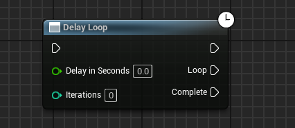

# ExposedAsyncProxy

- **Function Description:** Expose a proxy object of this class within the Async Task node.
- **Usage Location:** UCLASS
- **Engine Module:** Blueprint
- **Metadata Type:** string="abc"
- **Restriction Type:** Async Blueprint node
- **Associated Items:** [HideSpawnParms](../Param/HideSpawnParms/HideSpawnParms.md), [HasDedicatedAsyncNode](../HasDedicatedAsyncNode/HasDedicatedAsyncNode.md), [HideThen](../HideThen/HideThen.md)
- **Commonly Used:** ★★★

Utilized in UK2Node_BaseAsyncTask to reveal an asynchronous object pin for the blueprint's async node, enabling further manipulation of this asynchronous behavior.

Within the source code, it is used in two contexts: as a subclass of UBlueprintAsyncActionBase and as a subclass of UGameplayTask, each accompanied by separate UK2Node_BaseAsyncTask and UK2Node_LatentGameplayTaskCall to parse the class's declaration and definition, and to wrap and generate the corresponding asynchronous blueprint node.

The base classes are all derived from UBlueprintAsyncActionBase. The ExposedAsyncProxy is used to specify the name of the asynchronous task object. By returning the asynchronous object on the async blueprint node, it allows for the option to cancel the asynchronous operation at a later stage.

## Test Code:

UCancellableAsyncAction is a convenient subclass provided by the engine, inheriting from UBlueprintAsyncActionBase. UMyFunction_Async defines a blueprint async node called DelayLoop.

```cpp
DECLARE_DYNAMIC_MULTICAST_DELEGATE(FDelayOutputPin);
UCLASS(Blueprintable, BlueprintType,meta = (ExposedAsyncProxy = MyAsyncObject))
class INSIDER_API UMyFunction_Async :public UBlueprintAsyncActionBase
{
public:
	GENERATED_BODY()
public:
	UPROPERTY(BlueprintAssignable)
	FDelayOutputPin Loop;

	UPROPERTY(BlueprintAssignable)
	FDelayOutputPin Complete;

	UFUNCTION(BlueprintCallable, meta = (BlueprintInternalUseOnly = "true", WorldContext = "WorldContextObject"), Category = "Flow Control")
	static UMyFunction_Async* DelayLoop(const UObject* WorldContextObject, const float DelayInSeconds, const int Iterations);

	virtual void Activate() override;

	UFUNCTION()
	static void Test();
private:
	const UObject* WorldContextObject = nullptr;
	float MyDelay = 0.f;
	int MyIterations = 0;
	bool Active = false;

	UFUNCTION()
	void ExecuteLoop();

	UFUNCTION()
	void ExecuteComplete();
};
```

## Default blueprint nodes are:

If UMyFunction_Async inherits directly from UBlueprintAsyncActionBase without setting ExposedAsyncProxy, the resulting blueprint async node will look as shown in the following diagram.



However, if inheriting from UCancellableAsyncAction (which provides a Cancel method) and setting ExposedAsyncProxy to the desired AsyncObject pin name.

```cpp
UCLASS(Abstract, BlueprintType, meta = (ExposedAsyncProxy = AsyncAction), MinimalAPI)
class UCancellableAsyncAction : public UBlueprintAsyncActionBase
{
	UFUNCTION(BlueprintCallable, Category = "Async Action")
	ENGINE_API virtual void Cancel();
}

DECLARE_DYNAMIC_MULTICAST_DELEGATE(FDelayOutputPin);
UCLASS(Blueprintable, BlueprintType,meta = (ExposedAsyncProxy = MyAsyncObject))
class INSIDER_API UMyFunction_Async :public UCancellableAsyncAction
{}
```

## The effect after modification is as shown in the following diagram:


## Location of this Meta in the source code:

```cpp
void UK2Node_BaseAsyncTask::AllocateDefaultPins()
{
	bool bExposeProxy = false;
	bool bHideThen = false;
	FText ExposeProxyDisplayName;
	for (const UStruct* TestStruct = ProxyClass; TestStruct; TestStruct = TestStruct->GetSuperStruct())
	{
		bExposeProxy |= TestStruct->HasMetaData(TEXT("ExposedAsyncProxy"));
		bHideThen |= TestStruct->HasMetaData(TEXT("HideThen"));
		if (ExposeProxyDisplayName.IsEmpty())
		{
			ExposeProxyDisplayName = TestStruct->GetMetaDataText(TEXT("ExposedAsyncProxy"));
		}
	}

	if (bExposeProxy)
	{
		UEdGraphPin* ProxyPin = CreatePin(EGPD_Output, UEdGraphSchema_K2::PC_Object, ProxyClass, FBaseAsyncTaskHelper::GetAsyncTaskProxyName());
		if (!ExposeProxyDisplayName.IsEmpty())
		{
			ProxyPin->PinFriendlyName = ExposeProxyDisplayName;
		}
	}

}
```