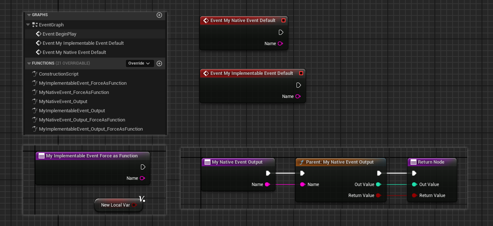

# ForceAsFunction

- **Function description:** Enforce the conversion of events defined with BlueprintImplementableEvent or NativeEvent in C++ to functions that must be overridden in subclasses.
- **Use location:** UFUNCTION
- **Engine module:** Blueprint
- **Metadata type:** bool
- **Frequency:** ★★★

Force events, defined with BlueprintImplementableEvent or NativeEvent in C++, to be converted into functions that are overridden in subclasses.

When is it necessary to convert an Event into a function?

- Once converted into a function, internal local variables can be defined within its implementation. However, this also means losing the capability to use delay functions such as Delay.
- Events cannot have output parameters, but if a function with an output is desired to be overridden in a blueprint class (requiring BlueprintImplementableEvent or NativeEvent), the default event-style overload is insufficient. Thus, forcing the event to be a function allows for proper overriding.
- Events with output or return parameters will be automatically converted to functions, even without the ForceAsFunction metadata.

## Test Code:

```cpp

UCLASS(Blueprintable, BlueprintType)
class INSIDER_API AMyFunction_ForceAsFunction :public AActor
{
public:
	GENERATED_BODY()
public:
//FUNC_Native | FUNC_Event | FUNC_Public | FUNC_BlueprintCallable | FUNC_BlueprintEvent
	UFUNCTION(BlueprintCallable, BlueprintNativeEvent)
	void MyNativeEvent_Default(const FString& name);

	//FUNC_Event | FUNC_Public | FUNC_BlueprintCallable | FUNC_BlueprintEvent
	UFUNCTION(BlueprintCallable, BlueprintImplementableEvent)
	void MyImplementableEvent_Default(const FString& name);

public:
	//(ForceAsFunction = , ModuleRelativePath = Function/MyFunction_ForceAsFunction.h)
	//FUNC_Native | FUNC_Event | FUNC_Public | FUNC_BlueprintCallable | FUNC_BlueprintEvent
	UFUNCTION(BlueprintCallable, BlueprintNativeEvent, meta = (ForceAsFunction))
	void MyNativeEvent_ForceAsFunction(const FString& name);

	////(ForceAsFunction = , ModuleRelativePath = Function/MyFunction_ForceAsFunction.h)
	//FUNC_Event | FUNC_Public | FUNC_BlueprintCallable | FUNC_BlueprintEvent
	UFUNCTION(BlueprintCallable, BlueprintImplementableEvent, meta = (ForceAsFunction))
	void MyImplementableEvent_ForceAsFunction(const FString& name);

public:
	//FUNC_Native | FUNC_Event | FUNC_Public | FUNC_HasOutParms | FUNC_BlueprintCallable | FUNC_BlueprintEvent
	UFUNCTION(BlueprintCallable, BlueprintNativeEvent)
	bool MyNativeEvent_Output(const FString& name, int32& OutValue);

	//FUNC_Event | FUNC_Public | FUNC_HasOutParms | FUNC_BlueprintCallable | FUNC_BlueprintEvent
	UFUNCTION(BlueprintCallable, BlueprintImplementableEvent)
	bool MyImplementableEvent_Output(const FString& name, int32& OutValue);

	//(ForceAsFunction = , ModuleRelativePath = Function/MyFunction_ForceAsFunction.h)
	//FUNC_Native | FUNC_Event | FUNC_Public | FUNC_HasOutParms | FUNC_BlueprintCallable | FUNC_BlueprintEvent
	UFUNCTION(BlueprintCallable, BlueprintNativeEvent, meta = (ForceAsFunction))
	bool MyNativeEvent_Output_ForceAsFunction(const FString& name, int32& OutValue);

	//(ForceAsFunction = , ModuleRelativePath = Function/MyFunction_ForceAsFunction.h)
	//FUNC_Event | FUNC_Public | FUNC_HasOutParms | FUNC_BlueprintCallable | FUNC_BlueprintEvent
	UFUNCTION(BlueprintCallable, BlueprintImplementableEvent, meta = (ForceAsFunction))
	bool MyImplementableEvent_Output_ForceAsFunction(const FString& name, int32& OutValue);
};
```

## Effect in Blueprint:

When functions are overridden, you will notice that only MyNativeEvent_Default and MyImplementableEvent_Default are overridden as events by default, while the rest are overridden as functions.

The diagram illustrates that after MyImplementableEvent_ForceAsFunction is converted to a function, local variables can be defined within it.

It also shows the function body of MyNativeEvent_Output, an event with output parameters, after it is overwritten as a function.

Regardless of whether it is overridden as an event or a function, the usage remains the same when called.



## Principle:

The logic for determining whether a function is an event is based on the following function:

Primarily, the second 'if' condition and the final judgment are considered. Functions marked with BlueprintImplementableEvent or NativeEvent will have the FUNC_BlueprintEvent tag added. Therefore, if they have ForceAsFunction metadata or output parameters (including return values), they can only be displayed as functions.

```cpp
bool UEdGraphSchema_K2::FunctionCanBePlacedAsEvent(const UFunction* InFunction)
{
	// First check we are override-able, non-static, non-const and not marked thread safe
	if (!InFunction || !CanKismetOverrideFunction(InFunction) || InFunction->HasAnyFunctionFlags(FUNC_Static|FUNC_Const) || FBlueprintEditorUtils::HasFunctionBlueprintThreadSafeMetaData(InFunction))
	{
		return false;
	}

	// Check if meta data has been set to force this to appear as blueprint function even if it doesn't return a value.
	if (InFunction->HasAllFunctionFlags(FUNC_BlueprintEvent) && InFunction->HasMetaData(FBlueprintMetadata::MD_ForceAsFunction))
	{
		return false;
	}

	// Then look to see if we have any output, return, or reference params
	return !HasFunctionAnyOutputParameter(InFunction);
}
```