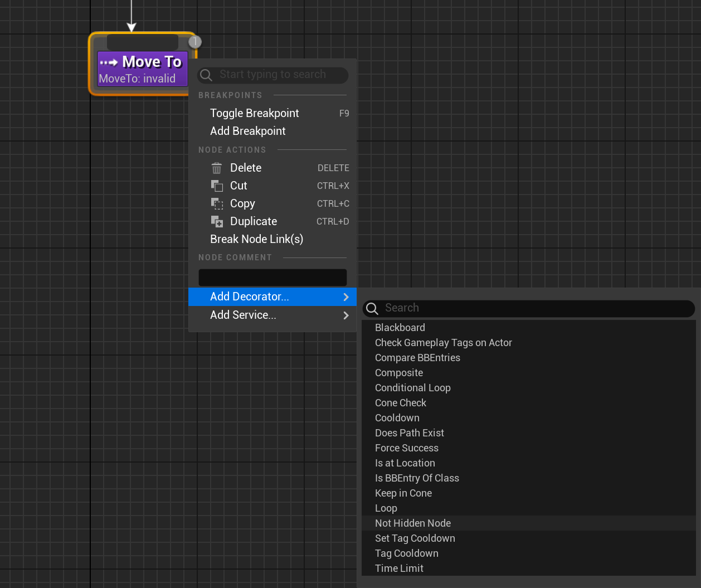

# HiddenNode

- **Function Description:** Hides the specified UBTNode so that it does not appear in the context menu when right-clicked.
- **Usage Location:** UCLASS
- **Engine Module:** Blueprint
- **Metadata Type:** bool
- **Restriction Type:** UBTNode
- **Commonality:** ★

Hides the specified UBTNode from appearing in the right-click menu.

## Test Code:

```cpp

UCLASS(MinimalAPI,meta = ())
class UMyBT_NotHiddenNode : public UBTDecorator
{
	GENERATED_UCLASS_BODY()

	UPROPERTY(Category = Node, EditAnywhere)
	float MyFloat;
};

UCLASS(MinimalAPI,meta = (HiddenNode))
class UMyBT_HiddenNode : public UBTDecorator
{
	GENERATED_UCLASS_BODY()

	UPROPERTY(Category = Node, EditAnywhere)
	float MyFloat;
};

```

## Test Results:

Only UMyBT_NotHiddenNode is visible, while UMyBT_HiddenNode is hidden from view.



## Principle:

The principle is quite straightforward; it involves marking the metadata and then setting the bIsHidden property.

```cpp
bool FGraphNodeClassHelper::IsHidingClass(UClass* Class)
{
	static FName MetaHideInEditor = TEXT("HiddenNode");

	return
		Class &&
		((Class->HasAnyClassFlags(CLASS_Native) && Class->HasMetaData(MetaHideInEditor))
		|| ForcedHiddenClasses.Contains(Class));
}

//D:\github\UnrealEngine\Engine\Source\Editor\AIGraph\Private\AIGraphTypes.cpp
void FGraphNodeClassHelper::BuildClassGraph()
{
		for (TObjectIterator<UClass> It; It; ++It)
		{
			UClass* TestClass = *It;
			if (TestClass->HasAnyClassFlags(CLASS_Native) && TestClass->IsChildOf(RootNodeClass))
			{

				NewData.bIsHidden = IsHidingClass(TestClass);

				NewNode->Data = NewData;

				if (TestClass == RootNodeClass)
				{
					RootNode = NewNode;
				}

				NodeList.Add(NewNode);
			}
		}
}
```