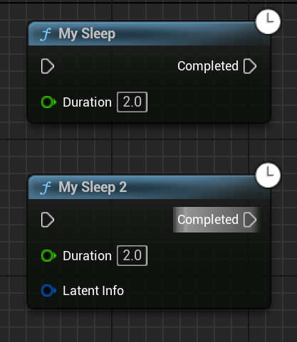

# Latent

- **Function Description:** Indicates that a function is a latent asynchronous operation
- **Usage Location:** UFUNCTION
- **Engine Module:** Blueprint
- **Metadata Type:** bool
- **Associated Items:** [LatentInfo](LatentInfo.md), [NeedsLatentFixup](NeedsLatentFixup.md), [LatentCallbackTarget](LatentCallbackTarget.md)
- **Commonality:** ★★★★★

Indicates that a function is a latent asynchronous operation and requires the use of LatentInfo for proper functionality.

It results in the manual triggering of the Then (also referred to as Complete) pin during logical execution (triggered internally by the engine), and a clock icon is added to the top right corner of the function.

## Test Code:

```cpp
class FMySleepAction : public FPendingLatentAction
{
public:
	float TimeRemaining;
	FName ExecutionFunction;
	int32 OutputLink;
	FWeakObjectPtr CallbackTarget;

	FMySleepAction(float Duration, const FLatentActionInfo& LatentInfo)
		: TimeRemaining(Duration)
		, ExecutionFunction(LatentInfo.ExecutionFunction)
		, OutputLink(LatentInfo.Linkage)
		, CallbackTarget(LatentInfo.CallbackTarget)
	{
	}

	virtual void UpdateOperation(FLatentResponse& Response) override
	{
		TimeRemaining -= Response.ElapsedTime();
		Response.FinishAndTriggerIf(TimeRemaining <= 0.0f, ExecutionFunction, OutputLink, CallbackTarget);
	}
};

UCLASS(Blueprintable, BlueprintType)
class INSIDER_API UMyFunction_Latent :public UBlueprintFunctionLibrary
{
public:
	GENERATED_BODY()
public:
	UFUNCTION(BlueprintCallable, meta = (Latent, WorldContext = "WorldContextObject", LatentInfo = "LatentInfo", Duration = "5"))
	static void	MySleep(const UObject* WorldContextObject, float Duration, FLatentActionInfo LatentInfo)
	{
			if (UWorld* World = GEngine->GetWorldFromContextObject(WorldContextObject, EGetWorldErrorMode::LogAndReturnNull))
			{
				FLatentActionManager& LatentActionManager = World->GetLatentActionManager();
				if (LatentActionManager.FindExistingAction<FMySleepAction>(LatentInfo.CallbackTarget, LatentInfo.UUID) == NULL)
				{
					LatentActionManager.AddNewAction(LatentInfo.CallbackTarget, LatentInfo.UUID, new FMySleepAction(Duration, LatentInfo));
				}
			}
}

	UFUNCTION(BlueprintCallable, meta = (Latent, WorldContext = "WorldContextObject", Duration = "5"))
	static void	MySleep2(const UObject* WorldContextObject, float Duration, FLatentActionInfo LatentInfo);
};
```

## Blueprint Effect:



MySleep functions normally like Delay. However, MySleep2 does not have LatentInfo marked, so the LatentInfo function parameters are not assigned by the blueprint system, rendering it inoperable.

Latent is frequently used in the source code, with the most common example being:

```cpp
UFUNCTION(BlueprintCallable, meta=(WorldContext="WorldContextObject", Latent = "", LatentInfo = "LatentInfo", DisplayName = "Load Stream Level (by Name)"), Category="Game")
static ENGINE_API void LoadStreamLevel(const UObject* WorldContextObject, FName LevelName, bool bMakeVisibleAfterLoad, bool bShouldBlockOnLoad, FLatentActionInfo LatentInfo);

UFUNCTION(BlueprintCallable, meta = (Latent, LatentInfo = "LatentInfo", WorldContext = "WorldContextObject", BlueprintInternalUseOnly = "true"), Category = "Utilities")
static ENGINE_API void LoadAsset(const UObject* WorldContextObject, TSoftObjectPtr<UObject> Asset, FOnAssetLoaded OnLoaded, FLatentActionInfo LatentInfo);

UFUNCTION(BlueprintCallable, Category="Utilities|FlowControl", meta=(Latent, WorldContext="WorldContextObject", LatentInfo="LatentInfo", Duration="0.2", Keywords="sleep"))
static ENGINE_API void	Delay(const UObject* WorldContextObject, float Duration, struct FLatentActionInfo LatentInfo );
```

For the differences between using Latent and inheriting from UBlueprintAsyncActionBase to create blueprint asynchronous nodes, further information can be found in other articles online.