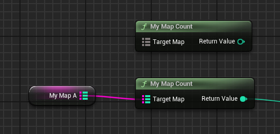

# MapParam

- **Function Description:** Designates a function to use TMap<TKey, TValue> with a wildcard generic element type.
- **Usage Location:** UFUNCTION
- **Engine Module:** Blueprint
- **Metadata Type:** string="abc"
- **Restriction Type:** TMap
- **Associated Items:** [MapKeyParam](MapKeyParam.md), [MapValueParam](MapValueParam.md)
- **Commonality:** ★★★

Designates a function to use TMap<TKey, TValue> with a wildcard generic element type.

Only one MapParam is supported; the source code implementation finds a pin based on a single name.

Examples in the source code are all found within UBlueprintMapLibrary.

## Test Code 1:

```cpp
	UFUNCTION(BlueprintPure, CustomThunk, meta = (MapParam = "TargetMap"))
	static int32 MyMap_Count(const TMap<int32, int32>& TargetMap);
	static int32 GenericMyMap_Count(const void* TargetMap, const FMapProperty* MapProperty);
	DECLARE_FUNCTION(execMyMap_Count);
```

## Blueprint Effect 1:



Due to the support for only one MapParam, if you write code like this.

## Test Code 2:

```cpp
	UFUNCTION(BlueprintPure, CustomThunk, meta = (MapParam = "MapA,MapB"))
	static int32 MyMap_CompareSize(const TMap<int32, int32>& MapA, const TMap<int32, int32>& MapB);
	static int32 GenericMyMap_CompareSize(void* MapA, const FMapProperty* MapAProp, void* MapB, const FMapProperty* MapBProp);
	DECLARE_FUNCTION(execMyMap_CompareSize);
```

This will result in MapParam being unable to find the pin, thus losing the wildcard functionality.


To implement features similar to Add, where the pin types for Key and Value can dynamically change according to the Map type, you need to add MapKeyParam and MapValueParam to specify additional function parameters. This allows the correct pins to be located, thus enabling the dynamic adjustment of the KeyValue pin types based on the Map type. The parameters specified by MapKeyParam and MapValueParam can also be containers such as arrays, as seen with the Keys and Values parameters in UBlueprintMapLibrary.

```cpp
	UFUNCTION(BlueprintCallable, CustomThunk, meta = (MapParam = "TargetMap",MapKeyParam = "Key", MapValueParam = "Value"))
	static bool MyMap_FindOrAdd(const TMap<int32, int32>& TargetMap, const int32& Key, const int32& Value);
	static bool GenericMyMap_FindOrAdd(const void* TargetMap, const FMapProperty* MapProperty, const void* KeyPtr, const void* ValuePtr);
	DECLARE_FUNCTION(execMyMap_FindOrAdd);
```

## Blueprint Effect 2:


## Principle Code:

```cpp
void UK2Node_CallFunction::ConformContainerPins()
{
		//Detect the container pin within this
		const FString& MapPinMetaData = TargetFunction->GetMetaData(FBlueprintMetadata::MD_MapParam);
		const FString& MapKeyPinMetaData = TargetFunction->GetMetaData(FBlueprintMetadata::MD_MapKeyParam);
		const FString& MapValuePinMetaData = TargetFunction->GetMetaData(FBlueprintMetadata::MD_MapValueParam);

		if(!MapPinMetaData.IsEmpty() || !MapKeyPinMetaData.IsEmpty() || !MapValuePinMetaData.IsEmpty() )
		{
			// if the map pin has a connection infer from that, otherwise use the information on the key param and value param:
			bool bReadyToPropagateKeyType = false;
			FEdGraphTerminalType KeyTypeToPropagate;
			bool bReadyToPropagateValueType = false;
			FEdGraphTerminalType ValueTypeToPropagate;

			UEdGraphPin* MapPin = MapPinMetaData.IsEmpty() ? nullptr : FindPin(MapPinMetaData);
			UEdGraphPin* MapKeyPin = MapKeyPinMetaData.IsEmpty() ? nullptr : FindPin(MapKeyPinMetaData);
			UEdGraphPin* MapValuePin = MapValuePinMetaData.IsEmpty() ? nullptr : FindPin(MapValuePinMetaData);

			TryReadTypeToPropagate(MapPin, bReadyToPropagateKeyType, KeyTypeToPropagate);//Read the connection type of the MapPin's Key
			TryReadValueTypeToPropagate(MapPin, bReadyToPropagateValueType, ValueTypeToPropagate);//Read the Map Value type connected to the MapPin
			TryReadTypeToPropagate(MapKeyPin, bReadyToPropagateKeyType, KeyTypeToPropagate);//Read the connection type on the KeyPin
			TryReadTypeToPropagate(MapValuePin, bReadyToPropagateValueType, ValueTypeToPropagate);//Read the connection type on the ValuePin

			TryPropagateType(MapPin, KeyTypeToPropagate, bReadyToPropagateKeyType);//Change the current type of the MapPin's Key
			TryPropagateType(MapKeyPin, KeyTypeToPropagate, bReadyToPropagateKeyType);//Change the current type of the KeyPin

			TryPropagateValueType(MapPin, ValueTypeToPropagate, bReadyToPropagateValueType);//Change the current type of the MapPin's Value
			TryPropagateType(MapValuePin, ValueTypeToPropagate, bReadyToPropagateValueType);//Change the current type of the ValuePin
		}
}
```