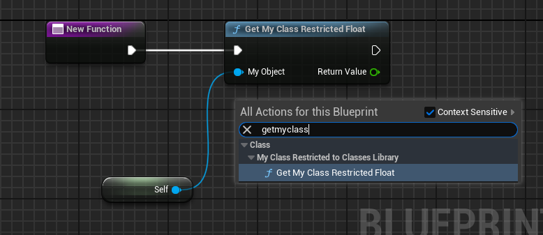

# RestrictedToClasses

- **Function Description:** Restricts the creation of functions within the Blueprint Function Library to only be possible by right-clicking within blueprints of classes specified by RestrictedToClasses
- **Usage Location:** UCLASS
- **Engine Module:** Blueprint
- **Metadata Type:** strings = "a, b, c"
- **Restriction Type:** BlueprintFunctionLibrary
- **Commonality:** ★★★

Applied to the Blueprint Function Library, this restricts the functions within the library to be used solely in blueprints of classes defined by RestrictedToClasses, and they cannot be created by right-clicking in other blueprint classes.

## Test Code:

```cpp
UCLASS(Blueprintable)
class INSIDER_API UMyClass_RestrictedToClasses :public UObject
{
	GENERATED_BODY()
public:
	UPROPERTY(BlueprintReadWrite,EditAnywhere)
	float MyFloat;
};

UCLASS(meta=(RestrictedToClasses="MyClass_RestrictedToClasses"))
class INSIDER_API UMyClass_RestrictedToClassesLibrary : public UBlueprintFunctionLibrary
{
	GENERATED_BODY()
public:
	UFUNCTION(BlueprintCallable)
	static float GetMyClassRestrictedFloat(UMyClass_RestrictedToClasses* myObject) {return myObject->MyFloat;}
};
```

Test the code for functionality:



Test the effect in other locations, for example, within a level blueprint:

Thus, it cannot be created through a right-click, but the function can still be invoked by directly pasting the node.


## Assess the impact elsewhere, such as within a level blueprint:

Nodes specified in UBTFunctionLibrary can only be used within BTNode, as it would be pointless elsewhere.

```cpp
UCLASS(meta=(RestrictedToClasses="BTNode"), MinimalAPI)
class UBTFunctionLibrary : public UBlueprintFunctionLibrary
{
UFUNCTION(BlueprintPure, Category="AI|BehaviorTree", Meta=(HidePin="NodeOwner", DefaultToSelf="NodeOwner"))
	static AIMODULE_API UBlackboardComponent* GetOwnersBlackboard(UBTNode* NodeOwner);
//....
}
```

## Example in the Source Code:

```cpp
static bool BlueprintActionFilterImpl::IsRestrictedClassMember(FBlueprintActionFilter const& Filter, FBlueprintActionInfo& BlueprintAction)
{
	bool bIsFilteredOut = false;
	FBlueprintActionContext const& FilterContext = Filter.Context;

	if (UClass const* ActionClass = BlueprintAction.GetOwnerClass())
	{
		if (ActionClass->HasMetaData(FBlueprintMetadata::MD_RestrictedToClasses))
		{
			FString const& ClassRestrictions = ActionClass->GetMetaData(FBlueprintMetadata::MD_RestrictedToClasses);

			// Parse the the metadata into an array that is delimited by ',' and trim whitespace
			TArray<FString> ParsedClassRestrictions;
			ClassRestrictions.ParseIntoArray(ParsedClassRestrictions, TEXT(","));
			for (FString& ValidClassName : ParsedClassRestrictions)
			{
				ValidClassName = ValidClassName.TrimStartAndEnd();
			}

			for (UBlueprint const* TargetContext : FilterContext.Blueprints)
			{
				UClass* TargetClass = TargetContext->GeneratedClass;
				if(!TargetClass)
				{
					// Skip possible null classes (e.g. macros, etc)
					continue;
				}

				bool bIsClassListed = false;

				UClass const* QueryClass = TargetClass;
				// walk the class inheritance chain to see if this class is one
				// of the allowed
				while (!bIsClassListed && (QueryClass != nullptr))
				{
					FString const ClassName = QueryClass->GetName();
					// If this class is on the list of valid classes
					for (const FString& ValidClassName : ParsedClassRestrictions)
					{
						bIsClassListed = (ClassName == ValidClassName);
						if (bIsClassListed)
						{
							break;
						}
					}

					QueryClass = QueryClass->GetSuperClass();
				}

				// if the blueprint class wasn't listed as one of the few
				// classes that this can be accessed from, then filter it out
				if (!bIsClassListed)
				{
					bIsFilteredOut = true;
					break;
				}
			}
		}
	}

	return bIsFilteredOut;
}
```