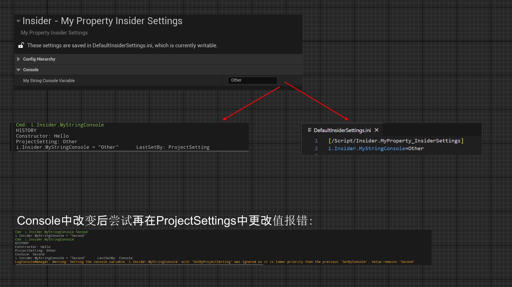

# ConsoleVariable

- **Function description:** Synchronize the value of a Config attribute with a console variable of the same name.
- **Use location:** UPROPERTY
- **Engine module:** Config
- **Metadata type:** string="abc"
- **Commonly used:** ★★★★★

Synchronize the value of a Config attribute with a console variable of the same name.

- Config values often need to be modified in the console (by pressing ~). This requirement is quite common, hence the creation of this tag. A classic example is the series of control variables starting with "r." in URendererSettings within the source code.
- The value in the Config file will also become the name of the ConsoleVariable (typically in a format like r.XXX.XX), rather than the property name.
- However, simply adding this tag is insufficient; the console variable will not be created automatically. You must manually create it using code and register a console variable with the same name, such as with TAutoConsoleVariable.
- Once the console variables are in place, additional code is required to synchronize their values. Refer to the test code calls for ImportConsoleVariableValues and ExportValuesToConsoleVariables.
- Be particularly aware that ConsoleVariable settings have priority levels. The console has a higher priority than ProjectSettings, so if you attempt to change a value in ProjectSettings after modifying it in the console, an error will occur.

## Test Code:

```cpp
UCLASS(config = InsiderSettings, defaultconfig)
class UMyProperty_InsiderSettings :public UDeveloperSettings
{
	GENERATED_BODY()
public:
	UPROPERTY(Config, EditAnywhere, BlueprintReadWrite, Category = Console, meta = (ConsoleVariable = "i.Insider.MyStringConsole"))
	FString MyString_ConsoleVariable;
public:
	virtual void PostInitProperties() override;
#if WITH_EDITOR
	virtual void PostEditChangeProperty(FPropertyChangedEvent& PropertyChangedEvent) override;
#endif
};

//.cpp
static TAutoConsoleVariable<FString> CVarInsiderMyStringConsole(
	TEXT("i.Insider.MyStringConsole"),
	TEXT("Hello"),
	TEXT("Insider test config to set MyString."));

void UMyProperty_InsiderSettings::PostInitProperties()
{
	Super::PostInitProperties();

#if WITH_EDITOR
	if (IsTemplate())
	{
		ImportConsoleVariableValues();
	}
#endif // #if WITH_EDITOR
}

#if WITH_EDITOR
void UMyProperty_InsiderSettings::PostEditChangeProperty(FPropertyChangedEvent& PropertyChangedEvent)
{
	Super::PostEditChangeProperty(PropertyChangedEvent);

	if (PropertyChangedEvent.Property)
	{
		ExportValuesToConsoleVariables(PropertyChangedEvent.Property);
	}
}
#endif // #if WITH_EDITOR
```

## Test Results:

It is evident that initially, the values in the console and the configuration files are synchronized with those in ProjectSettings.

If a value is changed in the console and then an attempt is made to modify it in ProjectSettings, an error will occur.



## Principle:

The specific logic for value synchronization can be understood by examining the following two functions, which essentially involve finding the corresponding ConsoleVariable by name and then performing get/set operations on its value.

```cpp
void UDeveloperSettings::ImportConsoleVariableValues()
{}

void UDeveloperSettings::ExportValuesToConsoleVariables(FProperty* PropertyThatChanged)
{}
```