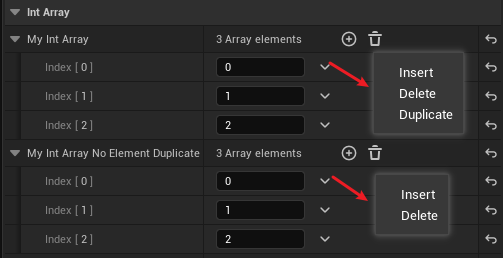

# NoElementDuplicate

- **Function Description:** Removes the Duplicate menu item button for elements within a TArray attribute.
- **Usage Location:** UPROPERTY
- **Engine Module:** Container Property
- **Metadata Type:** bool
- **Restriction Type:** TArray
- **Commonliness:** ★

Removes the Duplicate menu item button for elements within a TArray attribute.

Applied to TArray attributes, where the value can be of any type, including numbers, structures, or Object*.

## Test Code:

```cpp
public:
	UPROPERTY(EditAnywhere, BlueprintReadWrite, Category = IntArray)
	TArray<int32> MyIntArray;

	UPROPERTY(EditAnywhere, BlueprintReadWrite, Category = IntArray, meta = (NoElementDuplicate))
	TArray<int32> MyIntArray_NoElementDuplicate;
```

## Effect:

You can observe that for arrays with NoElementDuplicate, the dropdown menu to the right of the value only contains two items.



## Principle:

If the condition of "NoElementDuplicate" is met, the system will generate only the "Insert_Delete" menu; otherwise, the default "Insert_Delete_Duplicate" menu will be used. It is imperative that the current attribute in question is an array attribute and not of the "EditFixedSize" fixed-size type.

```cpp
void GetRequiredPropertyButtons( TSharedRef<FPropertyNode> PropertyNode, TArray<EPropertyButton::Type>& OutRequiredButtons, bool bUsingAssetPicker )
{
		const FArrayProperty* OuterArrayProp = NodeProperty->GetOwner<FArrayProperty>();

		if( OuterArrayProp )
		{
			if( PropertyNode->HasNodeFlags(EPropertyNodeFlags::SingleSelectOnly) && !(OuterArrayProp->PropertyFlags & CPF_EditFixedSize) )
			{
				if (OuterArrayProp->HasMetaData(TEXT("NoElementDuplicate")))
				{
					OutRequiredButtons.Add( EPropertyButton::Insert_Delete );
				}
				else
				{
					OutRequiredButtons.Add( EPropertyButton::Insert_Delete_Duplicate );
				}
			}
		}
}
```