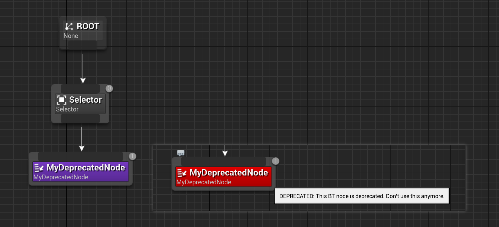

# DeprecatedNode

- **Function Description:** Used for BehaviorTreeNode or EnvQueryNode, indicating that the class is deprecated, with a red error display in the editor and an error tooltip for notification
- **Usage Location:** UCLASS
- **Engine Module:** DetailsPanel
- **Metadata Type:** bool
- **Restriction Type:** BehaviorTreeNode, EnvQueryNode
- **Commonality:** ★★

Applied to nodes in the AI behavior tree or EQS to mark them as deprecated.

## Example in Source Code:

```cpp
UCLASS(meta = (DeprecatedNode, DeprecationMessage = "Please use IsAtLocation decorator instead."), MinimalAPI)
class UBTDecorator_ReachedMoveGoal : public UBTDecorator
{
	GENERATED_UCLASS_BODY()
};

UCLASS(MinimalAPI, meta=(DeprecatedNode, DeprecationMessage = "This class is now deprecated, please use RunMode supporting random results instead."))
class UEnvQueryTest_Random : public UEnvQueryTest
{
	GENERATED_UCLASS_BODY()
};
```

## C++ Test Code:

```cpp
UCLASS(meta = (DeprecatedNode, DeprecationMessage = "This BT node is deprecated. Don't use this anymore."), MinimalAPI)
class UBTTask_MyDeprecatedNode : public UBTTaskNode
{
	GENERATED_UCLASS_BODY()
};
```

In the behavior tree, if the DeprecatedNode attribute is added, the node will be highlighted in red and an error message will be displayed.



## Code Tested Within the Source Code:

```cpp
FString FGraphNodeClassHelper::GetDeprecationMessage(const UClass* Class)
{
	static FName MetaDeprecated = TEXT("DeprecatedNode");
	static FName MetaDeprecatedMessage = TEXT("DeprecationMessage");
	FString DefDeprecatedMessage("Please remove it!");
	FString DeprecatedPrefix("DEPRECATED");
	FString DeprecatedMessage;

	if (Class && Class->HasAnyClassFlags(CLASS_Native) && Class->HasMetaData(MetaDeprecated))
	{
		DeprecatedMessage = DeprecatedPrefix + TEXT(": ");
		DeprecatedMessage += Class->HasMetaData(MetaDeprecatedMessage) ? Class->GetMetaData(MetaDeprecatedMessage) : DefDeprecatedMessage;
	}

	return DeprecatedMessage;
}
```