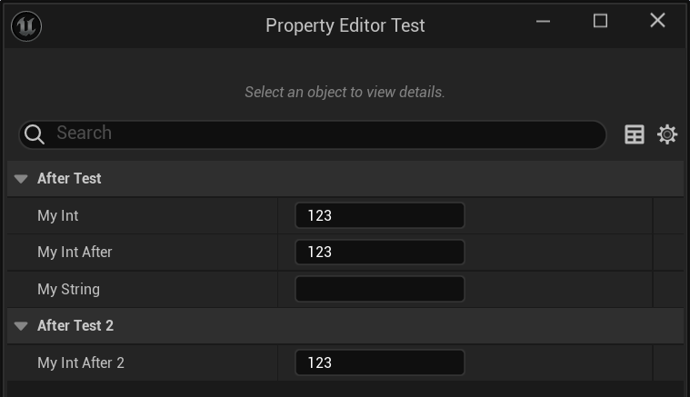

# DisplayAfter

- **Function description:** Ensures this attribute is displayed after a specified attribute.
- **Use location:** UPROPERTY
- **Engine module:** DetailsPanel
- **Metadata type:** string="abc"
- **Commonly used:** ★★★

Ensures this attribute is displayed after the specified attribute.

- By default, the order of properties in the details panel follows the sequence defined in the header file. However, if we wish to customize this order, this attribute can be used.
- The constraint is that both attributes must belong to the same Category. This is logical, as the Category's organization takes precedence.

## Test Code:

```cpp
UCLASS(BlueprintType)
class INSIDER_API UMyProperty_Priority :public UObject
{
	GENERATED_BODY()
public:
	UPROPERTY(EditAnywhere, BlueprintReadWrite, Category = AfterTest)
	int32 MyInt = 123;

	UPROPERTY(EditAnywhere, BlueprintReadWrite, Category = AfterTest)
	FString MyString;

	UPROPERTY(EditAnywhere, BlueprintReadWrite, Category = AfterTest, meta = (DisplayAfter = "MyInt"))
	int32 MyInt_After = 123;
public:
	UPROPERTY(EditAnywhere, BlueprintReadWrite, Category = AfterTest2, meta = (DisplayAfter = "MyInt"))
	int32 MyInt_After2 = 123;

};
```

## Test Results:

Visible MyInt_After is displayed directly after Int.

But MyInt_After2, being in a different Category, remains unchanged.



## Principle:

Checks if the property has a DisplayAfter attribute and, if so, inserts it after the specified property.

```cpp
	void PropertyEditorHelpers::OrderPropertiesFromMetadata(TArray<FProperty*>& Properties)
	{
		const FString& DisplayAfterPropertyName = Prop->GetMetaData(NAME_DisplayAfter);
		if (DisplayAfterPropertyName.IsEmpty())
		{
			InsertProperty(OrderedProperties);
		}
		else
		{
			TArray<TPair<FProperty*, int32>>& DisplayAfterProperties = DisplayAfterPropertyMap.FindOrAdd(FName(*DisplayAfterPropertyName));
			InsertProperty(DisplayAfterProperties);
		}
	}
```