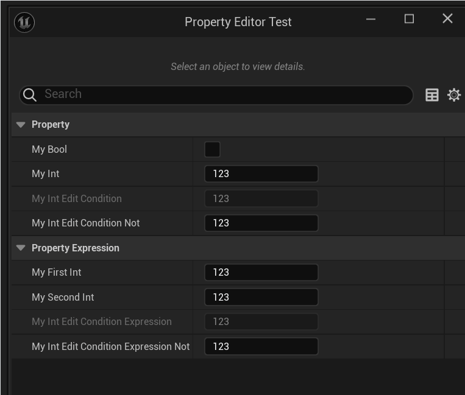

# EditCondition

- **Function Description:** Specify another attribute or an expression as a condition for the editability of a given attribute.
- **Usage Location:** UPROPERTY
- **Engine Module:** DetailsPanel
- **Metadata Type:** string="abc"
- **Associated Items:** [EditConditionHides](../EditConditionHides/EditConditionHides.md), [InlineEditConditionToggle](../InlineEditConditionToggle/InlineEditConditionToggle.md), [HideEditConditionToggle](../HideEditConditionToggle/HideEditConditionToggle.md)
- **Commonality:** ★★★★★

An attribute's editability is determined by specifying another attribute or an expression as its condition.

- Properties referenced in the expression must be within the same class or structure scope.

## Test Code:

```cpp
UCLASS(BlueprintType)
class INSIDER_API UMyProperty_EditCondition_Test :public UObject
{
	GENERATED_BODY()
public:
	UPROPERTY(EditAnywhere, BlueprintReadWrite, Category = Property)
	bool MyBool;

	UPROPERTY(EditAnywhere, BlueprintReadWrite, Category = Property)
	int32 MyInt = 123;

	UPROPERTY(EditAnywhere, BlueprintReadWrite, Category = Property, meta = (EditCondition = "MyBool"))
	int32 MyInt_EditCondition = 123;

	UPROPERTY(EditAnywhere, BlueprintReadWrite, Category = Property, meta = (EditCondition = "!MyBool"))
	int32 MyInt_EditCondition_Not = 123;

public:
	UPROPERTY(EditAnywhere, BlueprintReadWrite, Category = PropertyExpression)
	int32 MyFirstInt = 123;

	UPROPERTY(EditAnywhere, BlueprintReadWrite, Category = PropertyExpression)
	int32 MySecondInt = 123;

	UPROPERTY(EditAnywhere, BlueprintReadWrite, Category = PropertyExpression, meta = (EditCondition = "(MyFirstInt+MySecondInt)==500"))
	int32 MyInt_EditConditionExpression = 123;

	UPROPERTY(EditAnywhere, BlueprintReadWrite, Category = PropertyExpression, meta = (EditCondition = "!((MyFirstInt+MySecondInt)==500)"))
	int32 MyInt_EditConditionExpression_Not = 123;
};
```

## Test Results:

- Editability of other properties can be controlled by a single boolean property
- Complex decision mechanisms for editability can be introduced through an expression.



## Principle:

During the initialization of properties in the Details Panel, the EditCondition setting for the property is evaluated. If a value is present, a FEditConditionParser is created to parse the expression and then its value is computed.

```cpp
void FPropertyNode::InitNode(const FPropertyNodeInitParams& InitParams)
{
	const FString& EditConditionString = MyProperty->GetMetaData(TEXT("EditCondition"));

	// see if the property supports some kind of edit condition and this isn't the "parent" property of a static array
	const bool bIsStaticArrayParent = MyProperty->ArrayDim > 1 && GetArrayIndex() != -1;
	if (!EditConditionString.IsEmpty() && !bIsStaticArrayParent)
	{
		EditConditionExpression = EditConditionParser.Parse(EditConditionString);
		if (EditConditionExpression.IsValid())
		{
			EditConditionContext = MakeShareable(new FEditConditionContext(*this));
		}
	}

}
```