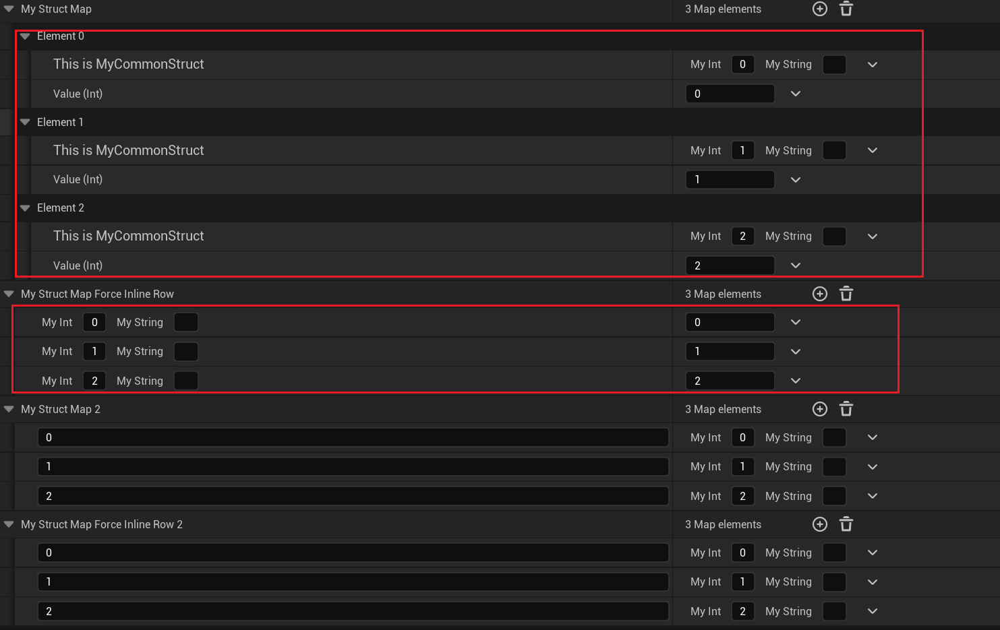

# ForceInlineRow

- **Function description:** Forces the key and other values of a TMap attribute's structure to be merged into the same line for display
- **Usage location:** UPROPERTY
- **Metadata type:** bool
- **Associated items:** [EditInline](../EditInline/EditInline.md)
- **Commonality:** ★

Forces the key and other values in the TMap attribute to be merged into the same line for display. Points to consider include:

- The attribute must be a TMap attribute, which contains a Key. TArray or TSet are not applicable.
- FStruct is used as the Key, enabling the source code mechanism to function, as it is the Key Property that is evaluated
- The FStruct must have registered related IPropertyTypeCustomization to allow customization of the structure's display UI
- The ShouldInlineKey of the IPropertyTypeCustomization returns false (the default is), otherwise if it is true, it will be merged into one row regardless of whether it is marked ForceInlineRow or not

## Test Code:

```cpp
public:
	UPROPERTY(EditAnywhere, BlueprintReadWrite)
	TMap<FMyCommonStruct, int32> MyStructMap;

	UPROPERTY(EditAnywhere, BlueprintReadWrite, meta = (ForceInlineRow))
	TMap<FMyCommonStruct, int32> MyStructMap_ForceInlineRow;

	UPROPERTY(EditAnywhere, BlueprintReadWrite)
	TMap<int32, FMyCommonStruct> MyStructMap2;

	UPROPERTY(EditAnywhere, BlueprintReadWrite, meta = (ForceInlineRow))
	TMap<int32, FMyCommonStruct> MyStructMap_ForceInlineRow2;


void FMyCommonStructCustomization::CustomizeHeader(TSharedRef<IPropertyHandle> PropertyHandle, FDetailWidgetRow& HeaderRow, IPropertyTypeCustomizationUtils& CustomizationUtils)
{
	HeaderRow.NameContent()[SNew(STextBlock).Text(INVTEXT("This is MyCommonStruct"))];

	TSharedPtr<IPropertyHandle> IntPropertyHandle = PropertyHandle->GetChildHandle(GET_MEMBER_NAME_CHECKED(FMyCommonStruct, MyInt));
	TSharedPtr<IPropertyHandle> StringPropertyHandle = PropertyHandle->GetChildHandle(GET_MEMBER_NAME_CHECKED(FMyCommonStruct, MyString));

	HeaderRow.ValueContent()
		[
			SNew(SHorizontalBox)
				+ SHorizontalBox::Slot()
				.Padding(5.0f, 0.0f).AutoWidth()
				[
					IntPropertyHandle->CreatePropertyNameWidget()
				]
				+ SHorizontalBox::Slot()
				.Padding(5.0f, 0.0f).AutoWidth()
				[
					IntPropertyHandle->CreatePropertyValueWidget()
				]
				+ SHorizontalBox::Slot()
				.Padding(5.0f, 0.0f).AutoWidth()
				[
					StringPropertyHandle->CreatePropertyNameWidget()
				]
				+ SHorizontalBox::Slot()
				.Padding(5.0f, 0.0f).AutoWidth()
				[
					StringPropertyHandle->CreatePropertyValueWidget()
				]
		];

}
```

## Test Results:

You can see that the data items of MyStructMap are displayed across two lines. With ForceInlineRow, the UI for data items is merged into one line, appearing more concise.

It is also specifically noted that if FStruct is used as the Value, there is no such distinction.



If the corresponding IPropertyTypeCustomization for FMyCommonStruct is not registered, the structure's property UI will be displayed in the default manner, split into two lines.


If the ShouldInlineKey of FMyCommonStruct's IPropertyTypeCustomization returns true, it will cause the properties with this structure as the Key to be merged into one line even without ForceInlineRow, thereby negating the effect and distinction of ForceInlineRow.


## Principle:

This logic is also part of the construction process of the FDetailPropertyRow constructor, determining whether there is a GetPropertyKeyNode, which essentially requests a TMap attribute.

Then, as the Key type, if it is UObject*, because NeedsKeyNode always returns false, it will always enter the MakePropertyEditor branch.

Therefore, the type being tested is actually Struct, which must rely on the cooperation of bInlineRow and FoundPropertyCustomisation. At this point, IPropertyTypeCustomization must be present to enter the branch, and if IPropertyTypeCustomization::ShouldInlineKey() returns true, it will enter the branch regardless of the ForceInlineRow attribute. Otherwise, it depends on the ForceInlineRow attribute, which is when this Meta attribute comes into effect.

```cpp
FDetailPropertyRow::FDetailPropertyRow(TSharedPtr<FPropertyNode> InPropertyNode, TSharedRef<FDetailCategoryImpl> InParentCategory, TSharedPtr<FComplexPropertyNode> InExternalRootNode)
{
	if (PropertyNode->GetPropertyKeyNode().IsValid())
	{
		TSharedPtr<IPropertyTypeCustomization> FoundPropertyCustomisation = GetPropertyCustomization(PropertyNode->GetPropertyKeyNode().ToSharedRef(), ParentCategory.Pin().ToSharedRef());

		bool bInlineRow = FoundPropertyCustomisation != nullptr ? FoundPropertyCustomisation->ShouldInlineKey() : false;

		static FName InlineKeyMeta("ForceInlineRow");
		bInlineRow |= InPropertyNode->GetParentNode()->GetProperty()->HasMetaData(InlineKeyMeta);

		// Only create the property editor if it's not a struct or if it requires to be inlined (and has customization)
		if (!NeedsKeyNode(PropertyNodeRef, InParentCategory) || (bInlineRow && FoundPropertyCustomisation != nullptr))
		{
			CachedKeyCustomTypeInterface = FoundPropertyCustomisation;

			MakePropertyEditor(PropertyNode->GetPropertyKeyNode().ToSharedRef(), Utilities, PropertyKeyEditor);
		}
	}
}

bool FDetailPropertyRow::NeedsKeyNode(TSharedRef<FPropertyNode> InPropertyNode, TSharedRef<FDetailCategoryImpl> InParentCategory)
{
	FStructProperty* KeyStructProp = CastField<FStructProperty>(InPropertyNode->GetPropertyKeyNode()->GetProperty());
	return KeyStructProp != nullptr;
}
```

Examples used in the source code:

In the source code search, this example was found, but in reality, ForceInlineRow on HLODSetups does not take effect here.

```cpp
USTRUCT()
struct FRuntimePartitionDesc
{
	GENERATED_USTRUCT_BODY()

#if WITH_EDITORONLY_DATA
	/** Partition class */
	UPROPERTY(EditAnywhere, Category = RuntimeSettings)
	TSubclassOf<URuntimePartition> Class;

	/** Name for this partition, used to map actors to it through the Actor.RuntimeGrid property  */
	UPROPERTY(EditAnywhere, Category = RuntimeSettings, Meta = (EditCondition = "Class != nullptr", HideEditConditionToggle))
	FName Name;

	/** Main partition object */
	UPROPERTY(VisibleAnywhere, Category = RuntimeSettings, Instanced, Meta = (EditCondition = "Class != nullptr", HideEditConditionToggle, NoResetToDefault, TitleProperty = "Name"))
	TObjectPtr<URuntimePartition> MainLayer;

	/** HLOD setups used by this partition, one for each layers in the hierarchy */
	UPROPERTY(EditAnywhere, Category = RuntimeSettings, Meta = (EditCondition = "Class != nullptr", HideEditConditionToggle, ForceInlineRow))
	TArray<FRuntimePartitionHLODSetup> HLODSetups;
#endif

#if WITH_EDITOR
	void UpdateHLODPartitionLayers();
#endif
};
```