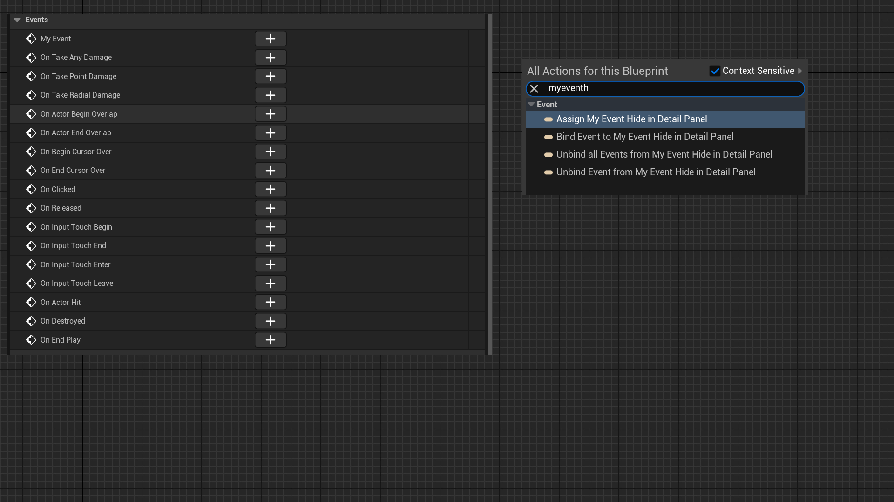

# HideInDetailPanel

- **Function Description:** Hides the dynamic multicast delegate attribute within the Actor's event panel.
- **Usage Location:** UPROPERTY
- **Engine Module:** DetailsPanel
- **Metadata Type:** bool
- **Restriction Type:** Dynamic multicast delegate within an Actor
- **Commonality:** ★★

Hides the dynamic multicast delegate property in the Actor's event panel.

## Test Code:

```cpp
UCLASS(BlueprintType,Blueprintable)
class INSIDER_API AMyProperty_HideInDetailPanel :public AActor
{
	GENERATED_BODY()
public:
	DECLARE_DYNAMIC_MULTICAST_DELEGATE(FOnMyHideTestEvent);

	UPROPERTY(BlueprintAssignable, Category = "Event")
	FOnMyHideTestEvent MyEvent;

	UPROPERTY(BlueprintAssignable, Category = "Event", meta = (HideInDetailPanel))
	FOnMyHideTestEvent MyEvent_HideInDetailPanel;
};

```

## Test Effects:

The test procedure involves creating a subclass of AMyProperty_HideInDetailPanel in the Blueprint and observing the display of the Event.

Visible MyEvent is displayed in the Events section of Class Defaults, whereas MyEvent_HideInDetailPanel is not shown.

However, MyEvent_HideInDetailPanel can still be bound within the Blueprint; it's just not displayed in the UI by default.



## Principle:

The system first checks for the absence of this marker before creating the corresponding UI controls.

```cpp
void FActorDetails::AddEventsCategory(IDetailLayoutBuilder& DetailBuilder)
{
		IDetailCategoryBuilder& EventsCategory = DetailBuilder.EditCategory("Events", FText::GetEmpty(), ECategoryPriority::Uncommon);
		static const FName HideInDetailPanelName("HideInDetailPanel");

		// Find all the Multicast delegate properties and give a binding button for them
		for (TFieldIterator<FMulticastDelegateProperty> PropertyIt(Actor->GetClass(), EFieldIteratorFlags::IncludeSuper); PropertyIt; ++PropertyIt)
		{
			FMulticastDelegateProperty* Property = *PropertyIt;

			// Only show BP assiangable, non-hidden delegates
			if (!Property->HasAnyPropertyFlags(CPF_Parm) && Property->HasAllPropertyFlags(CPF_BlueprintAssignable) && !Property->HasMetaData(HideInDetailPanelName))
			{}
		}
}

void FBlueprintDetails::AddEventsCategory(IDetailLayoutBuilder& DetailBuilder, FName PropertyName, UClass* PropertyClass)
{
	static const FName HideInDetailPanelName("HideInDetailPanel");
// Check for multicast delegates that we can safely assign
if ( !Property->HasAnyPropertyFlags(CPF_Parm) && Property->HasAllPropertyFlags(CPF_BlueprintAssignable) &&
				!Property->HasMetaData(HideInDetailPanelName) )
}
```