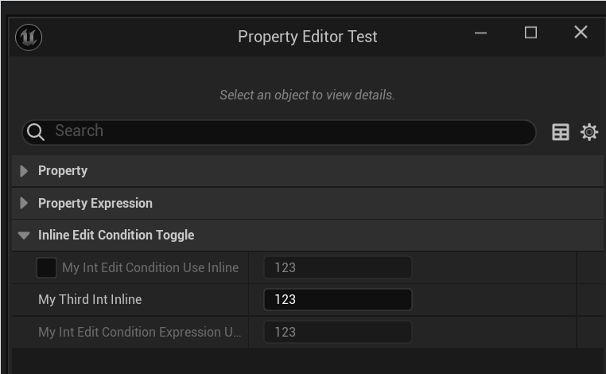

# InlineEditConditionToggle

- **Function description:** This feature allows the bool attribute to be integrated into the attribute field of another entity as a radio button when used as an EditCondition, rather than appearing as a separate edit field.
- **Usage Location:** UPROPERTY
- **Metadata Type:** bool
- **Restriction Type:** bool
- **Associated Items:** [EditCondition](../EditCondition/EditCondition.md)
- **Commonality:** ★★★★★

When used as an EditCondition, this bool attribute should be inlined within the attribute row of the other entity, presented as a radio button rather than forming its own edit row.

While the EditCondition is capable of handling other types of attributes or expressions, the InlineEditConditionToggle is specifically designed to work with bool attributes only.

## Test Code:

```cpp
public:
	UPROPERTY(EditAnywhere, BlueprintReadWrite, Category = InlineEditConditionToggle, meta = (InlineEditConditionToggle))
	bool MyBool_Inline;

	UPROPERTY(EditAnywhere, BlueprintReadWrite, Category = InlineEditConditionToggle, meta = (EditCondition = "MyBool_Inline"))
	int32 MyInt_EditCondition_UseInline = 123;

	UPROPERTY(EditAnywhere, BlueprintReadWrite, Category = InlineEditConditionToggle)
	int32 MyThirdInt_Inline = 123;

	UPROPERTY(EditAnywhere, BlueprintReadWrite, Category = InlineEditConditionToggle, meta = (EditCondition = "MyThirdInt_Inline>200"))
	int32 MyInt_EditConditionExpression_UseInline = 123;
```

## Test Results:

As a result, MyBool_Inline is now presented as a radio button. In contrast, MyThirdInt_Inline remains visible and is not concealed.



## Principle:

It can be observed that this is used to determine whether a radio button is supported for display.

```cpp

bool FPropertyNode::SupportsEditConditionToggle() const
{
	if (!Property.IsValid())
	{
		return false;
	}

	FProperty* MyProperty = Property.Get();

	static const FName Name_HideEditConditionToggle("HideEditConditionToggle");
	if (EditConditionExpression.IsValid() && !Property->HasMetaData(Name_HideEditConditionToggle))
	{
		const FBoolProperty* ConditionalProperty = EditConditionContext->GetSingleBoolProperty(EditConditionExpression);
		if (ConditionalProperty != nullptr)
		{
			// There are 2 valid states for inline edit conditions:
			// 1. The property is marked as editable and has InlineEditConditionToggle set.
			// 2. The property is not marked as editable and does not have InlineEditConditionToggle set.
			// In both cases, the original property will be hidden and only show up as a toggle.

			static const FName Name_InlineEditConditionToggle("InlineEditConditionToggle");
			const bool bIsInlineEditCondition = ConditionalProperty->HasMetaData(Name_InlineEditConditionToggle);
			const bool bIsEditable = ConditionalProperty->HasAllPropertyFlags(CPF_Edit);

			if (bIsInlineEditCondition == bIsEditable)
			{
				return true;
			}

			if (bIsInlineEditCondition && !bIsEditable)
			{
				UE_LOG(LogPropertyNode, Warning, TEXT("Property being used as inline edit condition is not editable, but has redundant InlineEditConditionToggle flag. Field \"%s\" in class \"%s\"."), *ConditionalProperty->GetNameCPP(), *Property->GetOwnerStruct()->GetName());
				return true;
			}

			// The property is already shown, and not marked as inline edit condition.
			if (!bIsInlineEditCondition && bIsEditable)
			{
				return false;
			}
		}
	}

	return false;
}
```