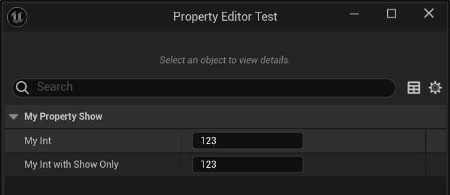

# bShowOnlyWhenTrue

- **Function Description:** Determines the display of the current attribute based on the field value within the editor's configuration file.
- **Usage Location:** UPROPERTY
- **Engine Module:** DetailsPanel
- **Metadata Type:** string="abc"
- **Commonly Used:** ★

Based on the field value in the editor's configuration file, the display of the current attribute is decided.

- This editor's configuration file refers to GEditorPerProjectIni, typically located at Config\DefaultEditorPerProjectUserSettings.ini
- The section name is "UnrealEd.PropertyFilters"
- The value for the Key can then be defined.

No examples were found in the source code, but this feature still functions correctly.

## Test Code:

```cpp
D:\github\GitWorkspace\Hello\Config\DefaultEditorPerProjectUserSettings.ini
[UnrealEd.PropertyFilters]
ShowMyInt=true
ShowMyString=false

UCLASS(BlueprintType)
class INSIDER_API UMyProperty_Show :public UObject
{
	GENERATED_BODY()
public:
	UPROPERTY(EditAnywhere, BlueprintReadWrite)
	int32 MyInt = 123;

	UPROPERTY(EditAnywhere, BlueprintReadWrite, meta = (bShowOnlyWhenTrue = "ShowMyInt"))
	int32 MyInt_WithShowOnly = 123;

	UPROPERTY(EditAnywhere, BlueprintReadWrite, meta = (bShowOnlyWhenTrue = "ShowMyString"))
	FString MyString_WithShowOnly;
};
```

## Test Results:

The property MyString_WithShowOnly is not displayed because we set ShowMyString=false in DefaultEditorPerProjectUserSettings.



## Principle:

It involves retrieving the value from the configuration to decide whether the property box should be displayed.

```cpp
void FObjectPropertyNode::GetCategoryProperties(const TSet<UClass*>& ClassesToConsider, const FProperty* CurrentProperty, bool bShouldShowDisableEditOnInstance, bool bShouldShowHiddenProperties,
	const TSet<FName>& CategoriesFromBlueprints, TSet<FName>& CategoriesFromProperties, TArray<FName>& SortedCategories)
{
	bool bMetaDataAllowVisible = true;
	const FString& ShowOnlyWhenTrueString = CurrentProperty->GetMetaData(Name_bShowOnlyWhenTrue);
	if (ShowOnlyWhenTrueString.Len())
	{
		//ensure that the metadata visibility string is actually set to true in order to show this property
		GConfig->GetBool(TEXT("UnrealEd.PropertyFilters"), *ShowOnlyWhenTrueString, bMetaDataAllowVisible, GEditorPerProjectIni);
	}

	if (bMetaDataAllowVisible)
	{
		if (PropertyEditorHelpers::ShouldBeVisible(*this, CurrentProperty) && !HiddenCategories.Contains(CategoryName))
		{
			if (!CategoriesFromBlueprints.Contains(CategoryName) && !CategoriesFromProperties.Contains(CategoryName))
			{
				SortedCategories.AddUnique(CategoryName);
			}
			CategoriesFromProperties.Add(CategoryName);
		}
	}

}

void FCategoryPropertyNode::InitChildNodes()
{
		bool bMetaDataAllowVisible = true;
		if (!bShowHiddenProperties)
		{
						static const FName Name_bShowOnlyWhenTrue("bShowOnlyWhenTrue");
						const FString& MetaDataVisibilityCheckString = It->GetMetaData(Name_bShowOnlyWhenTrue);
						if (MetaDataVisibilityCheckString.Len())
						{
							//ensure that the metadata visibility string is actually set to true in order to show this property
							// @todo Remove this
							GConfig->GetBool(TEXT("UnrealEd.PropertyFilters"), *MetaDataVisibilityCheckString, bMetaDataAllowVisible, GEditorPerProjectIni);
						}
		}

}
```