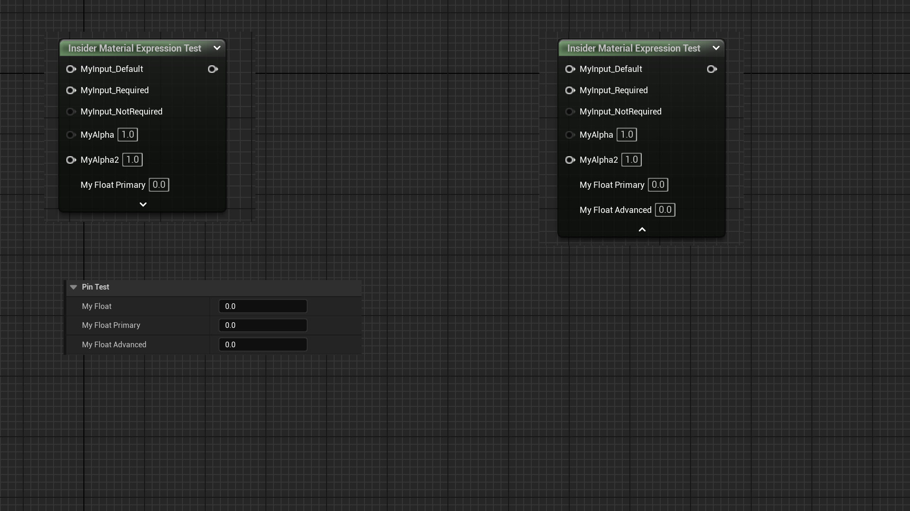

# ShowAsInputPin

- **Function Description:** Enables basic type attributes within UMaterialExpression to be represented as pins on the material node.
- **Usage Location:** UPROPERTY
- **Engine Module:** Material
- **Metadata Type:** bool
- **Restricted Type:** Attributes within UMaterialExpression
- **Commonality:** ★★★

Enables some basic type attributes within UMaterialExpression to be represented as pins on the material node.

- These basic types refer to commonly used types such as float and FVector.
- By default, these basic type properties are not displayed as pins.
- The ShowAsInputPin value has two options: 'Primary' can be displayed directly, while 'Advanced' requires expanding the arrow to be shown.

## Test Code:

```cpp

public:
	UPROPERTY(EditAnywhere, BlueprintReadWrite, Category = PinTest)
	float MyFloat;

	UPROPERTY(EditAnywhere, BlueprintReadWrite, Category = PinTest, meta = (ShowAsInputPin = "Primary"))
	float MyFloat_Primary;

	UPROPERTY(EditAnywhere, BlueprintReadWrite, Category = PinTest, meta = (ShowAsInputPin = "Advanced"))
	float MyFloat_Advanced;
```

## Test Results:

It is evident that MyFloat is not displayed on the node.

MyFloat_Primary is displayed on the node.

MyFloat_Advanced needs to have the arrow expanded before it is displayed.



## Principle:

Iterate through the properties within UMaterialExpression and generate pins based on the types that contain ShowAsInputPin.

```cpp
TArray<FProperty*> UMaterialExpression::GetPropertyInputs() const
{
	TArray<FProperty*> PropertyInputs;

	static FName OverridingInputPropertyMetaData(TEXT("OverridingInputProperty"));
	static FName ShowAsInputPinMetaData(TEXT("ShowAsInputPin"));
	for (TFieldIterator<FProperty> InputIt(GetClass(), EFieldIteratorFlags::IncludeSuper, EFieldIteratorFlags::ExcludeDeprecated); InputIt; ++InputIt)
	{
		bool bCreateInput = false;
		FProperty* Property = *InputIt;
		// Don't create an expression input if the property is already associated with one explicitly declared
		bool bOverridingInputProperty = Property->HasMetaData(OverridingInputPropertyMetaData);
		// It needs to have the 'EditAnywhere' specifier
		const bool bEditAnywhere = Property->HasAnyPropertyFlags(CPF_Edit);
		// It needs to be marked with a valid pin category meta data
		const FString ShowAsInputPin = Property->GetMetaData(ShowAsInputPinMetaData);
		const bool bShowAsInputPin = ShowAsInputPin == TEXT("Primary") || ShowAsInputPin == TEXT("Advanced");

		if (!bOverridingInputProperty && bEditAnywhere && bShowAsInputPin)
		{
			// Check if the property type fits within the allowed widget types
			FFieldClass* PropertyClass = Property->GetClass();
			if (PropertyClass == FFloatProperty::StaticClass()
				|| PropertyClass == FDoubleProperty::StaticClass()
				|| PropertyClass == FIntProperty::StaticClass()
				|| PropertyClass == FUInt32Property::StaticClass()
				|| PropertyClass == FByteProperty::StaticClass()
				|| PropertyClass == FBoolProperty::StaticClass()
				)
			{
				bCreateInput = true;
			}
			else if (PropertyClass == FStructProperty::StaticClass())
			{
				FStructProperty* StructProperty = CastField<FStructProperty>(Property);
				UScriptStruct* Struct = StructProperty->Struct;
				if (Struct == TBaseStructure<FLinearColor>::Get()
					|| Struct == TBaseStructure<FVector4>::Get()
					|| Struct == TVariantStructure<FVector4d>::Get()
					|| Struct == TBaseStructure<FVector>::Get()
					|| Struct == TVariantStructure<FVector3f>::Get()
					|| Struct == TBaseStructure<FVector2D>::Get()
					)
				{
					bCreateInput = true;
				}
			}
		}
		if (bCreateInput)
		{
			PropertyInputs.Add(Property);
		}
	}

	return PropertyInputs;
}
```