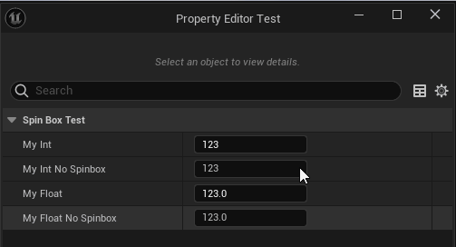

# NoSpinbox

- **Function Description:** Prevents the default UI editing features for drag-and-drop and mouse wheel manipulation of numerical properties, which include the int series and float series.
- **Usage Location:** UPROPERTY
- **Engine Module:** Numeric Property
- **Metadata Type:** bool
- **Restricted Types:** Numeric Types, int / float
- **Commonality:** ★★

Disables the default UI editing features for drag-and-drop and mouse wheel manipulation of numerical properties, including the int series and float series.

## Test Code:

```cpp
public:
	UPROPERTY(EditAnywhere, BlueprintReadWrite,Category=SpinBoxTest)
	int32 MyInt = 123;

	UPROPERTY(EditAnywhere, BlueprintReadWrite,Category=SpinBoxTest, meta = (NoSpinbox = true))
	int32 MyInt_NoSpinbox = 123;

	UPROPERTY(EditAnywhere, BlueprintReadWrite,Category=SpinBoxTest)
	float MyFloat = 123;

	UPROPERTY(EditAnywhere, BlueprintReadWrite,Category=SpinBoxTest, meta = (NoSpinbox = true))
	float MyFloat_NoSpinbox = 123;
```

## Test Effects:

It is observed that properties with NoSpinbox cannot be changed by dragging the mouse left or right, nor can the value be altered using the mouse wheel.



## Principle:

It can be noted that for the UI of numerical values, the function of bAllowSpin directly determines the Widget's AllowWheel and AllowSpin functionalities.

```cpp
virtual TSharedRef<SWidget>	GetDefaultValueWidget() override
{
	const typename TNumericPropertyParams<NumericType>::FMetaDataGetter MetaDataGetter = TNumericPropertyParams<NumericType>::FMetaDataGetter::CreateLambda([&](const FName& Key)
		{
			return (PinProperty) ? PinProperty->GetMetaData(Key) : FString();
		});

	TNumericPropertyParams<NumericType> NumericPropertyParams(PinProperty, PinProperty ? MetaDataGetter : nullptr);

	const bool bAllowSpin = !(PinProperty && PinProperty->GetBoolMetaData("NoSpinbox"));

	// Save last committed value to compare when value changes
	LastSliderCommittedValue = GetNumericValue().GetValue();

	return SNew(SBox)
		.MinDesiredWidth(MinDesiredBoxWidth)
		.MaxDesiredWidth(400)
		[
			SNew(SNumericEntryBox<NumericType>)
			.EditableTextBoxStyle(FAppStyle::Get(), "Graph.EditableTextBox")
			.BorderForegroundColor(FSlateColor::UseForeground())
			.Visibility(this, &SGraphPinNumSlider::GetDefaultValueVisibility)
			.IsEnabled(this, &SGraphPinNumSlider::GetDefaultValueIsEditable)
			.Value(this, &SGraphPinNumSlider::GetNumericValue)
			.MinValue(NumericPropertyParams.MinValue)
			.MaxValue(NumericPropertyParams.MaxValue)
			.MinSliderValue(NumericPropertyParams.MinSliderValue)
			.MaxSliderValue(NumericPropertyParams.MaxSliderValue)
			.SliderExponent(NumericPropertyParams.SliderExponent)
			.Delta(NumericPropertyParams.Delta)
			.LinearDeltaSensitivity(NumericPropertyParams.GetLinearDeltaSensitivityAttribute())
			.AllowWheel(bAllowSpin)
			.WheelStep(NumericPropertyParams.WheelStep)
			.AllowSpin(bAllowSpin)
			.OnValueCommitted(this, &SGraphPinNumSlider::OnValueCommitted)
			.OnValueChanged(this, &SGraphPinNumSlider::OnValueChanged)
			.OnBeginSliderMovement(this, &SGraphPinNumSlider::OnBeginSliderMovement)
			.OnEndSliderMovement(this, &SGraphPinNumSlider::OnEndSliderMovement)
		];
}
```