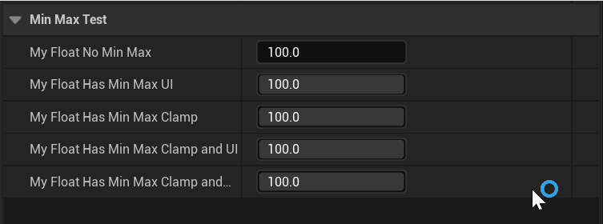

# UIMin

- **Function Description:** Specifies the minimum range value for the scrollbar drag on the numeric input field
- **Usage Location:** UPROPERTY
- **Engine Module:** Numeric Property
- **Metadata Type:** float/int
- **Restriction Type:** float, int32
- **Associated Items:** [UIMax](../UIMax.md), [ClampMin](../ClampMin.md), [ClampMax](../ClampMax.md)
- **Commonly Used:** ★★★★★

The difference between UIMin-UIMax and ClampMin-ClampMax is that the UI series prevents users from exceeding a certain range while dragging the mouse, but users can still manually input values outside this range. The Clamp series, however, sets actual value constraints, preventing users from exceeding these limits whether they are dragging or manually entering values.

Neither of these constraints can prevent direct value modifications in Blueprints.

## Test Code:

```cpp
	UPROPERTY(EditAnywhere, BlueprintReadWrite, Category = MinMaxTest)
	float MyFloat_NoMinMax = 100;
	UPROPERTY(EditAnywhere, BlueprintReadWrite, Category = MinMaxTest, meta = (UIMin = "0", UIMax = "100"))
	float MyFloat_HasMinMax_UI = 100;
	UPROPERTY(EditAnywhere, BlueprintReadWrite, Category = MinMaxTest, meta = (ClampMin = "0", ClampMax = "100"))
	float MyFloat_HasMinMax_Clamp = 100;
	UPROPERTY(EditAnywhere, BlueprintReadWrite, Category = MinMaxTest, meta = (ClampMin = "0", ClampMax = "100",UIMin = "20", UIMax = "50"))
	float MyFloat_HasMinMax_ClampAndUI = 100;
	UPROPERTY(EditAnywhere, BlueprintReadWrite, Category = MinMaxTest, meta = (ClampMin = "20", ClampMax = "50",UIMin = "0", UIMax = "100"))
	float MyFloat_HasMinMax_ClampAndUI2= 100;
```

## Test Results:

- From MyFloat_HasMinMax_UI, it is observed that UIMin and UIMax limit the scrollbar range of the numeric input field, but values exceeding 999 can still be manually entered
- In MyFloat_HasMinMax_Clamp, ClampMin and ClampMax simultaneously limit both the UI and manual input ranges.
- In MyFloat_HasMinMax_ClampAndUI and MyFloat_HasMinMax_ClampAndUI2, it is noted that the UI scrollbar will adopt the narrower range between the UI constraints and the Clamp constraints, and the actual input value will also be confined within this narrower range.



## Principle:

TNumericPropertyParams acquires certain metadata upon construction to initialize these variables, or they will revert to default values.

Numeric types have actual minimum and maximum values (MinValue-MaxValue), provided by ClampMin and ClampMax. There are also UI minimum and maximum values (MinSliderValue-MaxSliderValue), determined by Max(UImin, ClampMin) and Min(UIMax, ClampMax), ensuring the smallest range for legal input.

```cpp
template<typename NumericType>
struct TNumericPropertyParams
{
	if (MetaDataGetter.IsBound())
	{
		UIMinString = MetaDataGetter.Execute("UIMin");
		UIMaxString = MetaDataGetter.Execute("UIMax");
		SliderExponentString = MetaDataGetter.Execute("SliderExponent");
		LinearDeltaSensitivityString = MetaDataGetter.Execute("LinearDeltaSensitivity");
		DeltaString = MetaDataGetter.Execute("Delta");
		ClampMinString = MetaDataGetter.Execute("ClampMin");
		ClampMaxString = MetaDataGetter.Execute("ClampMax");
		ForcedUnits = MetaDataGetter.Execute("ForceUnits");
		WheelStepString = MetaDataGetter.Execute("WheelStep");
	}

	TOptional<NumericType> MinValue;
	TOptional<NumericType> MaxValue;
	TOptional<NumericType> MinSliderValue;
	TOptional<NumericType> MaxSliderValue;
	NumericType SliderExponent;
	NumericType Delta;
	int32 LinearDeltaSensitivity;
	TOptional<NumericType> WheelStep;
}
//Finally, these values are passed on to
SAssignNew(SpinBox, SSpinBox<NumericType>)
	.Style(InArgs._SpinBoxStyle)
	.Font(InArgs._Font.IsSet() ? InArgs._Font : InArgs._EditableTextBoxStyle->TextStyle.Font)
	.Value(this, &SNumericEntryBox<NumericType>::OnGetValueForSpinBox)
	.Delta(InArgs._Delta)
	.ShiftMultiplier(InArgs._ShiftMultiplier)
	.CtrlMultiplier(InArgs._CtrlMultiplier)
	.LinearDeltaSensitivity(InArgs._LinearDeltaSensitivity)
	.SupportDynamicSliderMaxValue(InArgs._SupportDynamicSliderMaxValue)
	.SupportDynamicSliderMinValue(InArgs._SupportDynamicSliderMinValue)
	.OnDynamicSliderMaxValueChanged(InArgs._OnDynamicSliderMaxValueChanged)
	.OnDynamicSliderMinValueChanged(InArgs._OnDynamicSliderMinValueChanged)
	.OnValueChanged(OnValueChanged)
	.OnValueCommitted(OnValueCommitted)
	.MinFractionalDigits(MinFractionalDigits)
	.MaxFractionalDigits(MaxFractionalDigits)
	.MinSliderValue(InArgs._MinSliderValue)
	.MaxSliderValue(InArgs._MaxSliderValue)
	.MaxValue(InArgs._MaxValue)
	.MinValue(InArgs._MinValue)
	.SliderExponent(InArgs._SliderExponent)
	.SliderExponentNeutralValue(InArgs._SliderExponentNeutralValue)
	.EnableWheel(InArgs._AllowWheel)
	.BroadcastValueChangesPerKey(InArgs._BroadcastValueChangesPerKey)
	.WheelStep(InArgs._WheelStep)
	.OnBeginSliderMovement(InArgs._OnBeginSliderMovement)
	.OnEndSliderMovement(InArgs._OnEndSliderMovement)
	.MinDesiredWidth(InArgs._MinDesiredValueWidth)
	.TypeInterface(Interface)
	.ToolTipText(this, &SNumericEntryBox<NumericType>::GetValueAsText);


//In Conclusion
void SSpinBox<NumericType>::CommitValue(NumericType NewValue, double NewSpinValue, ECommitMethod CommitMethod, ETextCommit::Type OriginalCommitInfo)
{
	if (CommitMethod == CommittedViaSpin || CommitMethod == CommittedViaArrowKey)
	{
		const NumericType LocalMinSliderValue = GetMinSliderValue();
		const NumericType LocalMaxSliderValue = GetMaxSliderValue();
		NewValue = FMath::Clamp<NumericType>(NewValue, LocalMinSliderValue, LocalMaxSliderValue);
		NewSpinValue = FMath::Clamp<double>(NewSpinValue, (double)LocalMinSliderValue, (double)LocalMaxSliderValue);
	}

	{
		const NumericType LocalMinValue = GetMinValue();
		const NumericType LocalMaxValue = GetMaxValue();
		NewValue = FMath::Clamp<NumericType>(NewValue, LocalMinValue, LocalMaxValue);
		NewSpinValue = FMath::Clamp<double>(NewSpinValue, (double)LocalMinValue, (double)LocalMaxValue);
	}

	// Update the internal value, this needs to be done before rounding.
	InternalValue = NewSpinValue;

	const bool bAlwaysUsesDeltaSnap = GetAlwaysUsesDeltaSnap();
	// If needed, round this value to the delta. Internally the value is not held to the Delta but externally it appears to be.
	if (CommitMethod == CommittedViaSpin || CommitMethod == CommittedViaArrowKey || bAlwaysUsesDeltaSnap)
	{
		NumericType CurrentDelta = Delta.Get();
		if (CurrentDelta != NumericType())
		{
			NewValue = FMath::GridSnap<NumericType>(NewValue, CurrentDelta); // snap numeric point value to nearest Delta
		}
	}

	// Update the max slider value based on the current value if we're in dynamic mode
	if (SupportDynamicSliderMaxValue.Get() && ValueAttribute.Get() > GetMaxSliderValue())
	{
		ApplySliderMaxValueChanged(float(ValueAttribute.Get() - GetMaxSliderValue()), true);
	}
	else if (SupportDynamicSliderMinValue.Get() && ValueAttribute.Get() < GetMinSliderValue())
	{
		ApplySliderMinValueChanged(float(ValueAttribute.Get() - GetMinSliderValue()), true);
	}
}

```