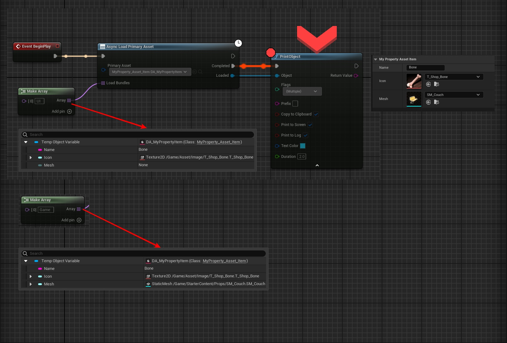

# AssetBundles

- **Function description:** Indicates which assets the attribute refers to belong to which AssetBundles.
- **Use location:** UPROPERTY
- **Engine module:** Object Property
- **Metadata type:** strings = "a, b, c"
- **Restriction type:** UPrimaryDataAsset internal FSoftObjectPtr, FSoftObjectPath
- **Related items:** [IncludeAssetBundles](../IncludeAssetBundles/IncludeAssetBundles.md)
- **Commonly used:** ★★★

Used for SoftObjectPtr or SoftObjectPath properties within UPrimaryDataAsset, indicating which AssetBundles the assets they refer to belong to.

To understand the purpose of this, you need to first understand some basic concepts:

- PrimaryAsset refers to items that can be manually loaded/released in the game, including level files (.umap) and some game-related objects, such as characters or items in backpacks. As the name implies, main assets are the primary root assets in the game, with a large number of other assets under their reference tree. On the other hand, we often actively load or release these main assets, such as loading levels, loading monster characters, or loading drop items. However, we generally do not load assets like materials, textures, or sounds directly, as most of them are referenced by main assets. When we load main assets, these secondary assets are loaded automatically.
- SecondaryAsset refers to other assets, such as textures and sounds. These types of assets are automatically loaded based on the PrimaryAsset. We generally do not need to manage secondary assets, as they are automatically loaded by the main assets based on the reference relationship.
- AssetBundle can be referred to as an asset package, which is essentially a list of assets. We name each asset package to distinguish it, such as UI and Game, which also categorizes assets. Here, we do not differentiate between PrimaryAsset and SecondaryAsset, as the categorization is based on usage rather than loading method. The role of AssetBundle is that when loading a PrimaryAsset, the PrimaryAsset itself may reference other SecondaryAssets with different purposes. We can group these SecondaryAssets into different AssetBundles, allowing us to control the loading of these SecondaryAssets more precisely by providing an additional AssetBundleName when loading the PrimaryAsset.
- For a PrimaryAsset, the specified AssetBundle's asset property must be a soft reference; otherwise, it will be loaded regardless if it is a hard reference. Soft reference assets need to be loaded manually by default. By attaching an AssetBundle, the soft reference asset can be loaded incidentally when the PrimaryAsset is loaded.

## Test Code:

```cpp
UCLASS(BlueprintType)
class INSIDER_API UMyProperty_Asset_Item :public UPrimaryDataAsset
{
	GENERATED_BODY()
public:
	UPROPERTY(BlueprintReadWrite,EditAnywhere)
		FString Name;
	UPROPERTY(BlueprintReadWrite, EditAnywhere,meta=(AssetBundles="UI,Game"))
		TSoftObjectPtr<UTexture2D> Icon;
	UPROPERTY(BlueprintReadWrite, EditAnywhere,meta=(AssetBundles="Game"))
		TSoftObjectPtr<UStaticMesh> Mesh;
public:
	virtual FPrimaryAssetId GetPrimaryAssetId() const override;
};
```

## Test Results:

- First, we defined the UMyProperty_Asset_Item asset in BP and configured the corresponding reference objects. As shown in the figure, there is an icon for UI and Game use, and there is a Mesh specifically for Game use. Imagine that in some interfaces, we only need the icon of the item.
- Then, when loading the PrimaryAsset, we can specify the name of LoadBundles to load only specific Bundles. As shown in the figure below.
- When specifying the Bundle as UI, you can see that the Mesh is not loaded.
- When specifying the Bundle as Game, you can see that both the Icon and Mesh are loaded.
- Note that when testing in the editor, if the Mesh has been loaded previously, it may still reside in the editor's memory. Therefore, even when using the name UI, you may still find that the Mesh can be referenced.



## Principle:

First, UPrimaryDataAsset contains an AssetBundleData that stores information about the currently referenced AssetBundle. This information is saved during the PreSave process in the editor environment and is analyzed and mapped in UAssetManager::InitializeAssetBundlesFromMetadata. Subsequently, when UAssetManager loads the PrimaryAsset, it internally calls ChangeBundleStateForPrimaryAssets, checks the AssetBundle, and adds other additional assets to be loaded together to PathsToLoad, thus completing the logic of loading together.

```cpp
void UAssetManager::InitializeAssetBundlesFromMetadata_Recursive(const UStruct* Struct, const void* StructValue, FAssetBundleData& AssetBundle, FName DebugName, TSet<const void*>& AllVisitedStructValues) const
{
	static FName AssetBundlesName = TEXT("AssetBundles");
	static FName IncludeAssetBundlesName = TEXT("IncludeAssetBundles");

	//Based on the current object's value, search for the value of properties that own AssetBundles. Finally, AddBundleAsset, where BundleName is the set value, and FoundRef is the asset path of the referenced object
	TSet<FName> BundleSet;
	TArray<const FProperty*> PropertyChain;
	It.GetPropertyChain(PropertyChain);

	for (const FProperty* PropertyToSearch : PropertyChain)
	{
					if (PropertyToSearch->HasMetaData(AssetBundlesName))
					{
						TSet<FName> LocalBundleSet;
						TArray<FString> BundleList;
						const FString& BundleString = PropertyToSearch->GetMetaData(AssetBundlesName);
						BundleString.ParseIntoArrayWS(BundleList, TEXT(","));

						for (const FString& BundleNameString : BundleList)
						{
							LocalBundleSet.Add(FName(*BundleNameString));
						}

						// If Set is empty, initialize. Otherwise intersect
						if (BundleSet.Num() == 0)
						{
							BundleSet = LocalBundleSet;
						}
						else
						{
							BundleSet = BundleSet.Intersect(LocalBundleSet);
						}
		}
}

	for (const FName& BundleName : BundleSet)
	{
					AssetBundle.AddBundleAsset(BundleName, FoundRef.GetAssetPath());
	}
}

#if WITH_EDITORONLY_DATA
void UPrimaryDataAsset::UpdateAssetBundleData()
{
	// By default parse the metadata
	if (UAssetManager::IsInitialized())
	{
		AssetBundleData.Reset();
		UAssetManager::Get().InitializeAssetBundlesFromMetadata(this, AssetBundleData);
	}
}

void UPrimaryDataAsset::PreSave(FObjectPreSaveContext ObjectSaveContext)
{
	Super::PreSave(ObjectSaveContext);

	UpdateAssetBundleData();

	if (UAssetManager::IsInitialized())
	{
		// Bundles may have changed, refresh
		UAssetManager::Get().RefreshAssetData(this);
	}
}
#endif

void UPrimaryDataAsset::PostLoad()
{
	Super::PostLoad();

#if WITH_EDITORONLY_DATA
	FAssetBundleData OldData = AssetBundleData;

	UpdateAssetBundleData();

	if (UAssetManager::IsInitialized() && OldData != AssetBundleData)
	{
		// Bundles changed, refresh
		UAssetManager::Get().RefreshAssetData(this);
	}
#endif
}

//When loading an asset, if there is an FAssetBundleEntry, it is added to PathsToLoad together
TSharedPtr<FStreamableHandle> UAssetManager::ChangeBundleStateForPrimaryAssets(const TArray<FPrimaryAssetId>& AssetsToChange, const TArray<FName>& AddBundles, const TArray<FName>& RemoveBundles, bool bRemoveAllBundles, FStreamableDelegate DelegateToCall, TAsyncLoadPriority Priority)
{
	if (!AssetPath.IsNull())
		{
			// Dynamic types can have no base asset path
			PathsToLoad.Add(AssetPath);
		}

		for (const FName& BundleName : NewBundleState)
		{
			FAssetBundleEntry Entry = GetAssetBundleEntry(PrimaryAssetId, BundleName);

			if (Entry.IsValid())
			{
				for (const FTopLevelAssetPath & Path : Entry.AssetPaths)
				{
					PathsToLoad.AddUnique(FSoftObjectPath(Path));
				}
			}
			else
			{
				UE_LOG(LogAssetManager, Verbose, TEXT("ChangeBundleStateForPrimaryAssets: No assets for bundle %s::%s"), *PrimaryAssetId.ToString(), *BundleName.ToString());
			}
		}
}
```

Reference documentation: [https://dev.epicgames.com/documentation/en-us/unreal-engine/asset-management-in-unreal-engine ? application_version = 5.4](https://dev.epicgames.com/documentation/en-us/unreal-engine/asset-management-in-unreal-engine?application_version=5.4)