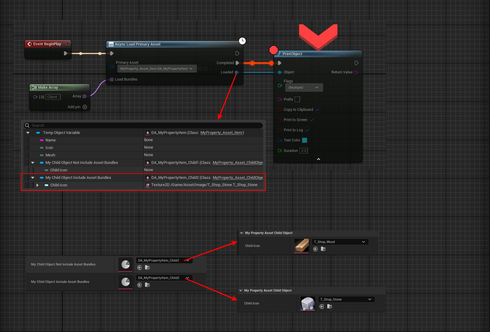

# IncludeAssetBundles

- **Function Description:** Used for sub-object attributes of UPrimaryDataAsset to specify that recursion should continue into the sub-object to detect AssetBundle data.
- **Usage Location:** UPROPERTY
- **Engine Module:** Object Property
- **Metadata Type:** string="abc"
- **Restriction Type:** ObjectPtr within UPrimaryDataAsset
- **Associated Items:** [AssetBundles](../AssetBundles/AssetBundles.md)
- **Commonly Used:** ★★

Used for sub-object attributes of UPrimaryDataAsset to specify that recursion should continue into the sub-object to detect AssetBundle data.

By doing this, the FSoftObjectPtr or FSoftObjectPath properties within the object, marked with AssetBundle data, will be parsed and added to the AssetBundleData of UPrimaryDataAsset.

- By default, InitializeAssetBundlesFromMetadata_Recursive will only analyze the attributes at the level of UPrimaryDataAsset itself, such as the Icon and Mesh properties below.
- However, if there is another level of nesting, meaning UPrimaryDataAsset has a child object, UMyProperty_Asset_ChildObject, and UMyProperty_Asset_ChildObject contains FSoftObjectPath, it is desired that it be considered part of the AssetBundles and loaded simultaneously with UPrimaryDataAsset. In this case, the engine needs to be informed to continue analyzing this child object.
- Note that UMyProperty_Asset_ChildObject is always a hard reference using TObjectPtr, and this object will be loaded when UMyProperty_Asset_Item is loaded. Therefore, UMyProperty_Asset_ChildObject will always be loaded. However, the ChildIcon within UMyProperty_Asset_ChildObject uses TSoftObjectPtr, which is a soft reference, and thus relies on the AssetBundle mechanism to be loaded.

## Test Code:

```cpp
UCLASS(BlueprintType)
class INSIDER_API UMyProperty_Asset_ChildObject :public UDataAsset
{
	GENERATED_BODY()
public:
	UPROPERTY(BlueprintReadWrite, EditAnywhere, meta = (AssetBundles = "Client"))
	TSoftObjectPtr<UTexture2D> ChildIcon;
};

UCLASS(BlueprintType)
class INSIDER_API UMyProperty_Asset_Item :public UPrimaryDataAsset
{
	GENERATED_BODY()
public:
	UPROPERTY(BlueprintReadWrite, EditAnywhere)
	FString Name;
	UPROPERTY(BlueprintReadWrite, EditAnywhere, meta = (AssetBundles = "UI,Game"))
	TSoftObjectPtr<UTexture2D> Icon;
	UPROPERTY(BlueprintReadWrite, EditAnywhere, meta = (AssetBundles = "Game"))
	TSoftObjectPtr<UStaticMesh> Mesh;

public:
	UPROPERTY(BlueprintReadWrite, EditAnywhere)
	TObjectPtr<UMyProperty_Asset_ChildObject> MyChildObject_NotIncludeAssetBundles;

	UPROPERTY(BlueprintReadWrite, EditAnywhere, meta = (IncludeAssetBundles))
	TObjectPtr<UMyProperty_Asset_ChildObject> MyChildObject_IncludeAssetBundles;
public:
	virtual FPrimaryAssetId GetPrimaryAssetId() const override;
};
```

## Test Results:

In the lower part of the configured data graph, two images are set. However, after loading LoadPrimaryAsset, only the ChildIcon within MyChildObject_IncludeAssetBundles is loaded.



If analyzing the AssetBunbleData of UMyProperty_Asset_Item, it will be found that the Client contains only the path to the second Stone image. This is because only the second image is analyzed and included.

```cpp
{
				BundleName = "Client";
				BundleAssets =
				{
					{
						AssetPath =
						{
							PackageName = "/Game/Asset/Image/T_Shop_Stone";
							AssetName = "T_Shop_Stone";
						};
						SubPathString = "";
					};
				},
				AssetPaths =
				{
					{
						PackageName = "/Game/Asset/Image/T_Shop_Stone";
						AssetName = "T_Shop_Stone";
					};
				},
			};
```

## Principle:

For properties under UPrimaryDataAsset that are object properties, recursion will only continue downwards when IncludeAssetBundles is present.

```cpp
void UAssetManager::InitializeAssetBundlesFromMetadata_Recursive(const UStruct* Struct, const void* StructValue, FAssetBundleData& AssetBundle, FName DebugName, TSet<const void*>& AllVisitedStructValues) const
{
	static FName AssetBundlesName = TEXT("AssetBundles");
	static FName IncludeAssetBundlesName = TEXT("IncludeAssetBundles");

	//Based on the current object's value, search for the value of properties that have AssetBundles, and finally, AddBundleAsset, where BundleName is the set value, and FoundRef is the asset path of the referenced object
	else if (const FObjectProperty* ObjectProperty = CastField<FObjectProperty>(Property))
	{
		if (ObjectProperty->PropertyFlags & CPF_InstancedReference || ObjectProperty->GetOwnerProperty()->HasMetaData(IncludeAssetBundlesName))
		{
			const UObject* Object = ObjectProperty->GetObjectPropertyValue(PropertyValue);
			if (Object != nullptr)
			{
				InitializeAssetBundlesFromMetadata_Recursive(Object->GetClass(), Object, AssetBundle, Object->GetFName(), AllVisitedStructValues);
			}
		}
	}
}
```