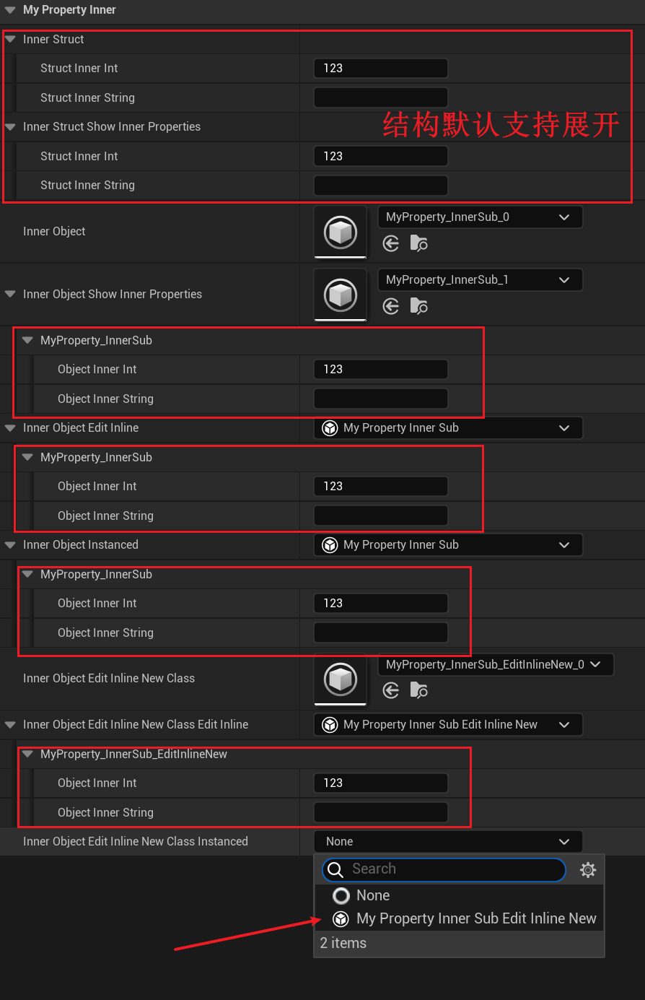

# ShowInnerProperties

- **Function description:** Display the internal properties of object references within the property details panel
- **Usage location:** UPROPERTY
- **Engine module:** Object Property
- **Metadata type:** bool
- **Restriction type:** UObject*
- **Associated items:** [ShowOnlyInnerProperties](../ShowOnlyInnerProperties/ShowOnlyInnerProperties.md), [FullyExpand](../FullyExpand.md), [CollapsableChildProperties](../CollapsableChildProperties.md)
- **Commonality:** ★★★★★

Displays the internal properties of object references within the property details panel.

By default, the internal properties of object reference attributes are not displayed in the details panel; only the object name is shown. However, if you wish to directly display and edit these internal properties, the ShowInnerProperties meta attribute comes into play.

ShowInnerProperties has two constraints: the attribute must be of type UObject*, and it cannot be a container.

Note that Struct properties are displayed with internal properties by default, thus there is no need to set ShowInnerProperties for them.

**What is the difference between it and EditInlineNew?**

This effect is similar to what is achieved by setting EditInlineNew on a UCLASS and setting Instanced on its object reference property. The difference lies in the fact that setting EditInlineNew on a UCLASS allows the object property reference to create objects within the property panel, while setting Instanced on a UPROPERTY automatically adds the EditInline meta attribute, resulting in the same effect of displaying internal properties. Therefore, fundamentally, what is similar to ShowInnerProperties is the EditInline meta attribute. However, EditInline has an additional layer of functionality, supporting object containers, whereas ShowInnerProperties only supports individual object reference properties.

## Test Code:

```cpp

USTRUCT(BlueprintType)
struct FMyPropertyInner
{
	GENERATED_BODY()
public:
	UPROPERTY(EditAnywhere, BlueprintReadWrite)
	int32 StructInnerInt = 123;
	UPROPERTY(EditAnywhere, BlueprintReadWrite)
	FString StructInnerString;
};

UCLASS(BlueprintType)
class INSIDER_API UMyProperty_InnerSub :public UObject
{
	GENERATED_BODY()
public:
	UPROPERTY(EditAnywhere, BlueprintReadWrite)
	int32 ObjectInnerInt = 123;
	UPROPERTY(EditAnywhere, BlueprintReadWrite)
	FString ObjectInnerString;
};

UCLASS(BlueprintType, EditInlineNew)
class INSIDER_API UMyProperty_InnerSub_EditInlineNew :public UObject
{
	GENERATED_BODY()
public:
	UPROPERTY(EditAnywhere, BlueprintReadWrite)
	int32 ObjectInnerInt = 123;
	UPROPERTY(EditAnywhere, BlueprintReadWrite)
	FString ObjectInnerString;
};

UCLASS(Blueprintable, BlueprintType)
class INSIDER_API UMyProperty_Inner :public UDataAsset
{
	GENERATED_BODY()
public:
	UPROPERTY(EditAnywhere, BlueprintReadWrite)
	FMyPropertyInner InnerStruct;
	UPROPERTY(EditAnywhere, BlueprintReadWrite, meta = (ShowInnerProperties))
	FMyPropertyInner InnerStruct_ShowInnerProperties;

	UPROPERTY(EditAnywhere, BlueprintReadWrite)
	UMyProperty_InnerSub* InnerObject;
	UPROPERTY(EditAnywhere, BlueprintReadWrite, meta = (ShowInnerProperties))
	UMyProperty_InnerSub* InnerObject_ShowInnerProperties;

	//(Category = MyProperty_Inner, EditInline = , ModuleRelativePath = Property/MyProperty_Inner.h)
	//CPF_Edit | CPF_BlueprintVisible | CPF_ZeroConstructor | CPF_NoDestructor | CPF_HasGetValueTypeHash | CPF_NativeAccessSpecifierPublic
	UPROPERTY(EditAnywhere, BlueprintReadWrite, meta = (EditInline))
	UMyProperty_InnerSub* InnerObject_EditInline;

	//(Category = MyProperty_Inner, EditInline = true, ModuleRelativePath = Property/MyProperty_Inner.h)
	//CPF_Edit | CPF_BlueprintVisible | CPF_ExportObject | CPF_ZeroConstructor | CPF_InstancedReference | CPF_NoDestructor | CPF_PersistentInstance | CPF_HasGetValueTypeHash | CPF_NativeAccessSpecifierPublic
	UPROPERTY(EditAnywhere, BlueprintReadWrite, Instanced)
	UMyProperty_InnerSub* InnerObject_Instanced;

	UPROPERTY(EditAnywhere, BlueprintReadWrite)
	UMyProperty_InnerSub_EditInlineNew* InnerObject_EditInlineNewClass;
	UPROPERTY(EditAnywhere, BlueprintReadWrite, meta = (EditInline))
	UMyProperty_InnerSub_EditInlineNew* InnerObject_EditInlineNewClass_EditInline;
	UPROPERTY(EditAnywhere, BlueprintReadWrite, Instanced)
	UMyProperty_InnerSub_EditInlineNew* InnerObject_EditInlineNewClass_Instanced;

public:
	UFUNCTION(CallInEditor)
	void ClearInnerObject();
	UFUNCTION(CallInEditor)
	void InitInnerObject();
};

void UMyProperty_Inner::ClearInnerObject()
{
	InnerObject = nullptr;
	InnerObject_ShowInnerProperties = nullptr;
	InnerObject_EditInline = nullptr;
	InnerObject_Instanced = nullptr;

	InnerObject_EditInlineNewClass = nullptr;
	InnerObject_EditInlineNewClass_EditInline = nullptr;
	InnerObject_EditInlineNewClass_Instanced = nullptr;

	Modify();

	FPropertyEditorModule& PropertyEditorModule = FModuleManager::GetModuleChecked<FPropertyEditorModule>("PropertyEditor");
	PropertyEditorModule.NotifyCustomizationModuleChanged();
}

void UMyProperty_Inner::InitInnerObject()
{
	InnerObject = NewObject<UMyProperty_InnerSub>(this);
	InnerObject_ShowInnerProperties = NewObject<UMyProperty_InnerSub>(this);
	InnerObject_EditInline = NewObject<UMyProperty_InnerSub>(this);
	InnerObject_Instanced = NewObject<UMyProperty_InnerSub>(this);

	InnerObject_EditInlineNewClass = NewObject<UMyProperty_InnerSub_EditInlineNew>(this);
	InnerObject_EditInlineNewClass_EditInline = NewObject<UMyProperty_InnerSub_EditInlineNew>(this);
	//InnerObject_EditInlineNewClass_Instanced = NewObject<UMyProperty_InnerSub_EditInlineNew>(this);

	Modify();

	FPropertyEditorModule& PropertyEditorModule = FModuleManager::GetModuleChecked<FPropertyEditorModule>("PropertyEditor");
	PropertyEditorModule.NotifyCustomizationModuleChanged();
}
```

## Blueprint Effect:



Observations include:

- Struct properties are displayed with internal properties expanded by default
- UMyProperty_InnerSub* InnerObject_ShowInnerProperties; supports expanding properties when marked with ShowInnerProperties
- UMyProperty_InnerSub* with both EditInline and Instanced also supports expanding internal properties, and their meta attributes are consistent, both showing EditInline = true
- Only UMyProperty_InnerSub_EditInlineNew* InnerObject_EditInlineNewClass; does not support expanding the reference attribute when EditInlineNew is set on the UCLASS, indicating that setting EditInlineNew on the class has no effect.
- However, we also observed that the InnerObject_EditInlineNewClass_Instanced setting supports direct object creation due to the presence of EditInlineNew on its class. Conversely, InnerObject_Instanced does not support direct object creation because its class UMyProperty_InnerSub lacks EditInlineNew and will not appear in the selection box.

## Extended Example:

Searching the source code reveals that UChildActorComponent::ChildActorTemplate also includes ShowInnerProperties, which is a typical application that allows direct editing of ChildActor property data within the familiar details panel.

But if we remove ShowInnerProperties, we can compare the effects before and after:

```cpp
class UChildActorComponent : public USceneComponent
{
	UPROPERTY(VisibleDefaultsOnly, DuplicateTransient, Category=ChildActorComponent, meta=(ShowInnerProperties))
	TObjectPtr<AActor> ChildActorTemplate;
}

void UMyProperty_Inner::RemoveActorMeta()
{
	FProperty* prop = UChildActorComponent::StaticClass()->FindPropertyByName(TEXT("ChildActorTemplate"));
	prop->RemoveMetaData(TEXT("ShowInnerProperties"));
}

void UMyProperty_Inner::AddActorMeta()
{
	FProperty* prop = UChildActorComponent::StaticClass()->FindPropertyByName(TEXT("ChildActorTemplate"));
	prop->SetMetaData(TEXT("ShowInnerProperties"), TEXT(""));
}

```

## Comparison Effect:


It can be seen that after removing ShowInnerProperties, the ChildActorTemplate property reverts to a standard object reference, and we can no longer directly edit the object's internal properties.

## Principle:

The most typical example in the source code is ChildActorTemplate, which allows the internal properties to be displayed directly.

```cpp
class UChildActorComponent : public USceneComponent
{
	UPROPERTY(VisibleDefaultsOnly, DuplicateTransient, Category=ChildActorComponent, meta=(ShowInnerProperties))
	TObjectPtr<AActor> ChildActorTemplate;
}
```

The source code for the function:

```cpp
void FPropertyNode::InitNode(const FPropertyNodeInitParams& InitParams)
{
		const bool bIsObjectOrInterface = CastField<FObjectPropertyBase>(MyProperty) || CastField<FInterfaceProperty>(MyProperty);
		// we are EditInlineNew if this property has the flag, or if inside a container that has the flag.
		bIsEditInlineNew = GotReadAddresses && bIsObjectOrInterface && !MyProperty->HasMetaData(Name_NoEditInline) &&
			(MyProperty->HasMetaData(Name_EditInline) || (bIsInsideContainer && OwnerProperty->HasMetaData(Name_EditInline)));
		bShowInnerObjectProperties = bIsObjectOrInterface && MyProperty->HasMetaData(Name_ShowInnerProperties);

		if (bIsEditInlineNew)
		{
			SetNodeFlags(EPropertyNodeFlags::EditInlineNew, true);
		}
		else if (bShowInnerObjectProperties)
		{
			SetNodeFlags(EPropertyNodeFlags::ShowInnerObjectProperties, true);
		}
}

void FItemPropertyNode::InitExpansionFlags(void)
{
	FProperty* MyProperty = GetProperty();

	if (TSharedPtr<FPropertyNode>& ValueNode = GetOrCreateOptionalValueNode())
	{
		// This is a set optional, so check its SetValue instead.
		MyProperty = ValueNode->GetProperty();
	}

	bool bExpandableType = CastField<FStructProperty>(MyProperty)
		|| (CastField<FArrayProperty>(MyProperty) || CastField<FSetProperty>(MyProperty) || CastField<FMapProperty>(MyProperty));

	if (bExpandableType
		|| HasNodeFlags(EPropertyNodeFlags::EditInlineNew)
		|| HasNodeFlags(EPropertyNodeFlags::ShowInnerObjectProperties)
		|| (MyProperty->ArrayDim > 1 && ArrayIndex == -1))
	{
		SetNodeFlags(EPropertyNodeFlags::CanBeExpanded, true);
	}
}
void FPropertyNode::RebuildChildren()
{
	if (HasNodeFlags(EPropertyNodeFlags::CanBeExpanded) && (ChildNodes.Num() == 0))
	{
		InitChildNodes();
		if (ExpandedPropertyItemSet.Size() > 0)
		{
			FPropertyNodeUtils::SetExpandedItems(ThisAsSharedRef, ExpandedPropertyItemSet);
		}
	}
}
```

Note that the condition for bShowInnerObjectProperties here is bIsObjectOrInterface and the presence of a meta attribute, so this feature only applies to object references. If EPropertyNodeFlags::ShowInnerObjectProperties is detected, then EPropertyNodeFlags::CanBeExpanded is set, ultimately allowing the properties of the object to be expanded.